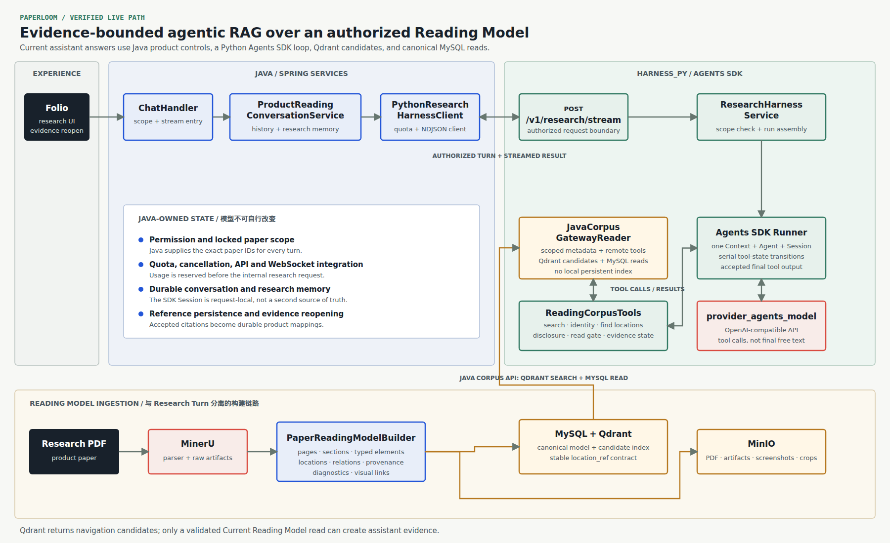

# PaperLoom

**PaperLoom is an evidence-bounded agentic RAG workbench for reading research-paper PDFs.**

The user-facing application is called **Folio**. It turns a paper into a page-aware Reading Model,
lets a tool-using research agent navigate only the papers authorized for the conversation, and keeps
the resulting citations reopenable after the model run has ended.

[Project site](https://chzarles.github.io/paperloom/) · [Documentation](docs/README.md) ·
[中文介绍](README.zh-CN.md)

## Why PaperLoom

Most RAG demos optimize the path from a query to plausible text. PaperLoom treats the path from a
claim back to its source as part of the product contract:

- PDF content is retained as ordered pages, sections, typed reading elements, locations, and visual
  assets;
- Java fixes the permission, paper-scope, quota, conversation, and persistence boundaries before
  research begins;
- Python runs one agent loop through a Java-owned Corpus API inside the authorized Reading Model scope;
- candidate previews are navigation only; citeable evidence exists only after an exact location is
  read;
- final submission is checked against the evidence ledger before it becomes a product answer;
- historical references remain connected to the paper location that supported the claim.

This repository is also an engineering record. ADRs and selected experiment reports preserve the
decisions, failed approaches, costs, and measurements that changed the system.

## Current Runtime

[](site/public/images/paperloom-system-architecture.svg)

The live research path is:

```text
ChatHandler
-> ProductReadingConversationService
-> PythonResearchHarnessClient
-> POST /v1/research/stream
-> ResearchHarnessService
-> OpenAI Agents SDK Runner
-> Java Corpus API
-> Qdrant candidates + MySQL exact read
```

Java supplies `user_id` and locked paper IDs. Python calls the Java Corpus API and exposes metadata
discovery, identity resolution, location search, exact reading, optional research guidance, and
validated final submission as tools. It no longer loads every Reading Element into each Harness replica.

Java indexes canonical Current Reading Model locations into a sparse-only Qdrant collection and
runs BM25-style lexical retrieval. It then validates and hydrates candidates from MySQL. Qdrant
remains a candidate index; `read_locations` is still the only evidence-producing content path.

## Reading Model

PaperLoom does not make raw parser output or a search index its durable paper representation. The
Reading Model records:

- model version, readiness, parser provenance, counts, and diagnostics;
- physical pages and readable sections with source spans;
- canonical typed elements such as headings, paragraphs, lists, tables, figures, charts, formulas,
  footnotes, asides, and code;
- stable page, section, table, and figure locations;
- PDF page screenshots and table, figure, or chart crops.

The Python product adapter first creates lightweight scoped paper-ID shells without Java I/O and
hydrates metadata only when the model invokes a paper discovery or identity tool. Java owns the full
Reading Model, active lexical index contract, candidate validation, and exact canonical reads.
See [Reading Model and Agent Tools](docs/architecture/reading-model-and-agent-tools.md).

## Agent Tool Protocol

The agent cannot jump directly from a scoped paper ID to a citation. The current authorization
ladder is:

```text
Java-authorized paper scope
-> disclosed paper candidate or resolved identity
-> disclosed reading location
-> exact location read
-> Evidence ID created
-> final answer validated against known evidence
```

`read_locations` is the only content tool that creates citeable evidence.
`submit_research_answer` must be the only tool call in the final step.

## Architecture

| Area | Current responsibility |
| --- | --- |
| Folio | Vue 3 research workbench, paper selection, progress, conversations, and evidence reopening |
| Java product boundary | Authentication, authorization, locked source scope, quota, cancellation, durable conversations, and reference mappings |
| Python research boundary | Agents SDK loop, tool execution, disclosure state, evidence ledger, citation checks, and final submission |
| Java Corpus plane | Paper authorization, lexical Qdrant retrieval, Current Model validation, and exact reads |
| MySQL | Product papers, canonical Reading Models, conversations, and durable reference data |
| Qdrant | Rebuildable sparse BM25 candidate index keyed by stable `location_ref` |
| MinIO | Original PDFs, parser artifacts, page screenshots, and crop assets |
| Model provider | MiniMax-M3 used by the Agents SDK runtime through deployment-managed credentials |

Qdrant contributes navigation candidates but never evidence directly. Exact MySQL reads preserve the
claim-to-location contract.

## Evaluation

PaperLoom records both outcomes and observable research behavior. Optional per-run capture stores
ordered model, tool, authorization, evidence, validation, token, latency, and failure events. Golden
Cases define required and forbidden papers or evidence, expected facts, claim obligations, outcome,
citation policy, trace obligations, and human or judge labels.

That data can support retrieval tuning, tool-policy analysis, provider routing, judge calibration,
future dense retriever or reranker training, and teacher-student distillation from strong APIs to a
local model. Distillation targets accepted answers and observable tool trajectories, not hidden
chain-of-thought. See [Evaluation System](docs/evaluation/README.md).

## Quick Start

Requirements: Java 17, Maven 3.8+, Node.js 18.20+, pnpm 8.7+, Python 3.11+, Docker Compose v2,
and a separately installed MinerU service for real PDF ingestion.

```bash
cp .env.example .env
# Fill the required database, storage, JWT, internal-service, and model credentials.

docker compose --env-file .env -f docs/docker-compose.yaml up -d

python3 -m venv .venv-harness
.venv-harness/bin/pip install -r harness_py/requirements.lock
scripts/paperloom-start-harness.sh start

mvn spring-boot:run
```

New uploads build their lexical Qdrant index automatically. If canonical Current Reading Models were
imported without an index, run the destructive `POST /api/v1/admin/retrieval/rebuild-all` operation
once after startup. The lexical rebuild does not call an embedding provider.

In another terminal:

```bash
cd frontend
corepack pnpm install
corepack pnpm dev
```

Folio is normally available at `http://localhost:9527`; the backend listens on
`http://localhost:8081`. The complete setup and first-paper check are in the
[Quick Start](docs/getting-started/quick-start.md).

## Verification

```bash
mvn test

.venv-harness/bin/python -m unittest discover -s harness_py/tests

cd frontend
pnpm typecheck
pnpm test:e2e

cd ../site
npm ci
npm run docs:build
```

## Project Status

PaperLoom is an active engineering project, not a finished hosted service. Its current contract is
research-paper PDF ingestion, an inspectable Reading Model, authorized agentic retrieval, and
evidence-grounded research chat.

It does not yet claim general-purpose document ingestion, reliable coordinate-level highlighting,
automatic citation-graph construction, multimodal retrieval, validated dense-retrieval quality and
capacity at large scale, or perfect metadata extraction for every PDF.

## Documentation

- [Documentation index](docs/README.md)
- [Architecture overview](docs/architecture/overview.md)
- [Reading Model and agent tools](docs/architecture/reading-model-and-agent-tools.md)
- [Evidence and citation model](docs/architecture/evidence-and-citations.md)
- [Evaluation system](docs/evaluation/README.md)
- [Engineering evolution](docs/engineering-evolution/README.md)
- [Architecture decisions](docs/adr/)
- [Contributing](CONTRIBUTING.md)
- [Security policy](SECURITY.md)

## License

PaperLoom is licensed under the [Apache License 2.0](LICENSE). Third-party components and assets
retain their own licenses; see [Third-Party Notices](THIRD_PARTY_NOTICES.md).
