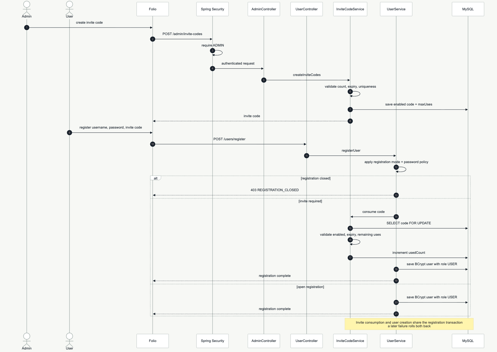
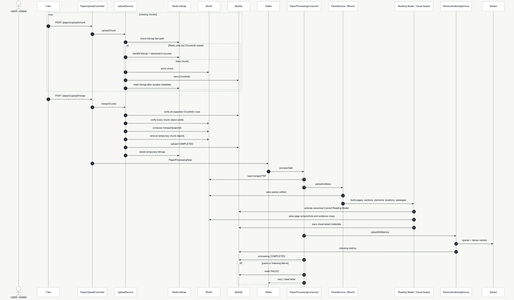
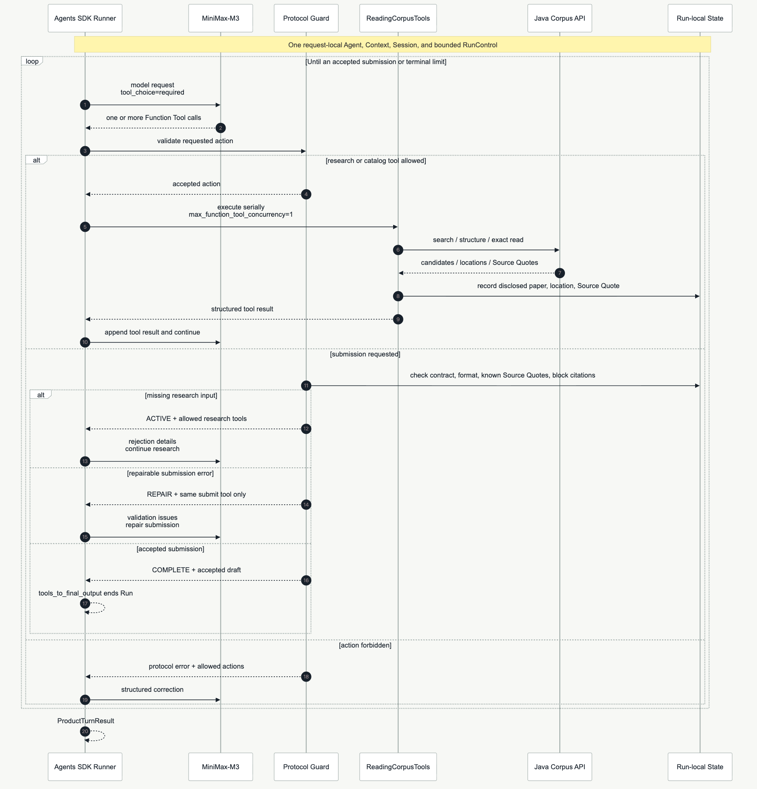
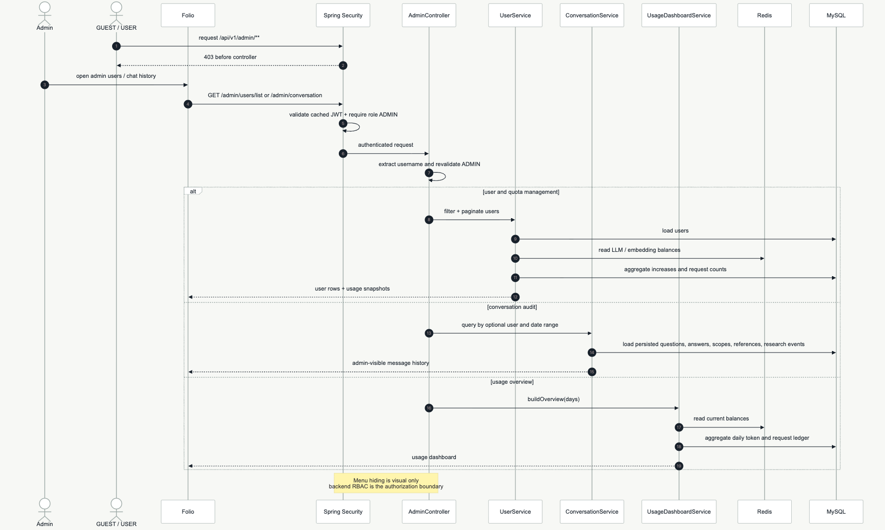

# Runtime Diagram Catalog

This page groups the implemented runtime paths by business workflow. These are sequence diagrams:
they show call order, ownership changes, persistence, and important failure branches. The broader
component boundaries remain in the [Architecture Overview](overview.md).

Each workflow links to its rendered PNG and scalable SVG.

## Account And Access

| Workflow | Diagram |
| --- | --- |
| Registration and invite-code consumption | [PNG](../../site/public/images/runtime-registration-invite.png) / [SVG](../../site/public/images/runtime-registration-invite.svg) |
| Login, token refresh, and logout | [PNG](../../site/public/images/runtime-account-session.png) / [SVG](../../site/public/images/runtime-account-session.svg) |
| Guest login and authorization | [PNG](../../site/public/images/runtime-guest-auth.png) / [SVG](../../site/public/images/runtime-guest-auth.svg) |
| Token top-up, reservation, and settlement | [PNG](../../site/public/images/runtime-token-accounting.png) / [SVG](../../site/public/images/runtime-token-accounting.svg) |

[](../../site/public/images/runtime-registration-invite.svg)

## Papers And Evidence

| Workflow | Diagram |
| --- | --- |
| Paper collection lifecycle | [PNG](../../site/public/images/runtime-paper-collections.png) / [SVG](../../site/public/images/runtime-paper-collections.svg) |
| Paper ingestion and indexing | [PNG](../../site/public/images/runtime-paper-ingestion.png) / [SVG](../../site/public/images/runtime-paper-ingestion.svg) |
| Retry, publication, retrieval rebuild, and deletion | [PNG](../../site/public/images/runtime-paper-operations.png) / [SVG](../../site/public/images/runtime-paper-operations.svg) |
| PDF evidence preview | [PNG](../../site/public/images/runtime-pdf-evidence.png) / [SVG](../../site/public/images/runtime-pdf-evidence.svg) |
| Reopen a persisted citation | [PNG](../../site/public/images/runtime-reference-reopen.png) / [SVG](../../site/public/images/runtime-reference-reopen.svg) |

[](../../site/public/images/runtime-paper-ingestion.svg)

## Conversation And Agent Execution

| Workflow | Diagram |
| --- | --- |
| Conversation sessions and immutable source scope | [PNG](../../site/public/images/runtime-conversation-scope.png) / [SVG](../../site/public/images/runtime-conversation-scope.svg) |
| Research chat | [PNG](../../site/public/images/runtime-research-chat.png) / [SVG](../../site/public/images/runtime-research-chat.svg) |
| Harness Agent loop | [PNG](../../site/public/images/runtime-agent-loop.png) / [SVG](../../site/public/images/runtime-agent-loop.svg) |
| Cancel | [PNG](../../site/public/images/runtime-cancel.png) / [SVG](../../site/public/images/runtime-cancel.svg) |
| Retry with MySQL recovery | [PNG](../../site/public/images/runtime-retry.png) / [SVG](../../site/public/images/runtime-retry.svg) |
| Generation status and reconnect recovery | [PNG](../../site/public/images/runtime-generation-recovery.png) / [SVG](../../site/public/images/runtime-generation-recovery.svg) |

[](../../site/public/images/runtime-agent-loop.svg)

## Administration

| Workflow | Diagram |
| --- | --- |
| Users, conversation audit, and usage overview | [PNG](../../site/public/images/runtime-admin-control.png) / [SVG](../../site/public/images/runtime-admin-control.svg) |

[](../../site/public/images/runtime-admin-control.svg)

## Diagram Sources

Mermaid sources live in [`site/diagrams/`](../../site/diagrams/). Render the PNG and SVG outputs with:

```bash
cd site
npm run diagrams:render
```
