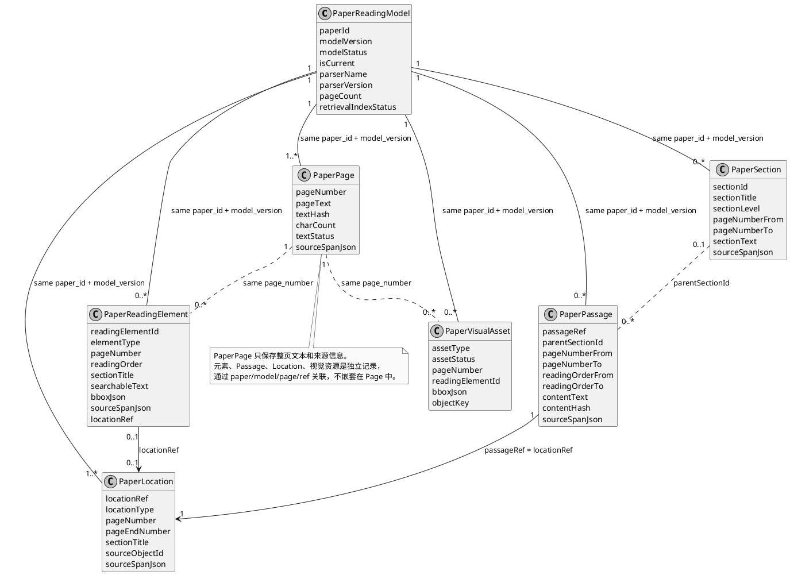

# PaperLoom-31 Automated Benchmark Proposal

日期：2026-08-09
状态：Proposal Final；Phase 1、Phase 2 已完成；正式 Snapshot SHA-256：
`6fcd796043523772c121217447da38d6fb53e1604f9ff71d482d404c585d1aa3`

## 1. 前提与目标

本方案采用以下不可变前提：

```text
MinerU Current Reading Model = 可信语料事实
```

因此，本 Benchmark **不评估 MinerU 是否正确还原原始 PDF**，也不进行人工 Evidence 标注、人工 Qrels 裁决或人工视觉
判断。它评估 MinerU 输出之后的产品链路：

```text
Reading Model -> Passage/Table/Figure -> Qdrant -> Exact Read
              -> Source Quote -> Citation -> Agent
```

固定语料是 `papers/` 中当前 31 份 PDF，Dataset ID 为 `paperloom-31-v1`。

不计算单一总分。固定分层为：

```text
L0  Corpus Readiness
G0  Access Gate
L1  Metadata Retrieval
L2  Evidence Retrieval + Exact Read
L3  Agent Execution
```

Retrieval 与 Agent 分开计分。

## 2. 形式化模型

定义 31 份 PDF：

```text
P = {p1, ..., p31}
```

产品处理：

```text
RM = MinerU(P)
```

其中 `RM` 表示数据库中的 Current `READING_MODEL_READY` Reading Model。

先从 Current Reading Model 导出候选，再构建 Target：

```text
C = ExportCurrentModelCandidates(RM)
T = BuildTargets(C, TargetPolicy)

|T| = 31
For every p in P: count(t in T where paper(t) = p) = 1
```

每个 Target 直接对应 MySQL 中一个 Evidence Location：

```text
Q(t) = {location_ref(t)}
```

`Q(t)` 是 L2 的 Qrel。`ExportCurrentModelCandidates` 和 `BuildTargets` 都不调用 Qdrant，因此：

```text
Q(t) != Search_Qdrant(t)
```

自动问题生成：

```text
query(t) = GenerateQuestion(content(t))
```

一次评测：

```text
Run = Evaluate(Snapshot, Product)
```

整个系统只保存三个逻辑对象：

```text
Benchmark Config -> Product Snapshot -> Run Result
```

### 2.1 Reading Model 的数据库组织

Reading Model 不是一个把所有内容嵌套在 `Page` 里的 JSON。它由多张通过 `paper_id`、`model_version`、页码和引用字段
关联的表组成：



从 Page 视角看，关联关系是：

```text
PaperPage(page_number = n)
  <- PaperReadingElement(page_number = n)
  <- PaperPassage(page_number_from <= n <= page_number_to)
  <- PaperSection(page_number_from <= n <= page_number_to)
  <- PaperLocation(page_number <= n <= page_end_number)
  <- PaperVisualAsset(page_number = n)
```

## 3. 三个数据对象

### 3.1 Benchmark Config

`benchmark.yaml` 受版本控制，只保存输入身份和自动化策略，不保存人工 Target：

```yaml
schema_version: paperloom-benchmark-config/v1
dataset_id: paperloom-31-v1

papers:
  - id: react_2022
    title: "ReAct: Synergizing Reasoning and Acting in Language Models"
    file: papers/23-ReAct.pdf
    source_pdf_sha256: "..."

target_policy:
  per_paper: 1
  passage_count: 22
  table_count: 6
  figure_count: 3

generation:
  provider: "..."
  model: "..."
  prompt_version: paperloom-query-generator-v3
  temperature: 0
  max_attempts: 5
```

PDF ID、文件名和 SHA-256 由命令自动扫描生成。Config 冻结每篇论文的规范标题，用于发现文件内容与预期论文不一致；它不保存
人工 quote、query、answer、Target 或 rubric。

### 3.2 Product Snapshot

`snapshot.json` 是某次 Current Reading Model 上自动生成并冻结的评测标准：

```json
{
  "schema_version": "paperloom-product-snapshot/v1",
  "dataset_id": "paperloom-31-v1",
  "config_sha256": "...",
  "papers": {
    "react_2022": {
      "product_paper_id": "...",
      "source_pdf_sha256": "...",
      "processing_status": "COMPLETED",
      "model_version": "...",
      "parser_identity": "...",
      "index_identity": "...",
      "publication_status": "PUBLISHED"
    }
  },
  "targets": {
    "target_react_01": {
      "paper": "react_2022",
      "location_ref": "passage_ref_...",
      "location_type": "PASSAGE",
      "page": 1,
      "content": "ReAct prompts LLMs to generate both verbal reasoning traces and actions...",
      "content_hash": "...",
      "source_span_hash": "...",
      "query": "ReAct 在执行任务时交替生成哪两类内容？",
      "expected_answer": "推理轨迹和动作",
      "answer_spans": ["reasoning traces", "actions"],
      "fact_keys": ["reasoning_traces", "actions"]
    }
  },
  "agent_cases": []
}
```

Snapshot 同时包含：

- `paper_id` 映射；
- Model、Parser、Index 身份；
- 自动选择的 Target 和 Qrels；
- 冻结的 L1/L2 Query；
- 自动生成的 12 个 Agent Case；
- Generator Model、Prompt 和参数身份。

Snapshot 生成完成后计算 SHA-256。后续 Run 只读，不覆盖。

### 3.3 Run Result

`run.json` 固定引用 `config_sha256` 和 `snapshot_sha256`，保存 L0/G0/L1/L2/L3 结果、技术错误、Provider 身份、
代码版本和 Agent Trace 索引。

## 4. 全自动 Snapshot 生成

### 4.1 产品导入

批量导入走真实产品路径：

```text
PDF -> Upload API -> merge -> Kafka -> MinerU API -> Reading Model
    -> Passage/Table/Figure -> Qdrant -> Index READY -> Publication
```

自动命令执行：

1. 扫描 31 份 PDF，生成并校验 Config Hash；
2. 使用管理员账户调用 Upload API；
3. 幂等重跑只复用同一管理员拥有、PDF Hash 相同的记录；
4. 等待处理、Current Model 和 Index 进入终态；
5. Parser 标题经 NFKC、大小写和标点归一化后必须与 Config 规范标题相同；
6. 成功论文自动发布；
7. 成功终态写入 Snapshot；失败则返回结构化 `PreparationError`，不生成 Snapshot。

不直接写 MySQL、MinIO、Kafka 或 Qdrant。

### 4.2 Target 候选

`ExportCurrentModelCandidates` 是只读 Java benchmark exporter。其形式化合同为：

```text
ExportCurrentModelCandidates:
  Input: 31 Current READY Reading Models
  Output: C = a list of LocationCandidate
  Side effects: none
  Qdrant calls: forbidden
```

每个候选的数据结构：

```text
LocationCandidate = {
  paper_key,
  product_paper_id,
  model_version,
  location_ref,
  location_type,
  page,
  content,
  content_hash,
  source_span,
  source_span_hash
}
```

Exporter 不重新实现 Reading Model 解析。它通过只读内部 Endpoint 复用
`ReadingModelQdrantIndexService.buildIndexedLocations()`，从其 payload 读取完整 `content_text`、`content_hash` 和
`source_span_json`。该方法从 MySQL Current Reading Model 枚举：

```text
PASSAGE: PaperPassage + PaperLocation
TABLE/FIGURE: PaperReadingElement + PaperLocation
```

候选资格函数定义为：

```text
Eligible(l) =
  CurrentReadyModel(l)
  AND content(l) is not empty
  AND page(l) is present
  AND source_span(l) is not empty
  AND if type(l) = PASSAGE then normalized_length(content(l)) >= 220
  AND section(l) is not References, Bibliography, or Checklist
  AND content(l) is not a bibliography-like fallback

C = {l exported from MySQL where Eligible(l) = true}
```

Exporter 只负责把 MySQL 事实转成候选列表，不选择 Target、不生成问题、不调用模型或 Qdrant。

### 4.3 确定性 Target 选择

`BuildTargets` 是 Snapshot Generator 中的纯函数，不是 Agent Tool，也不是线上业务接口。其形式化合同为：

```text
BuildTargets:
  Input:
    C = eligible LocationCandidate list
    TargetPolicy = {PASSAGE: 22, TABLE: 6, FIGURE: 3, per_paper: 1}
  Output:
    T = 31 BenchmarkTarget
  Failure:
    PreparationError
  Side effects: none
  Model calls: none
  Qdrant calls: forbidden
```

候选排序键：

```text
Rank(l) = (
  sha256(dataset_id | paper_key(l) | type(l) | page(l) | content_hash(l)),
  location_ref(l)
)
```

`FirstDistinctPaper(X, n)` 表示：按 `Rank` 升序遍历集合 `X`，每篇论文最多取一个，直到取得 `n` 个。

选择过程：

```text
F = FirstDistinctPaper({l in C where type(l) = FIGURE}, 3)

Tb = FirstDistinctPaper(
  {l in C where type(l) = TABLE and paper(l) not in papers(F)},
  6
)

RemainingPapers = P - papers(F) - papers(Tb)

Ps = {
  the lowest-Rank PASSAGE candidate of paper p
  for every p in RemainingPapers
}

SelectedLocations = F union Tb union Ps
T = {BuildTarget(l) for every l in SelectedLocations}
```

`BuildTarget` 只复制后续评测需要的字段：

```text
BuildTarget(l) = {
  target_id: "target_" + paper_key(l),
  paper: paper_key(l),
  location_ref: location_ref(l),
  location_type: type(l),
  page: page(l),
  content: content(l),
  content_hash: content_hash(l),
  source_span_hash: source_span_hash(l)
}
```

输出必须满足以下后置条件：

```text
count(T) = 31
count(T where type = PASSAGE) = 22
count(T where type = TABLE) = 6
count(T where type = FIGURE) = 3
for every p in P: count(t in T where paper(t) = p) = 1
for every t in T: Eligible(source_location(t)) = true
```

任一后置条件无法满足时返回 `PreparationError`，Snapshot 不生成；系统不人工换 Target，也不降低目标数量。

### 4.4 BuildTargets 的作用和下游

`BuildTargets` 的唯一职责是把大量 MinerU/MySQL Location 压缩为一组固定、可重复使用的评测坐标。它为四个下游行为
提供输入：

```text
BuildTargets(C, Policy)
  |
  +-> L0: 检查 31 个 Target 是否完整且可读
  |
  +-> GenerateQuestion: 使用 content(t) 生成并冻结 L2 Query
  |
  +-> L2: 使用 location_ref(t) 作为 Qrel，与 Qdrant Top-K 比较
  |
  +-> L3: 使用 target_id(t) 形成 Agent Case 的 required_target_ids
```

对应关系：

| Target 字段 | 下游用途 |
| --- | --- |
| `content` | 生成 Query、Expected Answer 和 Answer Spans |
| `location_ref` | L2 的唯一标准答案 Location |
| `target_id` | L3 Case 引用稳定 Target |
| `content_hash` | Exact Read 正文一致性校验 |
| `source_span_hash` | Exact Read Source Span 一致性校验 |
| `location_type/page` | Passage/Table/Figure 分类型报告 |

因此它不负责检索、回答或评分；它只在 Snapshot 准备阶段执行一次。Snapshot 冻结后，所有后续 Run 复用同一组 `T`，
不再次调用 `BuildTargets`。

### 4.5 Query 和 Answer 自动生成

固定 Generator 只接收目标正文和类型，不接收标题、作者或其他论文 Metadata。程序先把 MinerU 正文按换行拆为有序单元：

```text
Units(content) = [(u001, text1), (u002, text2), ..., (un, textn)]
```

Generator 输出：

```json
{
  "question": "...",
  "answer_unit_ids": ["u001"],
  "fact_keys": ["..."]
}
```

程序再做确定性映射：

```text
answer_spans = [text(unit_id) for unit_id in answer_unit_ids]
expected_answer = join(answer_spans)
```

因此 Expected Answer 和 Answer Spans 都直接来自 MinerU 原文，Generator 不能根据论文 Metadata 补充正文不存在的答案。

确定性校验：

1. `question`、`expected_answer` 和 `answer_spans` 非空，Question 必须包含中文；
2. 每个 `answer_span` 经 NFKC 和空白归一化后必须存在于 MinerU 正文；
3. Answer Spans 归一化后至少包含 40 个字符；
4. Question 不得包含 Location Ref、Product Paper ID 或完整正文；
5. Question 不得完整复制 expected answer；
6. Question 必须保留决定答案范围的限定词，例如附录、图表、示例/总体流程、数据集、阶段、模型、指标和条件，不得把局部事实泛化为全局设置；
7. 独立 Grounding Verifier 只查看 Question 和 Answer Spans；只有当原文直接、完整且无歧义地回答 Question，并且范围限定词没有丢失时才通过；
8. 失败最多重试 5 次，仍失败则 Snapshot 生成失败。

Generator 可能不是完全确定的，因此生成结果和 Generator 身份一起冻结。后续 Benchmark 不重新生成问题。

### 4.6 Agent Case 自动生成

Snapshot 自动生成 12 个 Case：

```text
6 single-paper cases，包含至少 1 Table 和 1 Figure
4 cross-paper comparison cases
1 follow-up case
1 missing-evidence control case
```

每个 Case 保存：

```text
question
history
expected_outcome
required_target_ids
expected_facts
citation_policy
```

Case 不再调用 Generator 自由创造 Target 之间的语义关系。生成规则是确定性的：

```text
Single(t):
  question = "请依据《" + title(t) + "》回答：" + query(t)

CrossPaper(a, b):
  question = "请分别依据《title(a)》和《title(b)》回答：\n"
             + "1. " + query(a) + "\n"
             + "2. " + query(b) + "\n"
             + "请分项回答并分别引用。"
  required_target_ids = [target_id(a), target_id(b)]

FollowUp(t):
  history = [User(query(t)), Assistant(expected_answer(t))]
  question = "请为刚才的结论提供对应论文中的原文证据，并保留引用。"
  required_target_ids = [target_id(t)]
```

四个 `cross-paper comparison` Case 的含义是一次请求必须分别完成两个论文问题，不额外推断两篇论文之间存在可比较关系。
Missing-evidence Control 使用固定不存在于 Corpus 的控制论文 ID，不依赖人工判断。

Snapshot 写入前执行一次 Validator，检查：31 个 Target 及 `22/6/3` 类型数量、12 个 Case、Required Target 存在、
Answer Span 属于对应 Target 正文、每篇 Metadata Query 非空，并且用户可见的 Case 文本不泄露内部 ID。

## 5. 分层评测

### L0：Corpus Readiness

由于无条件信任 MinerU，L0 只检查产品合同，不检查原 PDF 语义正确性：

```text
31 PDF hashes match Config
processing COMPLETED
Current Reading Model unique and READY
retrieval index READY
31 Targets generated
all Target content/source spans non-empty
all frozen queries passed validation
```

L0 报告 `configured=31`、`ready` 和结构化失败原因。

### G0：Access Gate

自动检查：

1. 管理员拥有导入记录；
2. 成功论文已全局发布；
3. 普通授权测试用户可以访问；
4. 排除一篇论文后，它不出现在 Paper Candidate、Evidence Candidate、Read 或 Citation 中。

G0 是硬 Gate，不进入 Retrieval 分数。

### L1：Metadata Retrieval

Metadata Query 直接使用 Config 中已冻结并通过 Product Parser 身份校验的规范标题。对 31 篇分别调用真实
`search_paper_candidates`，不传正确 Paper ID。

指标：

```text
Paper Recall@1/@3/@5
MRR
empty-result count
metadata-not-ready count
technical-error count
```

首版不做 Topic Discovery。

### L2：Evidence Retrieval + Exact Read

对每个 Target 使用 Snapshot 中冻结的 Query 和 oracle single-paper scope：

```text
search_paper_content -> Qdrant candidates -> read_paper_content(hit refs)
```

每个 Probe 使用同一个 `ReadingCorpusTools` 实例，保留 Search 返回的 Evidence Payload。

定义：

```text
Hit@K(t) = 1  if and only if  location_ref(t) is in TopK(t)
```

最终成功：

```text
L2Success@K(t) = Hit@K(t) AND ReadSuccess(t) AND SourceQuoteCreated(t)
```

指标：

```text
Target Recall@1/@3/@5/@10
MRR
candidate-hit/read-success
content-hash match
source-span-hash match
Source Quote created
per-type Passage/Table/Figure
technical-error count
```

Search miss、candidate-hit/read-fail、Hash mismatch 分开记录。

### L3：Agent Execution

12 个 Case 复用 `LiveResearchChatHarness` 和真实 Tool。Agent 获得完整 31 篇 scope 和 Case Question，但不获得 Target、
正确论文、Location、Qrels 或 Expected Answer。

对每个 Required Target 自动统计：

```text
paper_discovered -> target_returned -> target_read -> source_quote_cited
```

这四项是 Trace 诊断指标，用于解释 Agent 在哪里偏离冻结 Target；它们不作为 L3 硬 Gate。Exact `location_ref`
是否被召回和读取由 L2 负责。

确定性评分：

```text
tool technical success
scope isolation
answered/partial 时至少存在一个 Source Quote 引用
所有引用均可解析到本 Run Evidence Ledger
```

`structured outcome enum matches` 作为报告字段，只比较 `answered`、`partial`、`insufficient_evidence` 等结构化结果，不判断回答
事实是否正确，也不进入首版硬 Gate。

回答语义质量由固定 Judge Model 根据 Case、Expected Facts、Answer Spans 和实际引用正文自动评分。Judge 分数单独报告，
不进入权限、引用或 Exact Read 的硬 Gate。

每个 Case 首版只运行一次。首份 Baseline 跑通前不做 Best-of-N。

### 前端验收边界

前端 Evidence 渲染是发布验收，不是能力 Benchmark。Benchmark Runner 不调用 Playwright，也不把前端结果写入 Run 或
Internal Beta Gate。发布前另用一个真实 Source Quote 执行 Evidence 页面 smoke，验证引用能够打开且页面非空。

## 6. 运行产物

```text
research/benchmark/paperloom-31-v1/
  benchmark.yaml                                 # Git tracked

research/benchmark/local/snapshots/
  <snapshot-id>.json                             # immutable

research/benchmark/local/runs/<run-id>/
  run.json
  agent/<case-id>.json
  judge/<case-id>.json
```

`run.json` 至少包含：

```text
dataset_id
config_sha256
snapshot_sha256
code_revision
provider/model identity
generator/judge identity
L0/G0/L1/L2/L3 results
token and latency totals
technical errors
```

Provider 原始响应、论文正文和 Agent Trace 是本地敏感产物，不提交 Git。

## 7. Baseline 与 Internal Beta Gate

### 7.1 Baseline

Baseline 成立条件：

```text
Config and Snapshot hashes valid
31 paper states present
31 Targets and frozen queries present
12 Agent Cases present
L0/G0/L1/L2/L3 all executed
all technical failures have structured stage/code/detail
```

Baseline 允许 Retrieval miss、Agent partial 和较低 Judge 分数。它表示当前系统事实可复现，不表示全绿。

### 7.2 Internal Beta Gate

硬 Gate 只使用确定性结果：

```text
G0 passes
no Current Model/content-hash/source-span contract failure
no Agent technical failure
no scope leak
no answered/partial paper-content answer without citation
no fabricated or unresolvable citation
```

Judge 分数作为内容质量信号展示，不作为首版硬 Gate。

## 8. 可比较范围

同一个 `snapshot_sha256` 下，可以直接比较 Retrieval、Tool、Agent 和 Provider 修改。

MinerU 或 Reading Model 改变时生成新 Snapshot。由于本方案无条件信任 MinerU，新旧 Snapshot 的 Target 可能不同，因此首版
不对不同 Snapshot 做逐 Target 硬回归判断，只分别报告覆盖率和聚合结果。

## 9. 最小开发面

直接复用：

- Upload、Publication 和访问控制 API；
- MySQL Current Reading Model；
- `ReadingModelQdrantIndexService.buildIndexedLocations()`；
- `JavaCorpusGateway`、`ReadingCorpusTools`；
- `LiveResearchChatHarness`；
- 现有结构化 Generator/Judge 模型客户端。

只开发：

1. 在现有 Java Internal Corpus Controller 上增加一个按单篇论文导出 Current Model Candidate 的只读 Endpoint；
2. 一个 Python `paperloom31` 模块，提供 `prepare`、`snapshot`、`run` 三个操作，并直接计算简单的 Recall@K/MRR；
3. 在现有 Harness CLI 中接入这三个操作。

不开发：

- 人工 Target、人工 Qrels、人工 Review；
- MySQL Quote Resolver；
- Golden paper pack、Claim、Materializer 或 Resolved Manifest；
- Benchmark 数据库表、公开 API、消息队列或常驻服务；
- 新审核 UI、模型排行榜或无限重试。

只保留三个针对性检查：Config/Snapshot validator、Target selector/generator contract，以及一篇 PDF 的
Upload -> Snapshot -> L2 smoke。不复制完整测试矩阵。

## 10. 实施顺序

### Phase 1：自动准备语料

1. 扫描 31 份 PDF 并生成 Config；
2. 用一份 PDF 跑真实 Upload/MinerU/Index smoke；
3. 成功后导入并发布全部 31 篇。

### Phase 2：自动生成 Snapshot

1. 导出 Current Model Candidates；
2. 确定性选择 31 个 Target；
3. 自动生成并校验 L1/L2 Query；
4. 自动生成并校验 12 个 Agent Case；
5. 冻结 Snapshot Hash。

### Phase 3：建立 Baseline

1. 运行 L0/G0/L1/L2；
2. 运行 12 个 L3 Case 和自动 Judge；
3. 输出 Baseline 和 Internal Beta Gate。

发布前的 Evidence 页面 Playwright smoke 独立运行，不属于 Benchmark Phase。

## 11. 默认决策

1. MinerU Current Reading Model 是 Benchmark 的可信语料事实。
2. 不进行任何人工 Evidence 标注、裁决、视觉审核或回答审核。
3. Qrels 直接来自 MySQL 自动选择的 Location，不来自 Qdrant。
4. Query 和 Answer 由固定 Generator 生成；Agent Case 由固定布局函数组合；两者都经校验后冻结。
5. Retrieval 和 Agent 分开报告，不计算总分。
6. Judge 只提供内容质量信号，不参与首版硬 Gate。
7. 首版只比较同一 Snapshot 下的系统修改。
8. 先跑通一个自动 Baseline，再依据真实失败增加能力。
