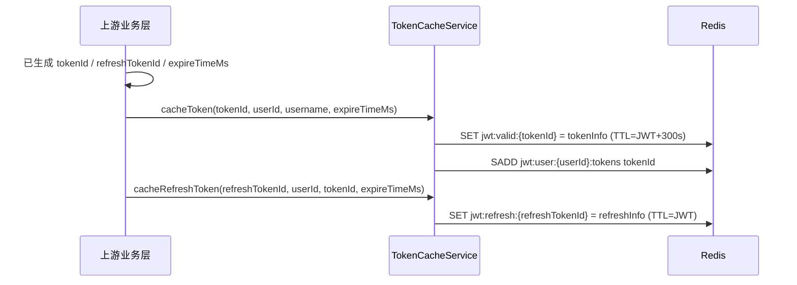
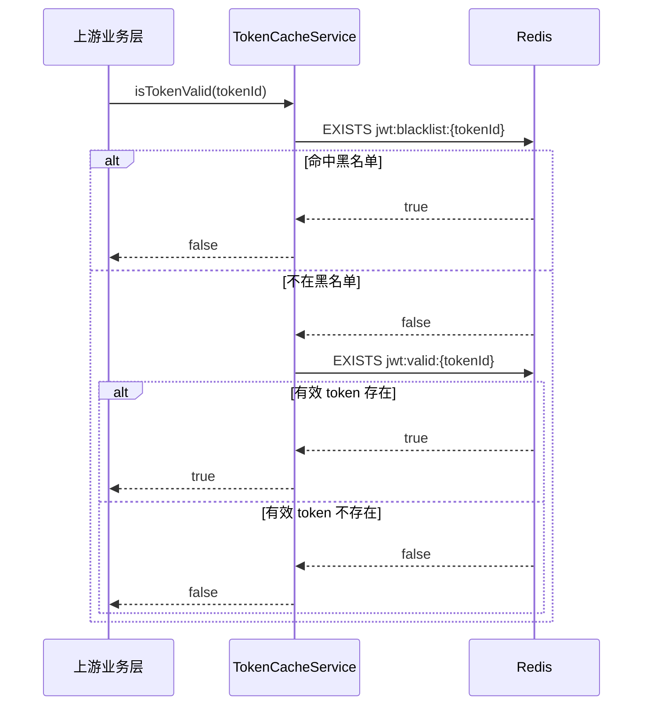
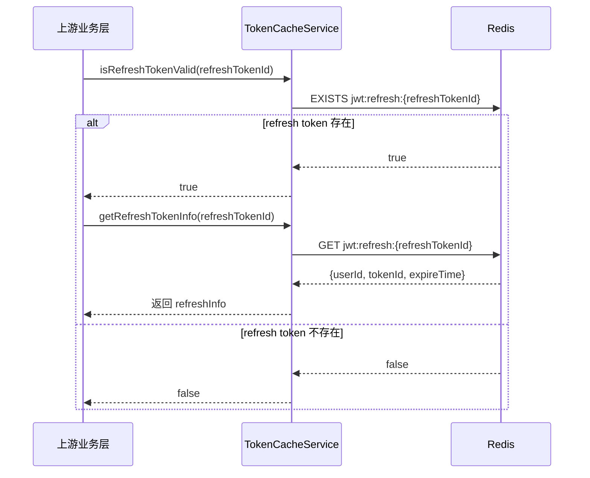
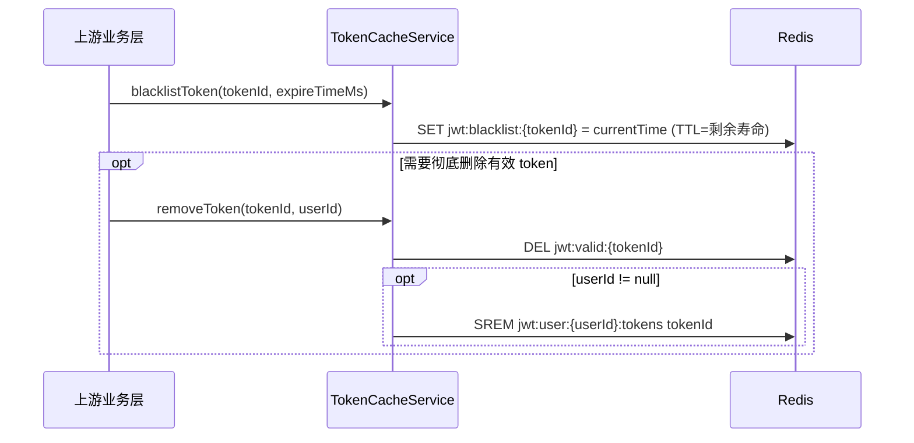
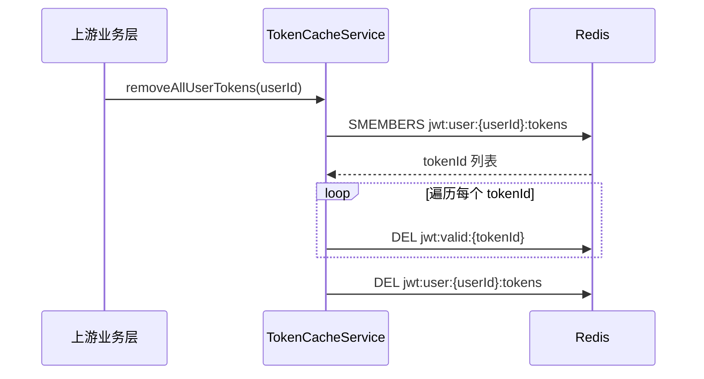

# JWT / Redis Token 管理时序图（严格贴合当前代码）

> 说明：本文档只基于 `src/main/java/com/yizhaoqi/smartpai/service/TokenCacheService.java` 的**现状**编写。  
> 只画**当前代码确实做了的事**，不把“可能存在于别的类里”的能力误写进来。

## 1. 当前类已经实现了什么

`TokenCacheService` 负责的是**JWT token 状态管理**，核心是把登录态、黑名单、用户 token 集合、refresh token 信息放进 Redis。

当前类直接提供的能力：

- `cacheToken(...)`：缓存有效 access token 信息
- `cacheRefreshToken(...)`：缓存 refresh token 信息
- `isTokenValid(...)`：校验 access token 是否有效
- `getTokenInfo(...)`：读取 access token 信息
- `isRefreshTokenValid(...)`：校验 refresh token 是否有效
- `getRefreshTokenInfo(...)`：读取 refresh token 信息
- `blacklistToken(...)`：将 token 加入黑名单
- `isTokenBlacklisted(...)`：校验 token 是否在黑名单中
- `removeToken(...)`：删除单个 token 缓存，并可从用户 token 集合移除
- `removeAllUserTokens(...)`：删除某个用户的所有有效 token
- `getUserActiveTokenCount(...)`：统计用户当前活跃 token 数量

---

## 2. 代码里没有画进去、且**当前类不实现**的东西

这些能力**不要画成 TokenCacheService 已经做了**：

- **Redis 事务**：当前类没有使用 Redis transaction
- **Redis SCAN**：当前类没有使用 scan / pattern 扫描
- **refresh token 自动换新 access token**：当前类只缓存和校验 refresh token，不负责“换新”
- **logout 时自动拉黑所有 token**：当前类的 `removeAllUserTokens(...)` 只会删除有效 token 和用户集合，不会自动把所有 token 放进黑名单
- **JWT 的生成逻辑本身**：`TokenCacheService` 不生成 JWT，只负责缓存/校验/删除状态

> 结论：本文档中的时序图只画“**TokenCacheService 实际支持的 Redis 状态变化**”。

---

## 3. 登录缓存（cacheToken / cacheRefreshToken）

> 这一步里，JWT / tokenId / refreshTokenId 的生成**不在本类**。  
> 图里只表示：上游业务层已经拿到了这些值，然后交给 `TokenCacheService` 缓存。

### Redis 状态变化
- 新增 `jwt:valid:{tokenId}`
- 新增 `jwt:user:{userId}:tokens`
- 新增 `jwt:refresh:{refreshTokenId}`

---

## 4. 接口访问校验（isTokenValid）

> 当前实现顺序固定：**先查黑名单，再查有效 token key 是否存在**。

### 业务含义
- 黑名单命中：直接判无效
- 有效 token 不存在：也判无效
- 两个条件都通过：才算有效

---

## 5. Refresh token 校验（isRefreshTokenValid / getRefreshTokenInfo）

> 这里**只做 refresh token 的存在性校验和信息读取**。  
> **不包含**“自动换新 access token”的逻辑。

### Redis 状态变化
- 这里只是读，不写
- 如果 key 存在，就返回对应 refresh 信息

---

## 6. 单个 token 失效（blacklistToken / removeToken）

> 当前类把“拉黑”和“删除”拆成了两个独立动作。  
> 上游业务层可以只做其中一个，也可以两个都做。

### 业务含义
- `blacklistToken(...)`：让 token **立刻不可再用**
- `removeToken(...)`：把有效 token 缓存**彻底删除**，并可从用户 token 集合中移除

> 注意：`removeToken(...)` **不会**自动写黑名单。

---

## 7. 退出所有设备（removeAllUserTokens）

> 当前实现只会：
> 1. 取出用户 token 集合  
> 2. 遍历删除每个 `jwt:valid:{tokenId}`  
> 3. 删除用户 token 集合  
> **不会自动拉黑这些 token**。

### 业务含义
- 用户所有设备上的有效 token 都被清掉
- 用户 token 集合也被清空
- 但这些 token **不一定**会进入黑名单

---

## 8. 补充：这些图和代码的边界

### 本文档已覆盖
- access token 缓存
- refresh token 缓存
- access token 有效性校验
- refresh token 有效性校验
- 单个 token 拉黑
- 单个 token 删除
- 用户所有 token 删除

### 本文档明确不覆盖
- Redis 事务
- Redis SCAN
- 自动 refresh 换新 access token
- logout 自动拉黑所有 token
- JWT 生成逻辑

---

## 9. 一句话总结

`TokenCacheService` 的职责不是“生成 JWT”，而是：

> **把 JWT 相关的状态放到 Redis 里，提供缓存、校验、拉黑、删除、统计这些能力。**

