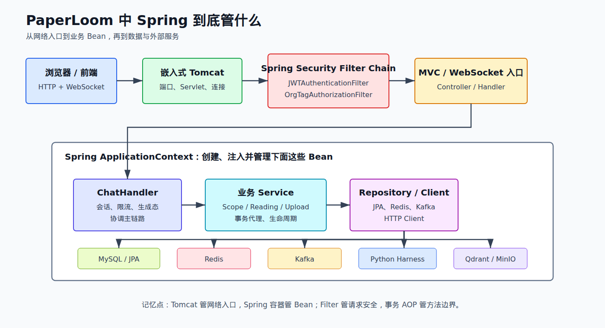
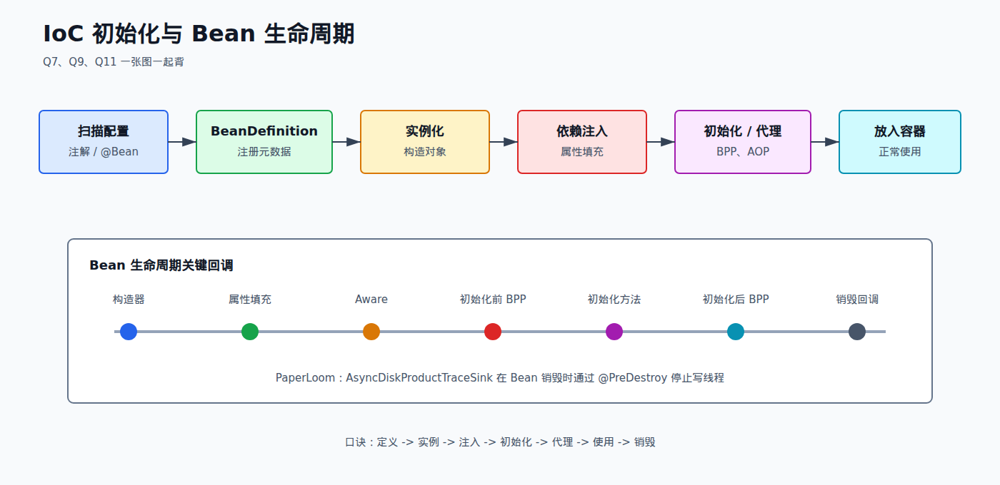
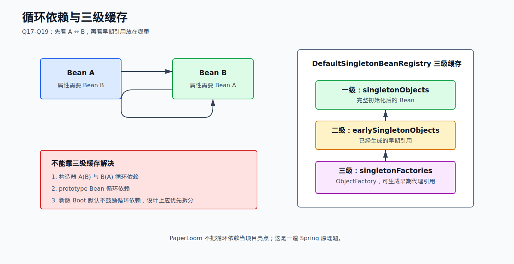
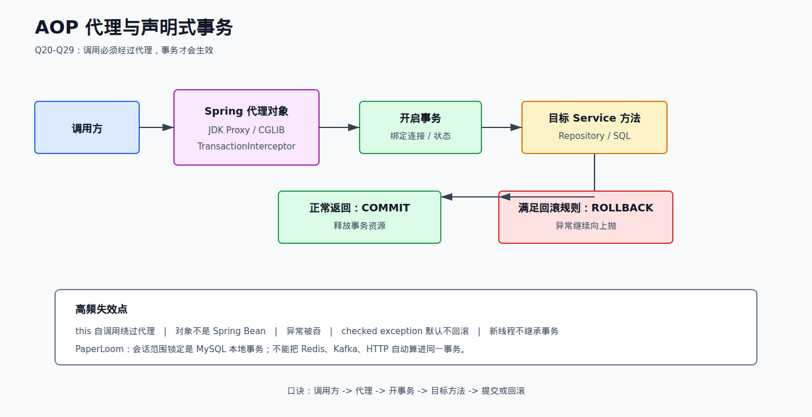
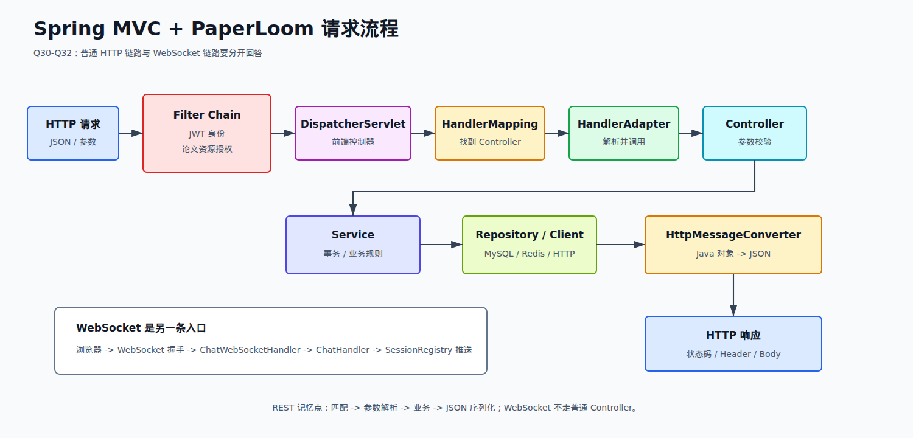
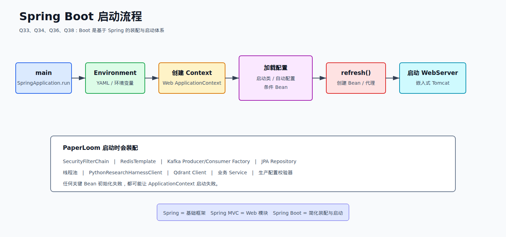

# 01 Spring 篇

来源：`面渣逆袭Spring篇V2.0亮白版.pdf`。

本册共 41 道主问题。我已经逐题过完，下面先给出取舍，再给出需要真正背下来的项目化答案。

## 41 题取舍表

| 题号 | PDF 页 | 原题 | 结论 | PaperLoom 对应点 |
| --- | ---: | --- | --- | --- |
| Q1 | 5 | Spring 是什么 | 必背 | Java 主服务就是 Spring Boot 应用 |
| Q2 | 12 | Spring 有哪些模块 | 必背 | Core、Context、AOP、MVC、Data、Security、Test 均有使用 |
| Q3 | 16 | Spring 常用注解 | 必背 | `@Service`、`@Bean`、`@Transactional`、`@Value` 等 |
| Q4 | 22 | Spring 使用了哪些设计模式 | 必背 | 工厂、单例、代理、模板方法、观察者 |
| Q5 | 29 | Spring 容器和 Web 容器区别 | 选背 | Spring 管 Bean，嵌入式 Tomcat 处理 HTTP/Servlet |
| Q6 | 31 | 什么是 IoC | 必背 | 所有 Service/Repository/Client 由容器装配 |
| Q7 | 37 | IoC 的实现机制 | 必背 | BeanDefinition、反射、依赖注入、后置处理器 |
| Q8 | 46 | BeanFactory 和 ApplicationContext 区别 | 必背 | Boot 启动创建 ApplicationContext |
| Q9 | 50 | 项目启动时 IoC 做什么 | 必背 | 扫描、注册、实例化、注入、代理、初始化 |
| Q10 | 53 | 如何理解 Bean | 选背 | Spring 管理的对象及其元数据和生命周期 |
| Q11 | 57 | Bean 生命周期 | 必背 | TraceSink 的后台线程与 `@PreDestroy` |
| Q12 | 65 | 为什么不推荐 `@Autowired` 字段注入 | 必背 | 新代码偏构造器注入，旧代码仍有字段注入 |
| Q13 | 69 | `@Autowired` 实现原理 | 选背 | BeanPostProcessor、按类型解析、候选选择 |
| Q14 | 69 | 什么是自动装配 | 选背 | 容器根据依赖类型和限定符完成装配 |
| Q15 | 71 | Bean 作用域 | 必背 | Service 默认 singleton；请求状态不能放共享字段 |
| Q16 | 74 | 单例 Bean 线程安全 | 必背 | CHM/COW List/局部变量/Session 级同步 |
| Q17 | 78 | 什么是循环依赖 | 必背高频 | 当前项目不应拿真实业务依赖硬举例 |
| Q18 | 79 | Spring 如何解决循环依赖 | 必背高频 | 三级缓存解决部分 singleton setter/field 循环依赖 |
| Q19 | 86 | 为什么需要三级缓存 | 必背高频 | 第三级保存 ObjectFactory，便于提前生成代理引用 |
| Q20 | 92 | 什么是 AOP | 必背 | 声明式事务；Filter/Interceptor 需与 AOP 区分 |
| Q21 | 107 | AOP 应用场景 | 必背 | 事务、日志、权限、监控 |
| Q22 | 112 | Spring AOP 和 AspectJ 区别 | 选背 | 运行时代理与编译期/加载期织入 |
| Q23 | 112 | AOP 和反射区别 | 选背 | AOP 是编程思想/增强机制，反射是运行时能力 |
| Q24 | 112 | JDK 代理和 CGLIB 区别 | 必背 | `@Transactional` 失效追问入口 |
| Q25 | 121 | 如何理解 Spring 事务 | 必背 | 会话范围锁定、引用持久化、状态更新 |
| Q26 | 123 | 声明式事务原理 | 必背 | 代理 + TransactionInterceptor + 事务管理器 |
| Q27 | 126 | `@Transactional` 失效 | 必背 | 自调用、异常、线程、Bean 管理、方法可见性 |
| Q28 | 129 | 事务隔离级别 | 必背 | 对应 MySQL 隔离和并发读写问题 |
| Q29 | 130 | 事务传播机制 | 必背 | 项目存在 `NOT_SUPPORTED` 精确读取路径 |
| Q30 | 136 | Spring MVC 核心组件 | 必背 | DispatcherServlet、Mapping、Adapter、Converter |
| Q31 | 139 | Spring MVC 工作流程 | 必背 | Filter -> Controller -> Service -> Response |
| Q32 | 143 | RESTful 接口流程 | 选背 | Controller 映射、参数绑定、JSON 转换 |
| Q33 | 145 | 介绍 Spring Boot | 必背 | starter、自动配置、嵌入式容器、外部配置 |
| Q34 | 147 | Spring Boot 自动装配 | 必背 | 条件装配与项目自定义 Config Bean |
| Q35 | 151 | 自定义 Starter | 了解 | 当前项目未自定义 Starter，不挂项目经验 |
| Q36 | 155 | Spring Boot 启动原理 | 必背 | Environment、Context、refresh、WebServer、Runner |
| Q37 | 160 | Spring Boot 和 Spring MVC 区别 | 选背 | Boot 简化应用装配；MVC 专注 Web 请求 |
| Q38 | 160 | Spring Boot 和 Spring 区别 | 必背 | Boot 基于 Spring，不是替代 Spring |
| Q39 | 161 | Spring Cloud | 只背概念 | 项目没有 Nacos/Gateway/Feign/Seata，禁止硬挂 |
| Q40 | 165 | SpringTask | 了解 | 项目异步 PDF 处理使用 Kafka，不是 SpringTask |
| Q41 | 167 | Spring Cache | 选背 | 项目手写 Redis 操作，没有使用 Spring Cache 注解 |

## 第一轮必须拿下

先背 Q1-Q4、Q6-Q9、Q11-Q16、Q20-Q21、Q24-Q31、Q33-Q34、Q36、Q38。Q17-Q19 是大厂高频原理题，
但回答时只讲 Spring 原理，不要虚构 PaperLoom 存在循环依赖。

## Q1：Spring 是什么？

**书中 30 秒答案：**Spring 是 Java 企业开发框架，核心是 IoC 和 AOP。IoC 负责对象创建、依赖关系和生命周期；
AOP 负责把事务、日志、权限等横切逻辑统一处理。Spring 生态还包括 MVC、Data、Security、Boot 等模块。

**项目化回答：**

> PaperLoom 的 Java 主服务基于 Spring Boot 3.4.2。IOC 管理 Controller、Service、Repository、Redis、Kafka 和
> HTTP Client 的依赖；Spring MVC 提供 REST 接口；Spring Security 处理 JWT 认证和资源授权；Spring Data JPA
> 管理 MySQL；事务代理保护会话范围和持久化状态。

依据：`../../pom.xml`、`../../src/main/java/io/github/chzarles/paperloom/config/`。

## Q2：Spring 有哪些模块？

**按项目背，不背全家桶：**

- Core/Beans/Context：IoC、Bean 和 ApplicationContext。
- AOP/Tx：代理和声明式事务。
- Web/WebMVC：HTTP Controller、参数绑定、JSON 响应。
- Data JPA/ORM：实体、Repository 和事务集成。
- Security：Filter Chain、认证与角色授权。
- Test：Spring Boot 集成测试。

WebFlux Starter 虽然在依赖中用于 `WebClient`，但项目主服务仍是 Spring MVC，不要说成全栈响应式系统。

## Q3：Spring 常用注解

按功能背：

- Bean：`@Component`、`@Service`、`@Repository`、`@Controller`、`@RestController`。
- 注入：`@Autowired`、`@Qualifier`、构造器注入。
- 配置：`@Configuration`、`@Bean`、`@Value`、`@ConfigurationProperties`。
- Web：`@RequestMapping`、`@GetMapping`、`@PostMapping`、`@RequestBody`、`@PathVariable`。
- 事务：`@Transactional`。
- 生命周期：`@PostConstruct`、`@PreDestroy`。
- Kafka：`@KafkaListener`。

项目例子：`AsyncExecutorConfig` 用 `@Bean(name = "chatMonitorExecutor")` 创建线程池，`ChatHandler` 用
`@Qualifier` 指定注入；`PaperProcessingConsumer` 用 `@KafkaListener` 消费论文任务。

## Q4：Spring 使用了哪些设计模式？

- 工厂模式：BeanFactory/ApplicationContext 创建和获取 Bean。
- 单例模式：默认 singleton Scope，但这是容器级单例。
- 代理模式：AOP 和声明式事务。
- 模板方法：JdbcTemplate 等固定流程、开放局部步骤。
- 观察者模式：ApplicationEvent 和 Listener。
- 适配器模式：Spring MVC 的 HandlerAdapter。

项目最适合讲代理模式：`@Transactional` 方法实际通过代理调用，在目标方法前后加入事务逻辑。

**书中易错点纠正：**Spring 保存单例 Bean 的注册表使用并发结构，只能说明容器取 Bean 的过程可并发，不能推出
Bean 内部业务状态自动线程安全。

## Q5：Spring 容器和 Web 容器的区别

Spring 容器负责 Bean 的创建、依赖和生命周期；Web/Servlet 容器负责监听端口、处理 HTTP、管理 Servlet。Spring Boot
启动嵌入式 Tomcat 后，Tomcat 把请求交给 DispatcherServlet，DispatcherServlet 再从 Spring 容器找到 Controller。

PaperLoom 默认后端端口是 8081，WebSocket 也由嵌入式 Web 容器接收，但业务 Handler 和 Service 仍由 Spring 管理。

## Q6：说一说什么是 IoC？

**书中核心：**IoC 是控制反转，对象的创建和依赖关系不再由对象自己控制，而是交给 Spring 容器。
DI 是 IoC 的一种实现方式，容器在创建 Bean 时把依赖注入进去。

**结合项目：**

> PaperLoom 的 `ChatHandler` 依赖 Redis、限流服务、会话服务、Python Harness Client 和线程池，
> 这些依赖都由 Spring 容器装配，业务类不自己 new。这样对象生命周期、配置替换和测试替身都能由容器管理。

代码：`../../src/main/java/io/github/chzarles/paperloom/service/ChatHandler.java`。

## Q7：IoC 的实现机制是什么？

**书中核心：**读取配置和注解，解析为 BeanDefinition；实例化 Bean；进行属性填充；执行 BeanPostProcessor；
完成初始化后放入容器。底层会用到工厂模式、反射和依赖注入。

**项目追问：**Spring 扫描 `@Service`、`@Configuration`、`@Bean`，再把 `chatMonitorExecutor` 按名称注入
`ChatHandler`。这里还能追问 `@Qualifier` 的作用。

## Q8：BeanFactory 和 ApplicationContext 的区别

BeanFactory 是最基础的 IoC 容器接口，提供 Bean 获取和依赖管理；ApplicationContext 在此基础上增加事件、资源加载、
国际化、环境配置，并自动注册常见后置处理器。Spring Boot 正常启动得到的是 ApplicationContext。

## Q9：项目启动时 IoC 会做什么？

扫描或读取配置 -> 注册 BeanDefinition -> 准备 BeanFactory -> 注册 BeanPostProcessor -> 实例化非懒加载单例 ->
依赖注入 -> 初始化和代理 -> 发布 Context 刷新完成事件。

项目启动时还会创建 SecurityFilterChain、Kafka Topic Bean、RedisTemplate、线程池和业务 Service。不要把这些说成
`main` 方法手动调用，它们由 Context Refresh 触发装配。

## Q10：如何理解 Bean？

Bean 是由 Spring 容器管理的对象，容器同时掌握它的名称、类型、作用域、依赖、初始化和销毁信息。普通 `new` 出来的
对象不是 Spring Bean，`@Transactional`、`@Autowired` 等容器能力也不会自动生效。

## Q11：Bean 的生命周期

**背诵顺序：**实例化 -> 属性填充 -> Aware 回调 -> 初始化前置处理 -> 初始化方法 -> 初始化后置处理/生成代理
-> 正常使用 -> 销毁回调。

**结合项目：**`AsyncDiskProductTraceSink` 创建后台写线程，并通过 `@PreDestroy` 在 Spring 容器关闭时停止接收、
等待线程退出，超时后 `shutdownNow`。这就是 Bean 生命周期管理的实际用途。

代码：`../../src/main/java/io/github/chzarles/paperloom/service/AsyncDiskProductTraceSink.java`。

## Q12：为什么不推荐字段注入？

**书中核心：**构造器注入依赖更明确，有利于不可变对象、单元测试和启动时发现循环依赖；字段注入隐藏依赖，
测试时也不方便直接构造。

**项目实话：**仓库里新代码大量使用构造器注入，但部分旧类仍有 `@Autowired` 字段注入。面试时可以说“我更倾向
构造器注入，项目也在逐步统一”，不能说已经全部改完。

## Q13：`@Autowired` 的实现原理

`AutowiredAnnotationBeanPostProcessor` 解析字段、构造器和方法上的注入点，生成 InjectionMetadata；Bean 属性填充阶段，
BeanFactory 根据类型查找候选 Bean，再结合 `@Qualifier`、`@Primary` 和名称消除歧义，最后通过反射或构造器完成注入。

## Q14：什么是自动装配？

自动装配是容器根据依赖声明自动选择 Bean 并注入。它和 Spring Boot 自动配置不是一回事：自动装配解决 Bean 之间如何
连接；自动配置解决在满足条件时由 Boot 提供哪些 Bean。

## Q15：Bean 的作用域

重点：singleton、prototype、request、session、application、websocket。普通 Service 默认 singleton；每次请求变化的
数据不能保存在 singleton 成员字段中。PaperLoom 把会话和任务状态放入 ConcurrentMap、Redis 或数据库，而不是把
“当前用户”放在 Service 字段里。

## Q16：Spring 单例 Bean 有线程安全问题吗？

**书中核心：**单例只表示容器中通常只有一个实例，不代表自动线程安全。无状态 Bean 一般安全；如果有共享可变
成员变量，就需要并发容器、锁、原子类或线程隔离。

**结合项目：**

- `PythonResearchHarnessClient.activeRequests` 使用 `ConcurrentHashMap`；
- `ChatSessionRegistry.sessions` 使用 `ConcurrentHashMap`；
- 大部分请求数据保存在方法局部变量里，避免共享。

## Q17-Q19：循环依赖和三级缓存

循环依赖是 A 依赖 B、B 又依赖 A。Spring 经典三级缓存用于部分 singleton 的 setter/field 循环依赖：

1. 一级 `singletonObjects`：完整初始化的 Bean。
2. 二级 `earlySingletonObjects`：提前暴露的早期 Bean 引用。
3. 三级 `singletonFactories`：产生早期引用的 ObjectFactory，可在需要时返回代理引用。

需要三级而不是直接把原对象放二级缓存，是为了在 AOP 场景下让其他 Bean 尽可能拿到与最终一致的代理引用。

**限制必须背：**构造器循环依赖无法靠提前暴露解决；prototype 循环依赖不能这样解决；Spring Boot 新版本默认也不鼓励
循环依赖。PaperLoom 不把循环依赖作为设计能力，发现后应优先拆职责或引入事件/中间层。

## Q20：什么是 AOP？

**书中核心：**AOP 把日志、事务、权限等横切逻辑从业务代码中抽离，通过切点和通知统一织入。

**结合项目：**Spring 的 `@Transactional` 通过代理和事务拦截器织入；HTTP 认证和资源授权则放在 Filter Chain。
面试时要区分：Filter 处理 Servlet 请求链，事务 AOP 处理 Spring Bean 方法调用。

## Q21：AOP 的应用场景

书中高频场景：日志、权限、事务、监控、缓存。项目最确定的是声明式事务；日志还有 `LoggingInterceptor` 和 Filter。
不要为了套 AOP 把所有 Filter、Interceptor 都说成切面，它们只是解决相似的横切问题，执行机制不同。

## Q22：Spring AOP 和 AspectJ 的区别

Spring AOP 主要基于运行时代理，只增强 Spring Bean 的方法调用，接入简单；AspectJ 可在编译期或类加载期织入，能力更强，
能处理构造器、字段等连接点，但工具链更复杂。项目使用的是 Spring 代理机制，没有使用 AspectJ 编织。

## Q23：AOP 和反射的区别

AOP 是分离横切关注点的设计思想和增强机制；反射是运行时读取和操作类、方法、字段的底层能力。动态代理可能使用反射，
但两者不是同一概念。

## Q24：JDK 动态代理和 CGLIB 的区别

**书中核心：**JDK 动态代理基于接口；CGLIB 通过生成目标类子类实现代理，`final` 类或方法不能被覆盖。两者都要求
调用经过代理对象。

**高频追问：**为什么同类内部调用会导致事务失效？因为 `this.xxx()` 没有经过 Spring 代理。

## Q25-Q26：如何理解 Spring 事务？声明式事务原理是什么？

**书中核心：**声明式事务通过 AOP 代理，在方法执行前开启事务，正常结束提交，满足回滚条件时回滚。

**结合项目：**`ConversationScopeService.lockForFirstMessage` 在事务内读取并悲观锁定会话行，然后校验和冻结论文
范围。这样两个并发首条消息不会分别写出两套范围。

代码：`ConversationScopeService`、`ConversationSessionRepository.findByConversationIdAndUserIdForUpdate`。

**边界：**Spring 本地事务只覆盖当前数据库事务，不能自动把 Redis、Kafka、HTTP 调用纳入同一个原子事务。

## Q27：`@Transactional` 哪些情况下会失效？

必须背：

1. 同类内部自调用，没有经过代理。
2. 方法或类不由 Spring 管理。
3. 非 public、final 等导致代理无法正确增强。
4. 异常被 catch 后吞掉。
5. 默认情况下 checked exception 不回滚。
6. 新线程不继承原线程事务。
7. 使用了错误的事务管理器。

## Q28：Spring 事务隔离级别

`DEFAULT` 使用数据库默认级别；另外对应读未提交、读已提交、可重复读、串行化。PaperLoom 使用 MySQL/InnoDB，
但面试时不要在没有检查线上配置的情况下断言所有事务一定是某个隔离级别。

## Q29：事务传播机制

重点背 `REQUIRED`、`REQUIRES_NEW`、`SUPPORTS`、`NOT_SUPPORTED`、`MANDATORY`、`NEVER`、`NESTED`。

项目里 `ProductReadingLocationReadService` 使用 `NOT_SUPPORTED`，说明有些精确读取不需要把外部或较长流程包在事务里，
避免无意义地占用连接和持锁。

## Q30：Spring MVC 的核心组件

- DispatcherServlet：前端控制器。
- HandlerMapping：找到处理方法。
- HandlerAdapter：适配并调用 Handler。
- HandlerMethodArgumentResolver：解析参数。
- HttpMessageConverter：JSON 与 Java 对象转换。
- HandlerExceptionResolver：异常处理。
- ViewResolver：传统页面视图解析；REST 接口通常直接写响应体。

## Q31：Spring MVC 工作流程

请求 -> Filter -> `DispatcherServlet` -> HandlerMapping -> Controller -> Service -> 返回值处理器/消息转换器 -> 响应。

结合项目：JWT Filter 先解析身份，论文授权 Filter 再校验资源，Controller 才进入业务服务。WebSocket 则进入独立的
`ChatWebSocketHandler`，不是普通 MVC Controller 链路。

## Q32：RESTful 接口流程

HTTP 方法和 URL 匹配 Controller -> 参数解析与校验 -> JSON 反序列化 -> Service/Repository -> 返回对象 -> Jackson
序列化为 JSON -> 状态码和响应头写回。项目内部 Corpus API 还使用独立内部 Token，不能因为路径 permitAll 就说没有
认证，认证逻辑在该内部接口自己的边界中。

## Q33：介绍 Spring Boot

Spring Boot 基于 Spring，通过 Starter、自动配置、嵌入式 Web 容器、外部化配置和 Actuator 思路简化应用开发与部署。
PaperLoom 可以直接打包成可执行 JAR，基础设施地址、密钥和限流参数从环境变量/YAML 读取。

## Q34：Spring Boot 自动装配原理

**书中核心：**Spring Boot 根据 classpath、配置属性和已有 Bean，通过条件注解加载自动配置。Starter 负责依赖组合，
自动配置负责提供默认 Bean，用户自己的 Bean 可以覆盖默认实现。

**结合项目：**引入 Web、Security、JPA、Redis、Kafka、WebSocket Starter 后，相应基础设施由 Boot 自动配置；项目再
通过 `RedisConfig`、`KafkaConfig`、`SecurityConfig` 提供定制。

## Q35：如何自定义 Starter？

了解即可：拆出自动配置模块，提供配置属性类和条件 Bean，通过自动配置 imports 注册，再提供 Starter 聚合依赖。
PaperLoom 没有自定义 Starter，面试只讲原理，不能说做过。

## Q36：Spring Boot 启动原理

创建 SpringApplication -> 准备 Environment -> 创建 ApplicationContext -> 加载启动类和配置 -> `refresh()` -> 创建
非懒加载 Bean 和代理 -> 启动嵌入式 WebServer -> 执行 Runner -> 发布启动完成事件。

PaperLoom 启动期间还会执行生产配置校验、初始化器和 Qdrant/论文相关准备逻辑；如果这些 Bean 初始化失败，Context
可能启动失败。

## Q37-Q38：Spring、Spring MVC、Spring Boot 的区别

Spring 是基础框架，核心是 IoC/AOP；Spring MVC 是 Spring 的 Web 模块；Spring Boot 是基于 Spring 的应用脚手架和
约定体系，用 Starter、自动配置和嵌入式容器减少配置。三者不是互相替代关系。

## Q41：Spring Cache

Spring Cache 是缓存抽象，常用 `@Cacheable`、`@CacheEvict`、`@CachePut`，底层通过 AOP、CacheManager 和具体 Cache
实现工作。Redis 是一种具体存储。

**项目边界：**PaperLoom 当前直接使用 RedisTemplate/StringRedisTemplate 实现限流、Bitmap 和生成态，没有启用
`@EnableCaching` 或 Spring Cache 注解。可以讲区别，不能说项目已经使用 Spring Cache。

## 不要乱说

- 不要说单例 Bean 天生线程安全。
- 不要说 `@Transactional` 是分布式事务。
- 不要说项目已经完全使用构造器注入。
- Spring Cloud、Seata、Spring Cache 不是当前主链路，不要包装成项目亮点。
