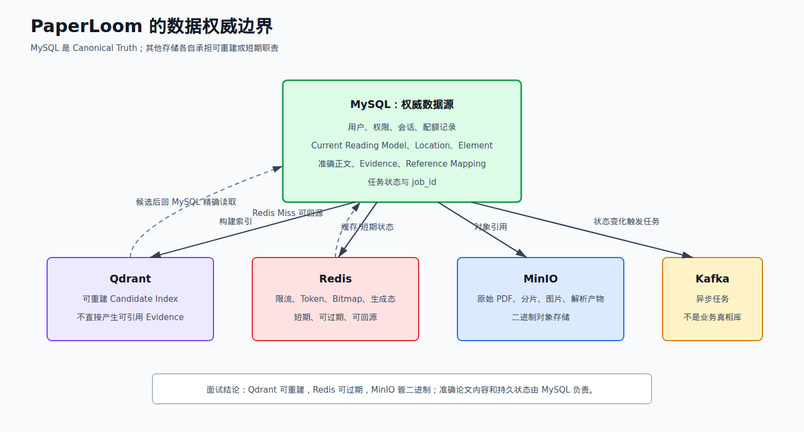
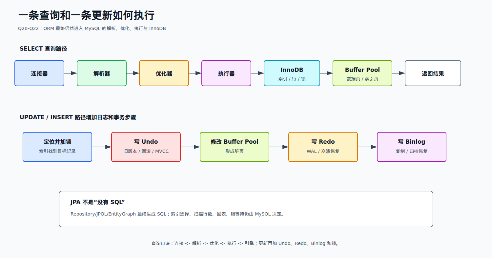
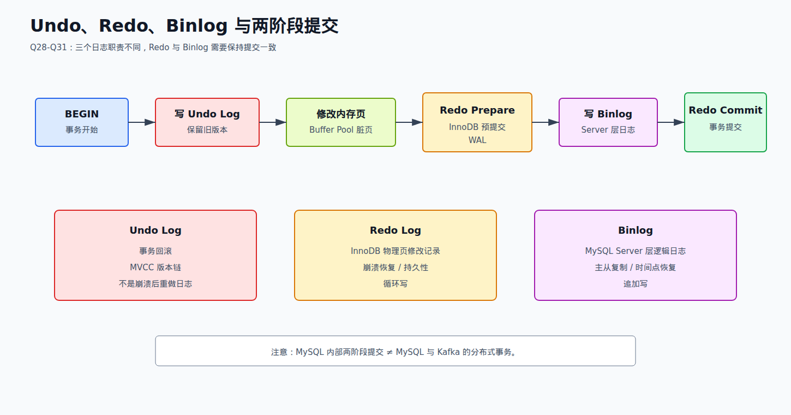
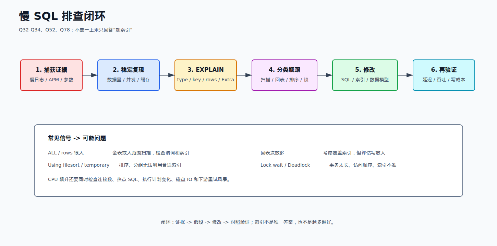
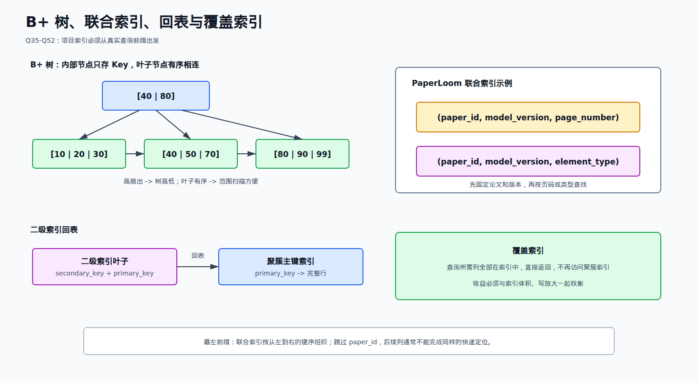
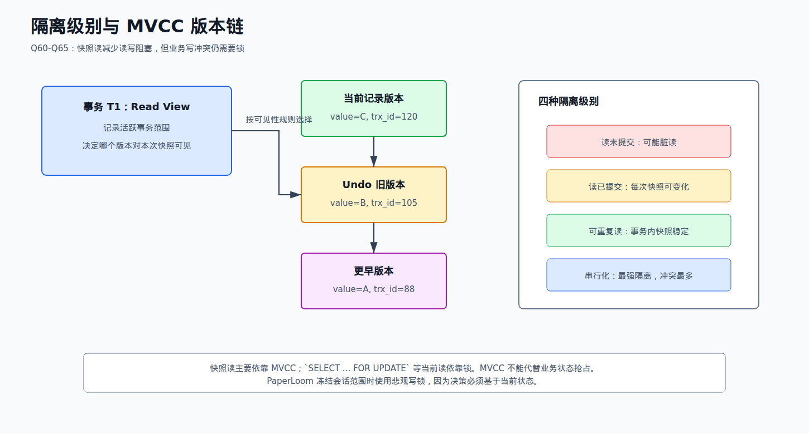
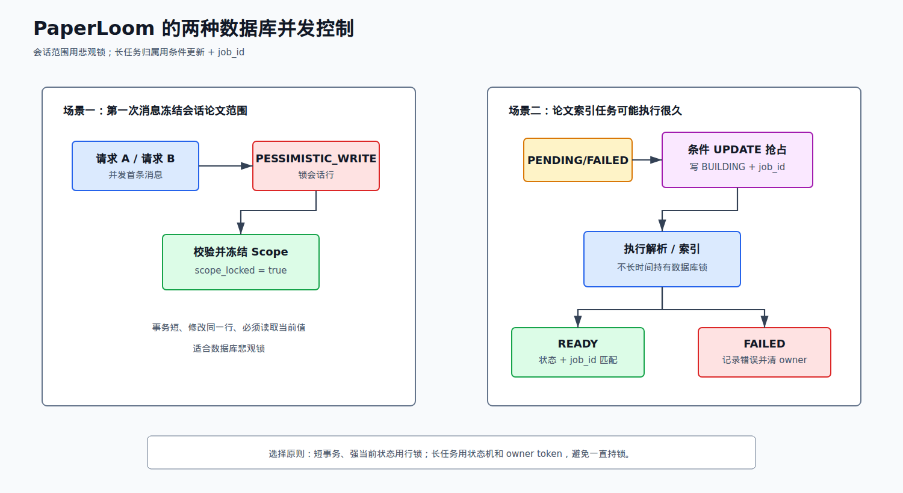

# 02 MySQL 篇

来源：`面渣逆袭MySQL篇V2.2.pdf`。

本册共 Q0-Q83。PaperLoom 中 MySQL 保存用户、权限、论文 Reading Model、会话、引用和任务状态，还是 Qdrant 精确
读取的权威来源，因此这是项目追问优先级最高的分册之一。



## Q0-Q19：SQL 与字段基础取舍

| 题号 | PDF 页 | 原题 | 结论 | 项目联系 |
| --- | ---: | --- | --- | --- |
| Q0 | 5 | 什么是 MySQL | 必背 | 项目主关系数据库，InnoDB + JPA |
| Q1 | 6 | 两张表如何连接 | 选背 | Repository 的关联查询、JPQL |
| Q2 | 8 | 内连接、左连接、右连接 | 必背基础 | 权限、集合、会话数据组合时会追问 |
| Q3 | 10 | 三大范式 | 选背 | Reading Model 使用规范化表拆分页面、章节、元素、位置 |
| Q4 | 13 | varchar 与 char | 必背基础 | paper_id、model_version、status 等字段设计 |
| Q5 | 13 | blob 和 text | 了解 | PDF 二进制放 MinIO，长文本放 MySQL Text 字段 |
| Q6 | 14 | DATETIME 和 TIMESTAMP | 选背 | 任务、会话和索引时间字段 |
| Q7 | 15 | in 和 exists | 选背 | 多论文范围查询时需要理解执行计划 |
| Q8 | 16 | 货币用什么类型 | 必背基础 | 金额用整数最小单位或 DECIMAL，不能用 float/double |
| Q9 | 16 | 如何存储 emoji | 选背 | 论文标题、聊天内容可能含 emoji，应使用 utf8mb4 |
| Q10 | 17 | drop/delete/truncate | 必背基础 | 运维与数据清理题 |
| Q11 | 18 | UNION 与 UNION ALL | 选背 | 去重成本与执行计划 |
| Q12 | 18 | count(1)、count(*)、count(列) | 必背基础 | `count(列)` 不统计 NULL |
| Q13 | 22 | SQL 执行顺序 | 必背 | 写复杂筛选、聚合、排序必须清楚 |
| Q14 | 24 | MySQL 常用命令 | 了解 | 面试速查，不挂项目亮点 |
| Q15 | 26 | bin 目录工具 | 了解 | mysqld、mysql、mysqldump 等 |
| Q16 | 26 | 第 3-10 条记录 | 了解 | `LIMIT offset, size` 基础 |
| Q17 | 27 | MySQL 函数 | 了解 | 不需背大量函数 |
| Q18 | 29 | 隐式类型转换 | 必背 | 会导致结果异常或索引失效 |
| Q19 | 30 | SQL 语法树解析 | 了解原理 | 解析器产生语法树，优化器基于逻辑结构生成计划 |

## Q20-Q31：架构、存储引擎与日志取舍

| 题号 | PDF 页 | 原题 | 结论 | 项目联系 |
| --- | ---: | --- | --- | --- |
| Q20 | 33 | MySQL 基础架构 | 必背 | JPA 最终进入连接、解析、优化、执行、InnoDB |
| Q21 | 34 | 查询语句如何执行 | 必背 | 精确读取、权限查询、会话查询 |
| Q22 | 36 | 更新语句如何执行 | 必背 | 状态机、会话锁定、任务抢占 |
| Q23 | 37 | 段、区、页、行 | 选背 | B+ 树和 Buffer Pool 的物理基础 |
| Q24 | 38 | 常见存储引擎 | 选背 | 项目使用 InnoDB |
| Q25 | 40 | 如何选择存储引擎 | 选背 | 事务、行锁、崩溃恢复决定选 InnoDB |
| Q26 | 40 | InnoDB 与 MyISAM | 必背基础 | 事务、行锁、外键、崩溃恢复、聚簇索引 |
| Q27 | 46 | Buffer Pool | 必背 | 数据页和索引页缓存，解释磁盘 IO 与脏页 |
| Q28 | 48 | MySQL 日志有哪些 | 必背 | undo、redo、binlog、slow log |
| Q29 | 58 | binlog 和 redo 区别 | 必背 | Server 层与 InnoDB 层职责不同 |
| Q30 | 59 | 为什么两阶段提交 | 必背 | 保证 redo 与 binlog 提交状态一致 |
| Q31 | 62 | redo log 写入过程 | 选背进阶 | WAL、redo buffer、page cache、磁盘 |

## Q32-Q52：慢 SQL 与索引取舍

| 题号 | PDF 页 | 原题 | 结论 | 项目联系 |
| --- | ---: | --- | --- | --- |
| Q32 | 76 | 什么是慢 SQL | 必背 | 先拿证据，再谈优化 |
| Q33 | 79 | SQL 优化方法 | 必背 | 索引、扫描、回表、批量、事务、数据模型 |
| Q34 | 108 | EXPLAIN | 必背 | `type/key/rows/filtered/Extra` |
| Q35 | 115 | 索引为什么快 | 必背 | 缩小扫描范围、有序叶子、减少 IO |
| Q36 | 119 | 索引分类 | 必背 | 主键、唯一、普通、联合、全文、聚簇/二级 |
| Q37 | 129 | 创建索引注意点 | 必背 | 从查询前缀和选择性出发，兼顾写放大 |
| Q38 | 129 | 索引失效 | 必背 | 函数、隐式转换、前导 `%`、最左前缀等 |
| Q39 | 131 | 哪些场景不适合索引 | 选背 | 小表、低选择性、写多读少、宽大字段 |
| Q40 | 134 | 索引越多越好吗 | 必背 | 不是；空间、写入、优化器成本都会增加 |
| Q41 | 136 | 为什么 InnoDB 用 B+ 树 | 必背 | 高扇出、树低、叶子有序、范围查询 |
| Q42 | 143 | 一棵 B+ 树存多少数据 | 选背 | 从页大小、扇出、行大小估算，不能死背一个数 |
| Q43 | 146 | 为什么不用普通二叉树 | 必背 | 树高导致随机 IO 次数多 |
| Q44 | 148 | 为什么不用 B 树 | 必背 | B+ 树内部节点更轻、叶子范围扫描更稳定 |
| Q45 | 153 | B+ 树与 Hash 索引 | 必背 | 范围/排序与等值查询差异 |
| Q46 | 155 | 聚簇与非聚簇索引 | 必背 | InnoDB 主键叶子保存整行 |
| Q47 | 159 | 回表 | 必背 | 二级索引拿主键，再查聚簇索引 |
| Q48 | 166 | 联合索引 | 必背 | PaperLoom 大量使用 paper_id + model_version 前缀 |
| Q49 | 170 | 覆盖索引 | 必背 | 减少回表，但会增大索引和写成本 |
| Q50 | 171 | 最左前缀 | 必背 | 联合索引按从左到右的键序组织 |
| Q51 | 181 | 索引下推 | 选背进阶 | 存储引擎提前过滤联合索引条件，减少回表 |
| Q52 | 186 | 如何看是否使用索引 | 必背 | EXPLAIN + 实际执行统计，不只看 key |

## Q53-Q65：锁、事务与 MVCC 取舍

| 题号 | PDF 页 | 原题 | 结论 | 项目联系 |
| --- | ---: | --- | --- | --- |
| Q53 | 189 | MySQL 有哪些锁 | 必背 | 全局/表/行、共享/排他、记录/间隙/临键 |
| Q54 | 191 | 全局锁 | 了解 | 备份场景；项目不把它用于业务并发 |
| Q55 | 193 | 行锁 | 必背 | InnoDB 锁索引记录；条件没索引可能扩大扫描和锁范围 |
| Q56 | 200 | 临键锁 | 必背进阶 | 记录锁 + 间隙锁，处理范围当前读和幻读 |
| Q57 | 201 | 意向锁 | 选背 | 表级标记某行将被加共享/排他锁 |
| Q58 | 204 | 乐观锁和悲观锁 | 必背 | 会话用悲观锁；索引任务用条件更新/CAS |
| Q59 | 209 | 死锁如何解决 | 必背 | 日志、顺序、索引、短事务、幂等重试 |
| Q60 | 211 | ACID | 必背 | 所有事务题入口 |
| Q61 | 223 | ACID 靠什么保证 | 必背 | undo、redo、锁、MVCC、约束 |
| Q62 | 232 | 隔离级别 | 必背 | RU、RC、RR、Serializable |
| Q63 | 237 | 隔离如何实现 | 必背 | 锁 + MVCC + Read View |
| Q64 | 240 | 幻读 | 必背 | 快照读和当前读要分开回答 |
| Q65 | 248 | MVCC | 必背 | 版本链、Read View、可见性规则 |

## Q66-Q83：扩展与场景题取舍

| 题号 | PDF 页 | 原题 | 结论 | 项目边界 |
| --- | ---: | --- | --- | --- |
| Q66 | 256 | 读写分离 | 只背概念 | 项目未落地数据库读写分离 |
| Q67 | 258 | 读写分离实现 | 只背概念 | 中间件或应用路由 |
| Q68 | 261 | 主从复制 | 必背原理 | binlog dump、relay log、重放 |
| Q69 | 262 | 主从延迟 | 选背 | 强一致读主库、并行复制、减少大事务 |
| Q70 | 264 | 如何分库 | 只背概念 | 项目未分库 |
| Q71 | 267 | 如何分表 | 只背概念 | 项目未分表 |
| Q72 | 268 | 分片策略 | 只背概念 | Hash、Range、目录映射等 |
| Q73 | 272 | 不停机扩容 | 了解 | 双写、迁移、校验、切流，未实践 |
| Q74 | 273 | 分库分表中间件 | 了解 | ShardingSphere 等，未使用 |
| Q75 | 275 | 分库分表问题 | 必背概念 | 跨分片查询、事务、ID、扩容、排序分页 |
| Q76 | 280 | 百万级数据删除 | 选背场景 | 分批、按索引、控制事务和归档 |
| Q77 | 282 | 千万级大表加字段 | 选背场景 | Online DDL、影子表、版本能力 |
| Q78 | 282 | MySQL CPU 飙升 | 必背排障 | 热点 SQL、连接、计划变化、锁、IO、重试风暴 |
| Q79 | 284 | SQL 索引设计题 | 必练 | 根据过滤、排序、返回列设计联合索引 |
| Q80 | 286 | 1000W 表 join 场景 | 选练 | 驱动表、索引、减少中间结果、必要时拆查询 |
| Q81 | 287 | 百万数据导入 | 选练 | 批量、事务大小、索引维护、Load Data |
| Q82 | 289 | 深分页 | 必背 | offset 越大扫描丢弃越多，改游标/延迟关联 |
| Q83 | 290 | 各班前十名 | 必练 SQL | 窗口函数 `ROW_NUMBER() OVER(PARTITION BY...)` |

## 第一轮必须拿下

Q20-Q22、Q27-Q30、Q32-Q38、Q40-Q41、Q45-Q50、Q53、Q55-Q65、Q78、Q82。这些题既是大厂高频，
又能从 PaperLoom 的真实代码继续追问。

## Q0：什么是 MySQL？项目为什么用它？

**书中核心：**MySQL 是关系型数据库管理系统，使用 SQL 管理结构化数据，支持事务、索引、约束、日志和复制。InnoDB
是常用默认存储引擎。

**项目化回答：**

> PaperLoom 把 MySQL 作为权威数据源，保存用户权限、论文 Current Reading Model、会话范围、准确正文、Evidence
> 和长期 Reference。Qdrant 只保存可重建候选索引，Redis 保存短期状态，MinIO 保存二进制。这样一次引用可以从
> 会话记录重新定位到 MySQL 中的准确论文位置。

## Q3：三大范式如何联系项目？

第一范式要求字段原子；第二范式消除对联合主键的部分依赖；第三范式减少非主属性之间的传递依赖。PaperLoom 没把整篇
论文解析结果塞进一个大 JSON 表，而是拆为 ReadingModel、Page、Section、ReadingElement、Location、VisualAsset，
便于独立约束、查询和版本管理。

**取舍：**规范化减少重复和更新异常，但高频读取可能需要 join；项目把检索候选投影到 Qdrant，正是一种派生的反规范化
读模型，但权威数据仍在规范化 MySQL 表中。

## Q4-Q9：字段类型怎么选？

- 定长且长度固定可用 char；长度变化明显用 varchar。
- 大文本用 TEXT，但不要把需要频繁筛选和排序的字段设计成大文本。
- 二进制 PDF 不放 BLOB，项目放 MinIO，只在 MySQL 存对象信息和结构化文本。
- 时间字段要明确时区和范围；项目 JDBC 配置统一 `Asia/Shanghai`。
- 金额用最小货币单位整数或 DECIMAL，不能用 float/double。
- 中文和 emoji 需要 utf8mb4。

## Q13：SQL 逻辑执行顺序

`FROM/JOIN -> WHERE -> GROUP BY -> HAVING -> SELECT -> DISTINCT -> ORDER BY -> LIMIT`。这是逻辑顺序，不完全等于
优化器的物理执行顺序。面试 SQL 题中，WHERE 不能直接使用同层 SELECT 别名，就是由逻辑阶段决定。

## Q18：隐式类型转换为什么危险？

字符串列与数字比较时可能发生转换，既可能产生意外匹配，也可能让索引列被转换后无法按 B+ 树快速定位。应用参数类型要
与列类型一致，特别是 paper_id、user_id、status 等高频条件。



## Q20-Q22：查询和更新如何执行？

查询：连接器 -> 解析器 -> 优化器 -> 执行器 -> 存储引擎 -> Buffer Pool/磁盘页 -> 返回。更新还要定位并加锁、生成
undo 旧版本、修改内存页、写 redo 和 binlog，再按提交协议完成事务。

**JPA 追问：**JPA 只是在应用层生成和执行 SQL，数据库仍会决定索引、Join 顺序、扫描行数、回表和锁。PaperLoom 的
Repository 里既有方法名派生查询，也有 JPQL、Native Query、`@EntityGraph`，所以必须会看实际 SQL。

## Q24-Q27：为什么选择 InnoDB？Buffer Pool 是什么？

InnoDB 支持事务、行级锁、MVCC、崩溃恢复和聚簇索引，适合 PaperLoom 这种权限、会话和任务状态系统。Buffer Pool
缓存数据页和索引页；更新先修改内存页形成脏页，再由后台刷盘。命中 Buffer Pool 的查询不等于每次都读物理磁盘。

**区分：**Buffer Pool 是数据库页缓存；JPA 一级缓存是 Persistence Context 内的实体缓存；Redis 是独立服务。



## Q28-Q31：undo、redo、binlog 和两阶段提交

- undo：保存旧版本，用于回滚和 MVCC。
- redo：InnoDB 的 WAL，记录页修改，用于崩溃恢复和持久性。
- binlog：MySQL Server 层逻辑日志，用于复制和时间点恢复。
- 两阶段提交：先 redo prepare，再写 binlog，最后 redo commit，使两类日志对同一事务保持一致。

**绝对不能混：**MySQL 内部两阶段提交不能让 MySQL 与 Kafka 原子提交。PaperLoom 上传路径仍有数据库与消息双写窗口，
强化方案是 Outbox。



## Q32-Q34：慢 SQL 怎么排查？

先通过慢日志/APM 拿 SQL、参数、耗时和频率；在接近真实的数据量和并发下复现；使用 EXPLAIN/EXPLAIN ANALYZE 查看
访问类型、索引、估算与实际行数、排序、临时表；再判断是扫描、回表、Join、锁等待、网络还是返回数据过多。

`EXPLAIN` 重点：

- `type`：ALL 最差不代表一定有问题，但说明扫描范围大；const/ref/range 通常更可控。
- `key`：实际选择的索引。
- `rows`、`filtered`：估算扫描量和过滤比例。
- `Extra`：Using index、Using filesort、Using temporary、Using index condition。

修改后必须对照验证延迟、吞吐、写入成本和执行计划，不能把“加了索引”当作完成。



## Q35-Q45：索引为什么使用 B+ 树？

B+ 树内部节点只保存 Key 和子指针，同一页能容纳更多分支，树高更低；完整数据集中在叶子节点，叶子按键有序相连，范围
扫描不需要回到上层。二叉树树高容易过高；B 树内部节点也存数据，扇出较小；Hash 擅长等值但不支持自然范围和排序。

“一棵 B+ 树能存多少数据”要按页大小、Key/指针大小、树高和行大小估算，不能死背固定的 2000 万。

## Q37-Q40：项目里如何设计索引？

以 `paper_reading_elements` 为例，实时读取先确定 `paper_id` 和 `model_version`，再按 page、element_type、source_object
或 parent 查询，所以实体定义了：

```text
(paper_id, model_version, page_number)
(paper_id, model_version, element_type)
(paper_id, model_version, source_object_id)
(paper_id, model_version, parent_reading_element_id)
```

字段顺序来自真实查询前缀。索引不是越多越好：每个索引占空间，插入更新要维护，统计信息和优化器选择也更复杂。最终仍要
拿真实 SQL 做 EXPLAIN。

## Q38：常见索引失效

1. 对索引列做函数或计算。
2. 参数类型不一致导致隐式转换。
3. 前导 `%` 模糊查询。
4. 联合索引跳过最左列。
5. `or` 一侧没有合适索引。
6. 返回数据比例太大，优化器选择全表扫描。
7. 排序、字符集或比较规则与索引不匹配。

## Q46-Q51：聚簇索引、回表、覆盖、最左前缀、索引下推

InnoDB 主键索引叶子保存完整行，是聚簇索引；二级索引叶子保存二级键和主键，查询其他列时按主键回表。覆盖索引让查询
需要的列都在索引中，可以直接返回，但会增加索引体积和写放大。

最左前缀来自联合索引的排序方式。索引下推允许存储引擎在二级索引层先判断可用条件，减少不必要回表。



## Q53-Q65：锁、隔离级别与 MVCC

锁要从粒度和模式两条线回答：全局/表/行；共享/排他；InnoDB 行级还有记录锁、间隙锁、临键锁。行锁实际锁索引记录，
如果条件无法利用索引，扫描和锁定范围可能扩大。

四个隔离级别：读未提交、读已提交、可重复读、串行化。MVCC 使用隐藏事务 ID、回滚指针、Undo 版本链和 Read View
判断可见性。普通快照读主要依靠 MVCC；`SELECT ... FOR UPDATE` 等当前读需要锁。

## Q60-Q61：ACID 靠什么保证？

- 原子性：undo log 和事务回滚。
- 持久性：redo log 和刷盘协议。
- 隔离性：锁、MVCC、隔离级别。
- 一致性：数据库约束、事务机制和正确业务逻辑共同保证。

一致性不是某一个日志单独提供的；应用跨 MySQL、Kafka、Redis 后还需要额外的一致性设计。



## Q58：项目如何选择乐观锁和悲观锁？

**会话范围：**首条消息必须读取当前 Scope 并立即冻结，事务短且修改同一行，所以 Repository 使用
`PESSIMISTIC_WRITE`。

**索引任务：**解析和构建索引可能运行很久，不能一直持有数据库锁，因此使用条件 UPDATE 抢占状态并写入 `job_id`；
完成时要求运行状态和 `job_id` 都匹配。它是数据库层 CAS + owner token。

## Q59：死锁如何排查和解决？

获取 InnoDB 死锁日志，画出事务持有什么锁、等待什么锁；检查 SQL 是否走索引、事务是否过长、不同路径访问顺序是否
相反。解决方式是统一顺序、缩短事务、拆小批次、补正确索引；失败重试必须保证业务幂等。

## Q64：幻读怎么回答？

幻读是同一事务按条件再次读取时出现新增或消失的行。要区分快照读和当前读：可重复读下快照读通过 MVCC 保持视图；
当前读需要 next-key lock 等范围锁防止其他事务在区间插入。

## Q66-Q75：读写分离、复制、分库分表怎么说？

只讲原理，不挂项目：主库写 binlog，从库 IO 线程拉取并写 relay log，SQL 线程/并行线程重放。主从延迟时，强一致请求
读主库，减少大事务和慢 SQL，使用并行复制并监控延迟。

PaperLoom 没有落地读写分离或分库分表。分库分表会带来跨分片事务、Join、聚合排序、分页、全局 ID、扩容和运维复杂度，
在当前数据量没有证据前不应为了简历提前引入。

## Q76-Q83：大数据量场景题

### 大批量删除

按主键/时间索引分批删除，每批短事务，控制锁和 Undo；能分区删除时优先归档或删除分区；避免一次删除数百万行造成日志、
复制和锁压力。

### 大表加字段

先确认 MySQL 版本是否支持 Instant/Inplace DDL；不支持或风险高时使用在线变更工具或影子表，完成数据同步、校验和切换。

### CPU 飙升

看连接数和线程、热点 SQL、执行计划是否变化、慢日志、锁等待、磁盘 IO、Buffer Pool 命中、下游超时重试。先止损限流，
再定位根因，不能直接重启或盲目扩 CPU。

### 深分页

`LIMIT 1000000, 20` 需要扫描并丢弃前面大量记录。优化为基于稳定有序索引的游标分页：

```sql
SELECT ...
FROM table
WHERE id > :last_id
ORDER BY id
LIMIT 20;
```

也可先用覆盖索引查主键，再与原表关联获取完整行。

## 项目中必须诚实的 MySQL 边界

- 当前使用 Spring Data JPA，不是 MyBatis。
- 生产配置仍有 Hibernate `ddl-auto=update`，不能声称已落地 Flyway/Liquibase。
- MySQL 和 Kafka 不是一个原子事务，仍有双写窗口。
- 没有分库分表、读写分离和生产级主从延迟治理实践。
- Qdrant 可以重建；MySQL 才是准确论文内容和持久化引用的权威数据源。

## 项目依据

- `../../src/main/java/io/github/chzarles/paperloom/model/PaperReadingElement.java`：四组 Reading Element 联合索引。
- `../../src/main/java/io/github/chzarles/paperloom/model/PaperReadingModel.java`：论文版本与 Current Model 索引。
- `../../src/main/java/io/github/chzarles/paperloom/repository/ConversationSessionRepository.java`：`PESSIMISTIC_WRITE`。
- `../../src/main/java/io/github/chzarles/paperloom/repository/PaperReadingModelRepository.java`：状态 + `job_id` 条件更新。
- `../../src/main/java/io/github/chzarles/paperloom/repository/PaperRetrievalControlRepository.java`：全量重建任务归属。
- `../../src/main/java/io/github/chzarles/paperloom/repository/ConversationRepository.java`：`@EntityGraph` 避免部分懒加载问题。
- `../../src/main/resources/application.yml`：MySQL、JPA、时区和 `ddl-auto` 当前配置。
- `../../docs/architecture/overview.md`：MySQL 是准确 Reading Model 与持久化产品状态来源。
