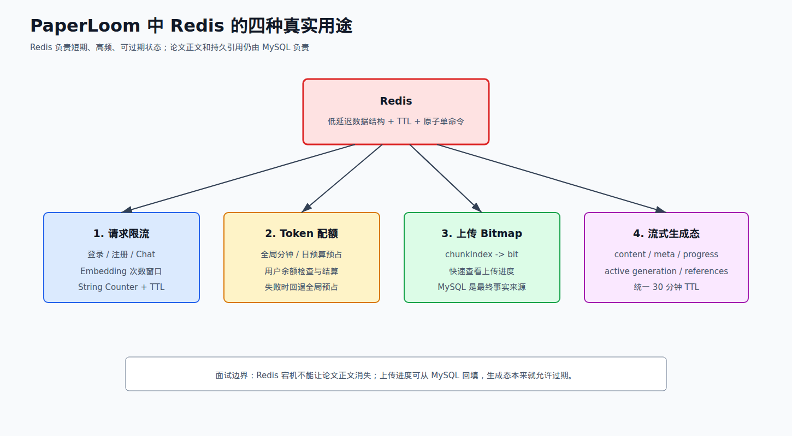
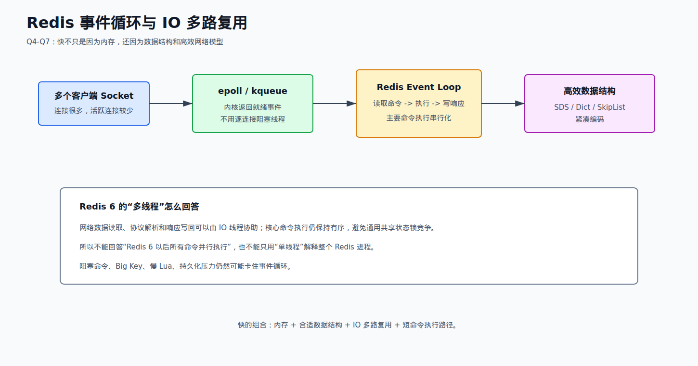
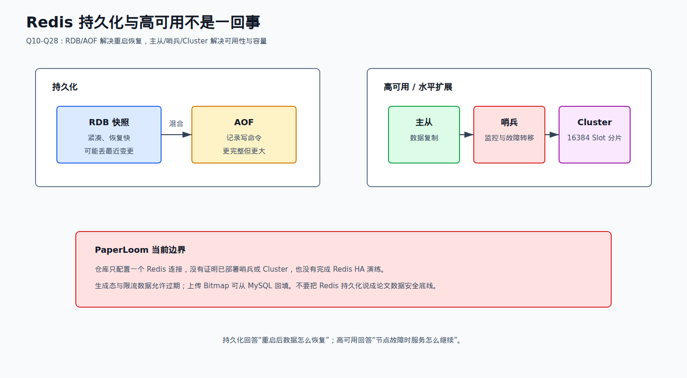
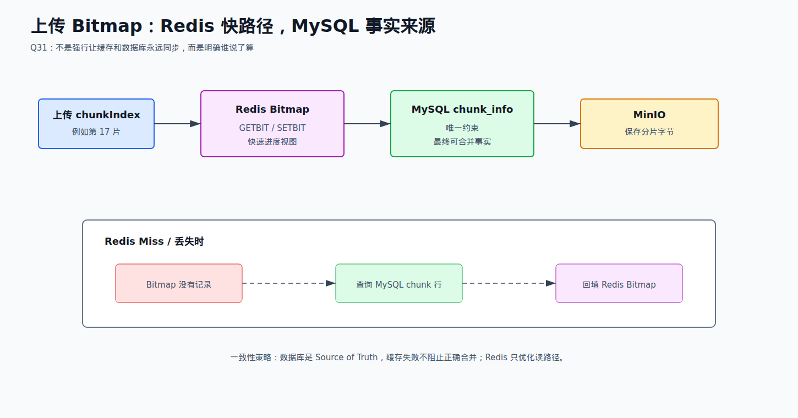
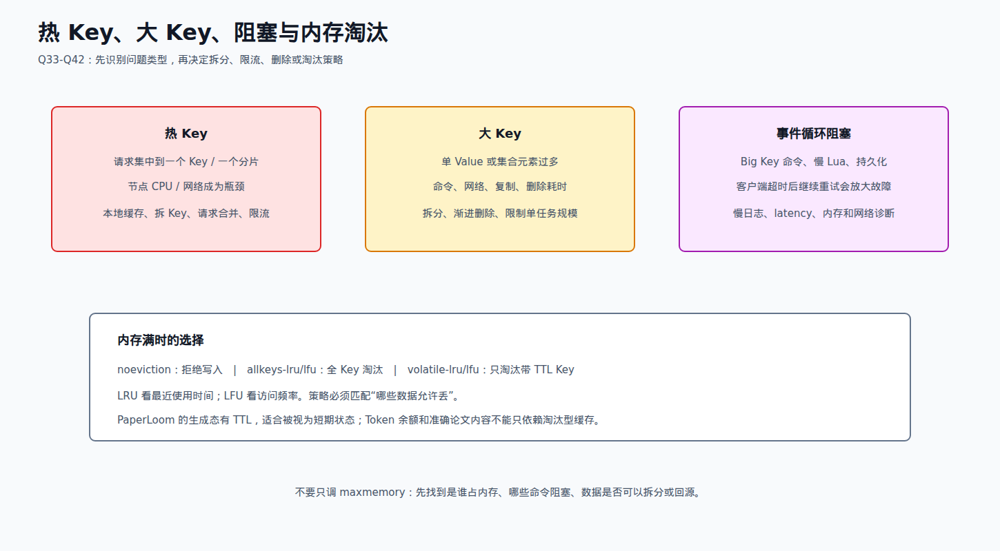
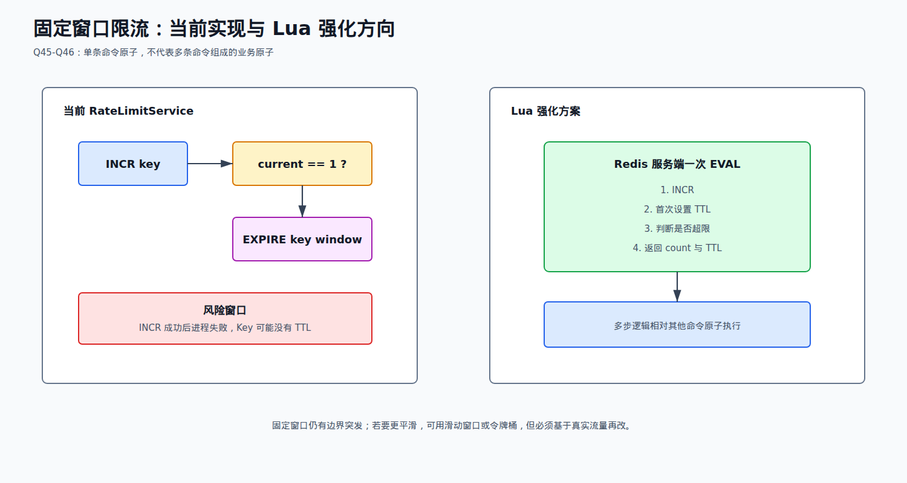
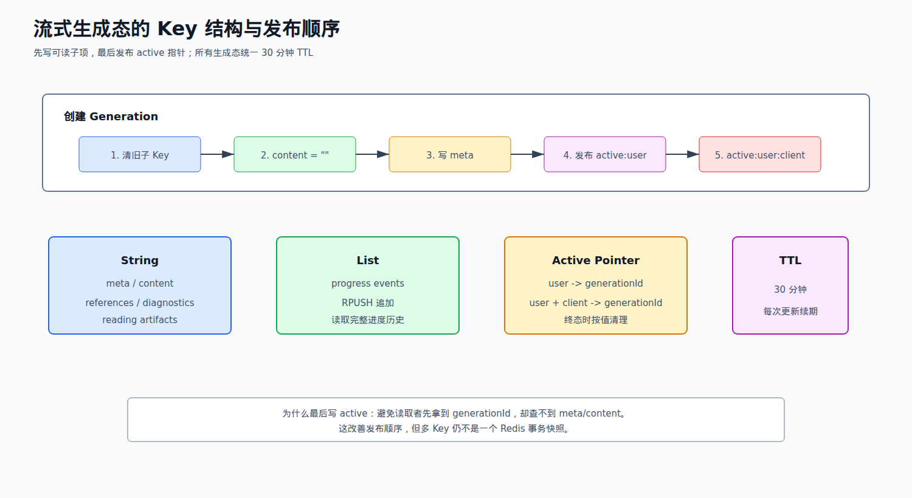

# 03 Redis 篇

来源：`面渣逆袭Redis篇V2.0.pdf`。本册原书共 57 道题；下面的题号、题名和 PDF 页码均按原书整理，项目回答只写 PaperLoom 代码能够证明的内容。

## 先记住项目边界

PaperLoom 当前把 Redis 当作短期状态和高速路径，不把它当论文正文、引用或分片事实的最终存储。代码中能直接核对到的用途只有四类：

1. `RateLimitService` 用 String 计数器做注册、登录、聊天、Embedding 请求的固定窗口限流。
2. `UsageQuotaService` 用 String 计数器预占和结算全局 Token 预算；余额模式由 `QuotaConfiguration` 切换到 `UsageBalanceQuotaService`，此时用户余额在 MySQL 侧检查和结算，不能说成“每个用户都在 Redis 原子预占”。
3. `UploadService` 用 Bitmap 做上传分片进度快路径；MySQL `chunk_info` 才是最终事实，Redis 丢失会回源并回填。
4. `ChatGenerationStateService` 用 String 保存生成态、内容、元数据、引用和诊断，用 List 保存进度事件，生成态 TTL 为 30 分钟；这些多 key 写入不是一个原子快照。



## 57 题总表

### Q1-Q14：基础、性能与持久化

| 题号 | PDF 页 | 原题 | 取舍 | PaperLoom 关联 |
| --- | ---: | --- | --- | --- |
| Q1 | 5 | 说说什么是 Redis | 必背 | Redis 与 MySQL 的职责边界 |
| Q2 | 12 | Redis 可以用来干什么 | 必背 | 四类真实用途 |
| Q3 | 16 | Redis 有哪些数据类型 | 必背 | String、Bitmap、List 的实际落点 |
| Q4 | 27 | Redis 为什么快呢 | 必背 | 限流和生成态的低延迟路径 |
| Q5 | 34 | 能详细说一下 IO 多路复用吗 | 必背 | Web/Redis 连接模型的基础 |
| Q6 | 42 | Redis 为什么早期选择单线程 | 必背 | 命令串行与原子性边界 |
| Q7 | 44 | Redis 6.0 使用多线程是怎么回事 | 必背 | 不要把 IO 线程化说成命令多线程 |
| Q8 | 46 | 说说 Redis 的常用命令（补充） | 选背 | 代码中的 INCR、EXPIRE、GETBIT、SETBIT |
| Q9 | 50 | 单线程的 Redis QPS 能到多少（补充） | 了解 | 不背固定数字，不声称项目压测值 |
| Q10 | 51 | Redis 的持久化方式有哪些 | 必背 | 临时状态和权威数据的取舍 |
| Q11 | 64 | RDB 和 AOF 各自有什么优缺点 | 必背 | 能解释丢失窗口与恢复成本 |
| Q12 | 65 | RDB 和 AOF 如何选择 | 必背 | 按数据重要性、恢复目标选择 |
| Q13 | 67 | Redis 如何恢复数据 | 选背 | 了解 AOF/RDB 加载顺序与修复工具 |
| Q14 | 68 | Redis 4.0 的混合持久化了解吗 | 选背 | 只讲原理，不说项目已启用 |

### Q15-Q28：主从、哨兵与 Cluster

| 题号 | PDF 页 | 原题 | 取舍 | PaperLoom 关联 |
| --- | ---: | --- | --- | --- |
| Q15 | 70 | 主从复制了解吗 | 必背原理 | 项目没有验证生产主从 |
| Q16 | 75 | Redis 主从有几种常见的拓扑结构 | 选背 | 只作架构对比 |
| Q17 | 77 | Redis 的主从复制原理了解吗 | 必背原理 | 异步复制、偏移量、复制积压缓冲区 |
| Q18 | 82 | 详细说说全量同步和增量同步 | 必背原理 | 能回答首次同步和断线重连 |
| Q19 | 85 | 主从复制存在哪些问题 | 必背 | 延迟、丢写、脑裂和读到旧值 |
| Q20 | 88 | Redis 哨兵机制了解吗 | 选背 | 未验证 Sentinel 部署 |
| Q21 | 89 | Redis 哨兵的工作原理知道吗 | 选背 | 监控、下线判断、选主、通知 |
| Q22 | 92 | Redis 领导者选举了解吗 | 了解 | 只背流程，不声称做过故障演练 |
| Q23 | 97 | 新的主节点是怎样被挑选出来的 | 了解 | 优先级、复制偏移量、run ID |
| Q24 | 100 | Redis 集群了解吗 | 选背 | 未验证 Cluster 集群 |
| Q25 | 101 | 请详细说一说 Redis Cluster | 选背 | 去中心化、Gossip、16384 槽 |
| Q26 | 104 | 集群中数据如何分区 | 选背 | 节点取余、一致性哈希、哈希槽对比 |
| Q27 | 109 | 能说说 Redis 集群的原理吗 | 选背 | 节点握手、槽路由、故障检测 |
| Q28 | 114 | 说说 Redis 集群的动态伸缩 | 选背 | 槽迁移与扩缩容风险 |

### Q29-Q42：缓存、热 Key 与内存

| 题号 | PDF 页 | 原题 | 取舍 | PaperLoom 关联 |
| --- | ---: | --- | --- | --- |
| Q29 | 120 | 什么是缓存击穿 | 必背 | 区分穿透、击穿、雪崩；上传回源不是典型击穿 |
| Q30 | 132 | 能说说布隆过滤器吗 | 选背 | 项目没有验证已使用布隆过滤器 |
| Q31 | 137 | 如何保证缓存和数据库的数据一致性 | 必背 | MySQL `chunk_info` 为准，Redis 回填 |
| Q32 | 147 | 如何保证本地缓存和分布式缓存的一致 | 了解 | PaperLoom 未核实 Caffeine 二级缓存方案 |
| Q33 | 152 | 什么是热 Key | 必背 | 生成态和限流 key 要关注集中访问 |
| Q34 | 154 | 那怎么处理热 Key 呢 | 选背 | 本地缓存、拆副本、读分散；项目不乱认领 |
| Q35 | 156 | 怎么处理大 Key 呢 | 必背 | 生成内容 String 追加的增长风险 |
| Q36 | 159 | 缓存预热怎么做呢 | 选背 | 项目没有查到启动预热实现 |
| Q37 | 160 | 无底洞问题听说过吗，如何解决 | 了解 | 集群节点增多后批量请求反而变慢 |
| Q38 | 161 | Redis 报内存不足怎么处理 | 必背排障 | 先识别临时数据与事实数据，不能盲删 |
| Q39 | 163 | Redis key 过期策略有哪些 | 必背 | 惰性删除 + 定期删除 |
| Q40 | 165 | Redis 有哪些内存淘汰策略 | 必背 | `noeviction`、LRU、LFU、volatile/allkeys |
| Q41 | 166 | LRU 和 LFU 的区别是什么 | 必背 | 最近访问与访问频率的取舍 |
| Q42 | 168 | Redis 发生阻塞了怎么解决 | 必背排障 | 慢命令、大 Key、连接和内存交换 |

### Q43-Q48：消息、事务、Lua、Pipeline 与锁

| 题号 | PDF 页 | 原题 | 取舍 | PaperLoom 关联 |
| --- | ---: | --- | --- | --- |
| Q43 | 169 | Redis 如何实现异步消息队列 | 了解 | 业务异步链路实际使用 Kafka，不是 Redis List |
| Q44 | 171 | Redis 如何实现延时消息队列 | 了解 | 项目没有把 Redis ZSet 当延时队列 |
| Q45 | 174 | Redis 支持事务吗 | 必背 | MULTI/EXEC/WATCH 不等于 MySQL 事务 |
| Q46 | 183 | 有 Lua 脚本操作 Redis 的经验吗 | 必背项目诚实版 | 书中会 Lua；当前限流代码没有 Lua |
| Q47 | 185 | Redis 的管道 Pipeline 了解吗 | 选背 | 批量减少 RTT，但不保证事务原子性 |
| Q48 | 190 | Redis 能实现分布式锁吗 | 必背边界 | PaperLoom 没有 Redis 分布式锁 |

### Q49-Q57：底层结构与场景题

| 题号 | PDF 页 | 原题 | 取舍 | PaperLoom 关联 |
| --- | ---: | --- | --- | --- |
| Q49 | 200 | Redis 都有哪些底层数据结构 | 必背 | SDS、dict、跳表、quicklist 的职责 |
| Q50 | 213 | Redis 为什么不用 C 语言的原生字符串 | 选背 | SDS 的长度、二进制安全和扩容 |
| Q51 | 214 | 你研究过 Redis 的字典源码吗 | 了解 | 两张哈希表与渐进式 rehash |
| Q52 | 219 | 你了解跳表吗 | 选背 | ZSet 有序与范围查询 |
| Q53 | 228 | 压缩列表了解吗 | 了解 | 紧凑存储与连锁更新 |
| Q54 | 234 | quicklist 了解吗 | 了解 | List 的分块链表结构 |
| Q55 | 239 | 1 亿个 key 中找固定前缀的 10 万个 key | 必背场景 | SCAN + MATCH，不用 KEYS |
| Q56 | 240 | Redis 在秒杀场景下可以扮演什么角色 | 选背场景 | 只讲通用方案，不能说 PaperLoom 做过秒杀 |
| Q57 | 250 | 客户端宕机后 Redis 服务端如何感知 | 选背 | TCP keepalive、timeout、连接池检测 |

## 第一轮必须拿下

优先背 Q1-Q8、Q10-Q11、Q15、Q17-Q19、Q29、Q31、Q33、Q35、Q38-Q42、Q45-Q48、Q55。每道题都按“概念句 → 项目句 → 取舍句 → 边界句”四句组织，不背原书项目名的现成话术。

## 重点背诵稿

### Q1-Q3：Redis 是什么，项目为什么用

**Q1 书中核心。** Redis 是基于键值对的 NoSQL 数据库，主要把数据放在内存中，因此读写延迟低；同时可以通过 RDB/AOF 等方式持久化。MySQL 是关系型数据库，Redis 不是 MySQL 的替代品。

**PaperLoom 四句回答：**

> Redis 是以内存读写为主要特征的键值数据库，适合缓存、计数、短期状态和需要低延迟的访问。PaperLoom 没有让 Redis 保存论文正文和引用事实，而是用它做限流计数、全局 Token 预算、上传 Bitmap 和聊天生成态。MySQL 保存 `chunk_info`、准确正文和引用，Redis 丢失时可以回源或让临时状态重新生成。这样速度和事实权威分开，代价是需要处理 TTL、回源和多 key 状态不一致；项目也没有验证 Sentinel/Cluster 高可用部署。

**Q2 用途只背书中的类别：** 缓存热点数据、计数器、ZSet 排行榜、分布式锁、List 消息、Lua 限流、Bitmap 等。项目对应关系要说具体：`RateLimitService` 的 `INCR` 是计数器；`UploadService` 的 `GETBIT/SETBIT` 是 Bitmap；`ChatGenerationStateService` 的 String 和 List 是临时生成态；Kafka 才是 PDF 合并后的异步解析、索引消息链路。

**Q3 类型选择：** 原书列出 String、List、Hash、Set、ZSet，以及 Bitmap、HyperLogLog、GEO 等扩展类型。面试时不要只报菜名，要说访问模式：

| 类型 | 适合的访问 | 项目当前证据 |
| --- | --- | --- |
| String | 单值、计数器、序列化对象、追加文本 | 限流、Token 计数、生成内容/元数据/active key |
| Bitmap | 按整数偏移量读写 0/1 | 上传分片是否完成 |
| List | 保持顺序的事件或队列 | 生成进度事件；不是可靠业务消息队列 |
| Hash | 一个 key 下的多个字段 | 原书有场景，PaperLoom 当前代码未作为核心 Redis 事实核实 |
| Set/ZSet | 去重、集合运算、按分数排序 | 原书常见用途，PaperLoom 当前代码未作为核心用途核实 |
| HyperLogLog/GEO/Stream | 基数估算、地理位置、持久化流式消息 | 只准备概念，不认领项目实践 |

### Q4-Q9：为什么快，单线程和命令

Redis 快不是“只因为内存”。完整回答应包含：内存访问避免大部分磁盘寻址；SDS、dict、跳表等结构减少无效扫描；事件循环配合 IO 多路复用，一个线程可以管理大量连接；命令执行路径短，早期主要由一个线程串行执行，减少锁竞争和上下文切换。



**Q5 IO 多路复用：** 一个进程把多个 socket 注册给 `select/poll/epoll` 等机制，线程阻塞等待“哪些描述符就绪”，返回后只处理就绪连接。因此不是一个连接配一个线程。回答 Redis 时落到事件循环：读请求、解析、执行命令、写回响应。

**Q6 单线程的准确说法：** 早期 Redis 的命令执行主要是单线程，避免并发修改数据结构时的大量锁和竞态；瓶颈更多在网络 IO 和内存，而不是复杂 CPU 计算。单线程带来命令级串行执行的原子性，但慢命令会阻塞所有客户端，所以不能执行大 Key 的重操作或长时间 Lua。

**Q7 Redis 6.0：** 多线程主要处理网络数据读取、写入和请求解析，核心命令执行仍由主线程串行完成。面试中不要说“Redis 6 以后所有命令都多线程”。

**Q8 常用命令只记项目会出现的：**

```text
INCR key                 # 固定窗口/Token 计数
EXPIRE key seconds       # 设置 TTL
GET key / SET key value  # 读写 String
GETBIT key offset        # 读上传分片位
SETBIT key offset 1      # 标记上传分片
APPEND key chunk         # 追加生成内容
RPUSH key event          # 按顺序追加进度事件
TTL key                  # 读取剩余时间（代码使用 getExpire）
```

**Q9 QPS：** 原书给出普通机器约十万级的基准示例，但 QPS 取决于 CPU、网络、命令、数据大小和客户端并发，必须用 `redis-benchmark` 或真实压测测量。PaperLoom 没有可核实的 Redis 生产压测数字，不能背成项目指标。

### Q10-Q14：RDB、AOF 和混合持久化



| 方式 | 书中核心 | 面试取舍 |
| --- | --- | --- |
| RDB | 特定时间点的二进制快照，文件紧凑、恢复快 | 两次快照之间的写入可能丢失 |
| AOF | 追加记录修改命令，按策略刷盘 | 数据丢失窗口小，但文件大、恢复通常更慢 |
| 混合持久化 | AOF 重写时前段用 RDB，后段追加 AOF 命令 | 兼顾加载速度与较小的最近写入窗口 |

**Q10-Q12 标准回答：** 先问数据能不能丢、恢复时间要求多紧、磁盘和写放大能接受多少。缓存类数据可以接受重建，重要状态才考虑更严格的持久化策略。AOF `appendfsync everysec` 不是“绝不丢数据”，它仍有刷盘窗口；`always` 更严格但性能代价更高。

**Q13 恢复：** Redis 重启时按配置加载持久化文件；AOF 存在时通常优先重放 AOF，没有 AOF 再加载 RDB。AOF 损坏可以用 `redis-check-aof --repair` 等工具处理，但修复前要保留原文件并核对数据完整性。

**Q14 混合持久化：** Redis 4.0 后 AOF 重写可以把当前内存快照以 RDB 格式放在文件前部，再把重写期间的新命令以 AOF 格式放在后部，恢复时先加载快照再重放尾部命令。

**项目边界：** PaperLoom 配置和代码只能证明使用了单个 Redis 连接，并不能证明已经启用 AOF、RDB、Sentinel、Cluster 或做过故障恢复演练。生成态只有 30 分钟 TTL；论文正文、引用和分片事实仍由 MySQL/MinIO 等持久化系统负责，不能把 Redis 持久化说成项目数据安全的最终保障。

### Q15-Q19：主从复制

主从复制是主节点处理写入，从节点异步接收并维护副本。常见价值是读扩展、备份和故障切换准备，但异步复制意味着主节点成功返回时，从节点可能还没有数据。

**Q16 拓扑只会对比：** 一主一从、一主多从、链式复制、主从加哨兵，以及 Cluster 的多主多从分片。不要把“讲过拓扑”说成“部署过集群”。

**Q17 原理：** 从节点向主节点发起复制；首次或无法续接时进行全量同步，正常追赶时使用增量命令。主节点维护复制偏移量和复制积压缓冲区，从节点带上自己的复制进度，主节点能覆盖断线期间的数据时就只补发缺口。

**Q18：**

```text
首次连接/积压区无法覆盖
        ↓
主节点生成 RDB 快照并传输
        ↓
从节点清空旧数据、加载快照
        ↓
继续接收快照生成期间及之后的写命令

短暂断线且 repl offset 可续接
        ↓
从复制积压缓冲区补发缺失命令
        ↓
从节点恢复到最新偏移量
```

全量同步消耗 CPU、磁盘 IO 和网络，增量同步成本小但依赖积压缓冲区仍有缺口。复制延迟高时从节点可能读旧值；主节点宕机发生在复制完成前时，已返回客户端的写入可能丢失。

**Q19 追问：** 主从复制解决的是副本和读扩展，不自动解决强一致、故障选主、脑裂、跨 key 事务或数据永久不丢。需要根据业务决定是否读主、等待复制、使用哨兵或 Cluster，并监控复制偏移量和延迟。

### Q20-Q28：哨兵和 Redis Cluster

**Q20-Q23 哨兵：** Sentinel 监控主从节点、通知客户端，并在主节点故障时执行自动故障转移。工作链路是：

1. 哨兵定期 PING，某个哨兵判断主节点不可达，形成主观下线。
2. 多个哨兵通过通信把判断升级为客观下线，并选出一个领导者。
3. 领导者按照从节点优先级、复制偏移量、run ID 等规则挑选新主节点。
4. 让新主节点接管并通知其他从节点和客户端。

原书将选举流程描述为基于 Raft 思路的领导者选举。面试不要只说“自动切换”，还要说明故障检测有时间窗口、异步复制可能丢最近写入、客户端必须正确发现新主节点。

**Q24-Q28 Cluster：** Cluster 是去中心化的分片方案，节点通过 Gossip 交换集群状态；数据按 16384 个哈希槽路由到负责槽位的主节点，主节点可以配置从节点。节点新增或删除时迁移槽位，而不是把所有 key 全部重新取模。

三种分区方式按原书对比：节点取余实现简单但节点数变化会导致大量 key 重新分布；一致性哈希减少迁移但需要虚拟节点等工程处理；哈希槽把固定槽位和节点绑定，扩缩容时迁移受影响槽位。跨 slot 的多 key 命令受限，使用 hash tag 才能把相关 key 放进同一槽，但这会牺牲部分分散能力。

**项目边界：** PaperLoom 的配置只有 host/port/password 单连接，没有 Sentinel 或 Cluster 的部署证据。面试正确说法是“了解主从、哨兵和 Cluster 的原理，但当前项目没有落地生产级 Redis 高可用和分片”，不要套用书中“三主三从”话术。

### Q29-Q32：缓存问题与一致性

**Q29 三个概念必须分清：**

| 问题 | 触发条件 | 典型处理 |
| --- | --- | --- |
| 缓存穿透 | 查一个本来不存在的数据，缓存和数据库都没有 | 参数校验、缓存空值、布隆过滤器 |
| 缓存击穿 | 一个热点 key 恰好过期，大量请求同时回源 | 互斥重建、逻辑过期、提前刷新、本地缓存 |
| 缓存雪崩 | 大量 key 同时过期或缓存服务整体不可用 | TTL 加随机、分批预热、限流降级、多副本 |

PaperLoom 的上传 Bitmap 丢失后从 `chunk_info` 查询并回填，是“快路径失效后的数据库回源”，不能包装成已经做了缓存击穿互斥锁。它的关键设计是 Redis 不是最终事实，回源仍然能得到正确的已上传分片集合。

**Q30 布隆过滤器：** 位数组加多个哈希函数；查询结果为“不存在”时一定不存在，为“可能存在”时仍需访问真实存储确认。优点是省内存、挡穿透，缺点是有误判且普通布隆过滤器不支持直接删除；需要删除时可用计数布隆过滤器。PaperLoom 当前代码没有可核实的布隆过滤器实现。

**Q31 缓存与数据库一致性：** 原书推荐旁路缓存的常见顺序是读时先 Redis，未命中查 MySQL 并回填；写时先更新数据库，再删除缓存，并通过重试、消息或 binlog 监听处理删除失败。延迟双删只能缩小窗口，不能把两个系统变成一个原子事务。



PaperLoom 的回答要更具体：上传检查先读 `upload:{userId}:{paperId}` Bitmap；Redis 无记录、空 Bitmap 或没有有效位时，调用 `ChunkInfoRepository` 读取 `chunk_info`，然后回填 Bitmap；合并时再次以数据库分片记录为准。这个设计承认 Redis 可能丢失或过期，靠数据库事实恢复正确性。

**Q32 本地缓存与 Redis：** 本地缓存延迟更低，但每个应用实例各自一份，容易出现实例间不一致；Redis 是共享缓存，可集中失效和扩容。常见一致性做法是更新通知、版本号、短 TTL 和“本地 → Redis → 数据库”的读取链路。项目证据图中没有 PaperLoom 已落地 Caffeine 二级缓存的实现，因此只讲通用方案，不认领技术派的缓存代码。

### Q33-Q42：热 Key、大 Key、过期、淘汰与阻塞

**Q33-Q35：** 热 Key 是访问集中在少数 key，可能造成单节点 CPU/网络热点；大 Key 是单值或集合过大，导致单次命令、网络传输、复制、删除和内存回收成本高。原书建议用监控、`redis-cli --bigkeys`、拆分 key、本地缓存或副本分散访问；删除大集合可用 `UNLINK`，遍历处理用 `SCAN` 而不是一次取尽。



PaperLoom 要说两处真实风险：

- 生成内容通过 `APPEND` 写入 String，单个任务的内容越大，单 key 读写、网络传输和过期清理成本越高；30 分钟 TTL 只解决生命周期，不等于限制大小。
- active generation、限流计数和 Bitmap 的访问模式不同，不能用同一个淘汰策略粗暴处理。项目没有证据证明已经做了本地缓存、热 key 副本、`--bigkeys` 监控或集群分片。

**Q36 预热：** 在启动或流量高峰前，把可预测热点数据分批加载到 Redis，避免冷启动请求同时回源。要配合随机 TTL、失败重试和限流，否则预热本身也会冲击数据库。PaperLoom 当前没有查到启动预热实现，不能把生成态初始化说成缓存预热；生成态是在创建请求时按需写入。

**Q37 无底洞：** 分布式缓存节点增加后，容量和理论吞吐上升，但一次请求需要访问更多节点，网络连接、序列化、合并结果的成本也上升，整体性能反而下降。解决思路是减少跨节点批量请求、按访问模式聚合 key、控制节点数和监控单请求网络开销。

**Q38 内存不足的排查顺序：** 先看 Redis `INFO memory`、操作系统内存和交换区，再找大 key、慢命令、连接数和增长异常；确认 `maxmemory`、过期和淘汰策略；最后才清理可重建数据或扩容。PaperLoom 的论文事实不能因为 Redis 内存不足而直接删除，能安全清理的只应是临时生成态、过期计数或可回源的 Bitmap，并且要先确认业务恢复路径。

**Q39-Q41：** Redis 过期删除包含惰性删除和定期删除：访问 key 时发现过期就删；后台周期性随机抽样检查过期 key。过期删除不等同于内存淘汰，内存达到上限后还要看 `maxmemory-policy`。原书列出的策略包括 `noeviction`、`allkeys-lru`、`allkeys-lfu`、`allkeys-random` 及 `volatile-lru/lfu/ttl/random`。LRU 看最近一次访问，LFU 看累计访问频率及其衰减；前者适合时间局部性明显的缓存，后者适合长期热点。

**Q42 阻塞排查：** 先用 `SLOWLOG GET` 看慢命令、用 `MONITOR`（短时间谨慎使用）看实时命令、用 `CLIENT LIST` 看连接；再查大 key、`DEL` 大集合、长 Lua、内存交换、连接池耗尽和网络问题。处理大集合时用 `UNLINK` 或分批 `SCAN`，不要在主线程执行几百万元素的同步删除。

### Q43-Q48：队列、事务、Lua、Pipeline 和分布式锁

**Q43-Q44：** 原书可用 List 的 `LPUSH/BRPOP` 做简单异步队列，用 ZSet 的 score 存执行时间做延迟队列，但它们需要自己补消费确认、失败重试、重复消费和持久化语义。PaperLoom 的 PDF 合并后解析和索引任务使用 Kafka；生成进度 List 是状态回放用途，不能回答成“Redis 消息队列保证了任务不丢”。

**Q45 Redis 事务：** `MULTI` 开始排队，`EXEC` 按入队顺序执行，`DISCARD` 放弃，`WATCH` 在提交前监视 key 变化。它能保证这些命令在执行阶段不被其他命令插入，但不像 MySQL 一样提供完整回滚和隔离级别；执行中的某条命令报错，不会自动撤销已经执行的前置命令。因此复杂的条件检查加更新通常优先考虑 Lua。

**Q46 Lua：** Redis 执行脚本期间不会交错执行其他命令，适合把“读当前值 → 判断 → 修改 → 设置 TTL”放在一个原子单元中，例如库存扣减、令牌桶和锁释放。



**项目实话：** `RateLimitService.checkSingleWindow` 当前先 `INCR`，当计数第一次变成 1 时再 `EXPIRE`，超过上限后读取 TTL 计算 `retry-after`。它是简单的固定窗口，窗口边界可能突发；`INCR` 与 `EXPIRE` 之间进程崩溃还可能留下没有 TTL 的 key。正确回答是“现有实现没有 Lua；若要消除这个窗口，可用 Lua 一次完成计数、首次设 TTL、判断上限和必要的回滚”。全局 Token 预算的 `UsageQuotaService` 同样使用 `INCR`/`EXPIRE`，不能说成 Lua 原子预占。

**Q47 Pipeline：** 客户端把多条命令一次发送，减少网络往返；服务端仍按顺序执行，但 Pipeline 不提供事务回滚或跨命令原子性。批量命令太多会占客户端和服务端内存，原书建议控制批次。PaperLoom 当前重点代码没有证明使用 Pipeline，不能把 Bitmap 回填说成 Pipeline。

**Q48 分布式锁：** 原书推荐 `SET key value NX PX ttl`，value 要是唯一 token；释放时用 Lua 先校验 token 再删除，避免持锁者过期后新持锁者被误删。还要考虑续期、客户端暂停、主从切换和锁服务故障。PaperLoom 没有 Redis 分布式锁；会话范围使用 MySQL 悲观锁，索引任务使用状态 + `job_id` 条件更新，不要说项目使用 Redisson 或 Redlock。

### Q49-Q54：底层结构，按面试深度回答

**Q49 总览：** 原书按重要程度讲 SDS、dict、ziplist、quicklist、skiplist 和双向链表等。回答“底层结构”时要把抽象类型和编码结构分开：String 不等于 C 字符串，ZSet 不等于只有跳表，List 在不同 Redis 版本也可能使用不同紧凑结构。

| 底层结构 | 关键点 | 面试一句话 |
| --- | --- | --- |
| SDS | 自带长度和剩余空间，二进制安全，扩容减少频繁分配 | 适合 Redis 的字符串和序列化值 |
| dict | 哈希表数组 + 链表/其他冲突结构；两张表支持渐进式 rehash | 扩容分摊到多次操作，避免长时间停顿 |
| skiplist | 多层索引的有序链表，平均 `O(logN)`，支持范围查询 | ZSet 用它按 score 有序访问 |
| ziplist | 连续紧凑内存，节省空间，但存在连锁更新 | 小数据量时紧凑，写入可能退化 |
| quicklist | 多个小块 ziplist 由双向链表连接 | 在空间和大 List 更新成本之间折中 |
| linked list | 早期 List 底层结构 | Redis 3.2 后主要由 quicklist 取代 |

原书以旧版本为背景，面试时可补一句：新版本对 ziplist 的实现和命名已经演进到 listpack 等结构，具体编码要以 Redis 版本为准，不要死背旧阈值。

**Q50 SDS 为什么不直接用 C 字符串：** C 字符串以 `\\0` 结尾，二进制数据可能包含 `\\0`；获取长度需要遍历；拼接可能频繁重新分配。SDS 保存长度，支持二进制安全，并通过预分配/扩容减少复制。PaperLoom 的 JSON 生成态和追加内容都落在 Redis String 上，原理上正是 SDS 这类字符串实现所服务的访问方式；不要把 SDS 说成业务层 JSON 格式。

**Q51 dict：** 最外层字典包含两个哈希表，平时使用 `ht[0]`；扩容时初始化 `ht[1]`，后续每次访问顺便搬一部分 bucket，直到迁移完成再交换两张表。这叫渐进式 rehash，避免一次性迁移阻塞单线程。它解决的是哈希表扩容停顿，不保证所有 Redis 命令都 `O(1)`，碰撞、迁移和具体命令仍会影响复杂度。

**Q52 跳表：** 在有序链表上增加多层索引，查找从高层向右、再向下，平均查找、插入、删除为 `O(logN)`；底层链表保持完整顺序，找到起点后可以高效做范围扫描。ZSet 实际把跳表的有序性与字典的按 member 定位结合起来，适合 `ZRANGE`、`ZRANGEBYSCORE` 和排名查询。

**Q53-Q54：** ziplist 把节点连续放在一段内存，节省指针空间，但前置节点长度变化可能触发后续节点的连锁更新；quicklist 把多个小 ziplist 分块，再用双向链表连接，降低单个连续列表过大时的更新风险，同时保留紧凑性。原书给出的具体阈值属于版本相关实现细节，背“为什么这样设计”比背数字更稳。

### Q55-Q57：三个场景题

**Q55 大量前缀 key：** 使用 `SCAN 0 MATCH user:* COUNT 1000`，按游标增量迭代直到游标回到 0；每批处理并记录游标。不要在生产环境对 1 亿个 key 使用 `KEYS user:*`，因为 `KEYS` 需要一次遍历并阻塞 Redis 主线程。SCAN 也不是强一致快照，遍历期间 key 变化时要接受重复或遗漏的处理语义，业务操作要幂等。

**Q56 秒杀：** 原书的回答链路是缓存预热、Redis 原子库存扣减、Lua 一次做资格/库存检查、限流削峰、异步排队，最后由数据库落单并处理重复购买。PaperLoom 没有秒杀业务，也没有 Redis 库存扣减；这里只能作为通用场景题背，不能写进项目经历。

**Q57 客户端宕机感知：** TCP keepalive 通过探测确认连接是否仍然可达；`tcp-keepalive` 控制探测周期。`timeout` 控制客户端多久没有发送命令后被 Redis 主动断开，默认 0 通常表示不因空闲命令断开；连接池还可用借出检测和空闲检测。面试时区分“网络层发现断链”和“应用层空闲超时”，两者不是同一个配置。

## 两条项目链路，面试时直接画

### 链路一：上传分片的快路径与事实回源

```text
请求检查 chunkIndex
      ↓
Redis Bitmap GETBIT upload:{userId}:{paperId}
      ├─ 命中 1：按幂等成功返回
      └─ 未命中/空：查询 MySQL chunk_info
                       ↓
                 回填 Bitmap（仅优化下一次读取）
      ↓
写分片到 MinIO + 保存 chunk_info
      ↓
合并时再次以 MySQL 分片记录为准
```

这条链路能同时回答 Q3、Q29、Q31、Q35、Q38、Q42：Bitmap 快，但不是事实；Redis 故障不会改变数据库中已保存的分片记录。

### 链路二：生成态的多 key 与 TTL



`createGeneration` 先删除旧的引用、诊断、阅读状态和进度 key，再写空内容、元数据，最后写用户的 active generation key；后续 `appendChunk`、更新引用/诊断/进度时刷新 30 分钟 TTL。这个顺序减少了“active key 已发布但 meta 尚不存在”的窗口，但每条 Redis 命令仍是分开的：读取者不一定拿到所有子 key 的同一时刻版本。

因此：

- 可以说“项目按先准备子项、后发布 active key 的顺序降低读到半成品的概率”；
- 不能说“项目用 MULTI/EXEC 或 Lua 做了多 key 原子快照”；
- 生成内容用 String `APPEND`，进度用 List `RPUSH`，超过 TTL 后整体属于可丢失的临时状态；
- MySQL 中的会话记录、准确论文内容和引用持久化仍是长期事实。

## 项目证据与绝对不能说错的边界

| 面试追问 | 可以说 | 不可以说 |
| --- | --- | --- |
| 项目 Redis 用在哪里 | 限流、Token 全局预算、上传 Bitmap、生成态 String/List | 用 ZSet 做排行榜、用 Hash 做站点地图（那是原书项目话术） |
| 限流是否原子 | `INCR` 后首次 `EXPIRE` 的固定窗口，存在两命令窗口 | 已经用 Lua/Redisson 保证原子 |
| Token 预占是否都在 Redis | 全局滚动预算使用 Redis counter；余额模式用户余额在 `UserTokenService` 侧检查/结算 | 所有用户 Token 都由 Redis 原子预留 |
| 上传 Bitmap 是否权威 | Redis 是快路径，MySQL `chunk_info` 是最终事实，丢失可回源回填 | Redis Bitmap 是唯一上传记录 |
| 生成态是否强一致 | 先子项后 active key，TTL 30 分钟；多 key 不构成原子快照 | MULTI/EXEC 或 Lua 已保证整份生成态一致 |
| Redis 高可用 | 配置只证明单连接 host/port/password | 已部署 Sentinel、Cluster、三主三从或做过自动故障转移 |
| 分布式锁 | 书中会 `SET NX PX`、token 校验和 Lua 释放 | PaperLoom 使用 Redis 分布式锁；实际关键并发控制在 MySQL |
| 消息队列 | Kafka 承担 PDF 合并后的异步解析/索引任务 | Redis List 是可靠业务 MQ 或延迟队列 |

## 对应代码

- `../src/main/java/io/github/chzarles/paperloom/service/RateLimitService.java`：固定窗口 `INCR`、首次 `EXPIRE`、TTL 与 `retry-after`。
- `../src/main/java/io/github/chzarles/paperloom/service/UsageQuotaService.java`：用户/全局 Token counter、预占、结算、失败回退。
- `../src/main/java/io/github/chzarles/paperloom/service/UsageBalanceQuotaService.java`：余额模式在用户 Token 服务中检查与结算，非 Redis 用户级原子预留。
- `../src/main/java/io/github/chzarles/paperloom/config/QuotaConfiguration.java`：根据配置选择余额模式或 Redis quota service。
- `../src/main/java/io/github/chzarles/paperloom/service/UploadService.java`：Bitmap 快路径、MySQL 回源与回填、`chunk_info` 最终事实。
- `../src/main/java/io/github/chzarles/paperloom/service/ChatGenerationStateService.java`：30 分钟 TTL、String/List 生成态和 active key 写入顺序。
- `../src/main/resources/application.yml`：当前 Redis 连接只配置 host、port、password，没有 Sentinel/Cluster 拓扑证据。

## 最后背一遍：项目版 Redis 自我介绍

> 我在 PaperLoom 里把 Redis 当作低延迟状态层，而不是论文事实库。限流使用固定窗口计数器，当前实现是分开的 `INCR` 和首次 `EXPIRE`，所以我不会说它已经用 Lua 做了原子限流；全局 Token 预算也用 Redis counter，但余额模式会切到用户余额服务，在结算时扣实际用量。上传分片用 Bitmap 做快速进度视图，Redis 丢失后从 MySQL `chunk_info` 回源并回填，合并仍以数据库为准。聊天生成态用 String 保存内容和元数据、List 保存进度事件，TTL 是 30 分钟，写入顺序是先子项、后 active key，但多 key 不是原子快照。项目当前没有可证明的 Sentinel、Cluster、Redis 分布式锁或 Redis 可靠消息队列实践。
