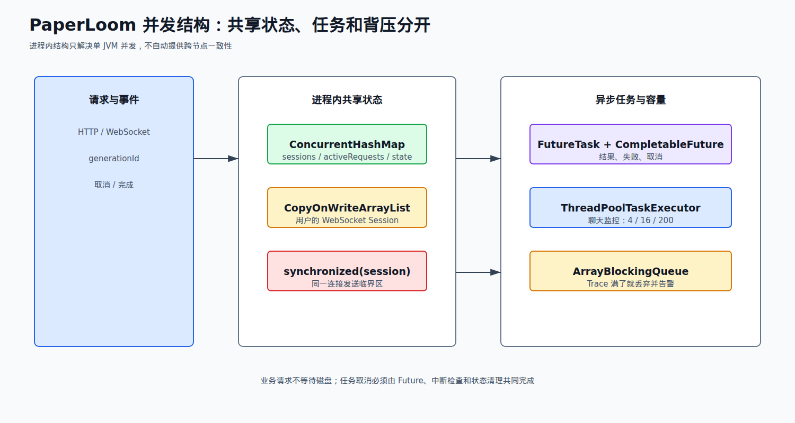
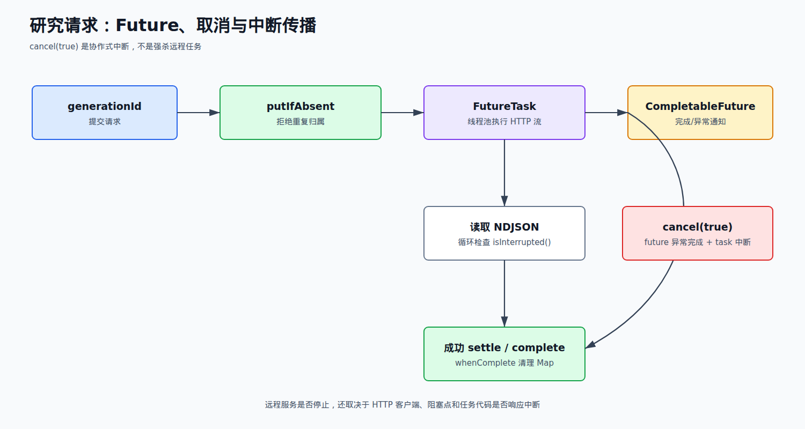
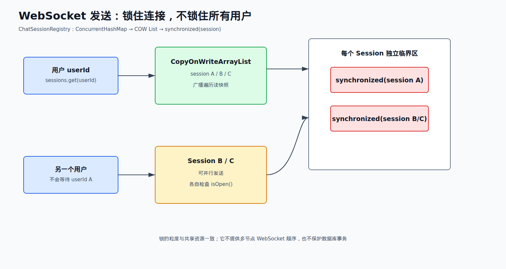
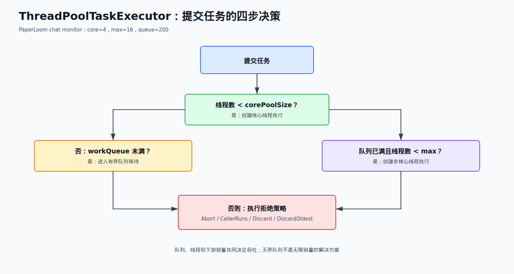

# 04 Java 并发编程篇

来源：`面渣逆袭并发编程篇V2.1.pdf`。原书共 71 道题；本册只把 PDF 中的题目整理成 PaperLoom 可核验的中文背诵稿，不把别的项目话术移植进来。

## 项目里的真实并发结构

PaperLoom 的并发重点不是“用了很多锁”，而是把请求状态、连接集合、异步任务和尽力而为的 Trace 分开：

| 代码结构 | 真实用途 | 需要说清的代价 |
| --- | --- | --- |
| `ConcurrentHashMap` | WebSocket 会话注册；ChatHandler 的 generation 状态、Future、取消标志等进程内注册表 | 只在单个 JVM 内共享，多副本不会自动同步 |
| `CopyOnWriteArrayList` | 一个用户的 WebSocket Session 列表 | 读多写少合适，注册/注销会复制数组 |
| `synchronized(session)` | 串行化同一 WebSocketSession 的发送 | 只锁单个连接，不锁全局；发送本身仍可能失败 |
| `CompletableFuture` | 研究任务完成、异常和取消通知 | Future 完成不等于远程 HTTP 已经立刻停止 |
| `FutureTask` | Python research harness 的可取消执行单元 | `cancel(true)` 只是中断请求，任务代码必须响应 |
| `ConcurrentHashMap.putIfAbsent` | generationId 对应活动请求，拒绝同一 generation 重复执行 | 归属只在当前进程；持久化状态另有 Redis/MySQL |
| `ThreadPoolTaskExecutor` | Chat 完成监控，core=4、max=16、队列=200 | 队列满会拒绝，调用方有降级路径 |
| `ArrayBlockingQueue` | `AsyncDiskProductTraceSink` 的有界 Trace 缓冲 | `offer` 失败时丢 Trace，不阻塞业务请求 |
| `Executors.newFixedThreadPool` | Trace writer 后台写盘 | writer 线程为 daemon；Trace 不是强审计日志 |
| `Executors.newCachedThreadPool` | Python harness HTTP 请求池 | 没有硬最大线程数，是当前真实的容量风险和改进点 |



## 71 题总表

### Q1-Q11：线程基础与线程安全

| 题号 | PDF 页 | 原题 | 取舍 | PaperLoom 关联 |
| --- | ---: | --- | --- | --- |
| Q1 | 5 | 并行跟并发有什么区别 | 必背 | 多线程与多核执行边界 |
| Q2 | 9 | 说说进程和线程的区别 | 必背 | Web 请求、后台任务在 JVM 进程内 |
| Q3 | 12 | 说说线程有几种创建方式 | 必背基础 | Executor/FutureTask 比手工 new Thread 更重要 |
| Q4 | 16 | 调用 start 会执行 run，为什么不直接调用 run | 必背 | 区分新线程与当前线程调用 |
| Q5 | 18 | 线程有哪些常用的调度方法 | 选背 | `start`、`sleep`、`join`、`interrupt` |
| Q6 | 20 | 线程有几种状态 | 必背 | 异步任务排查基础 |
| Q7 | 23 | 什么是线程上下文切换 | 选背 | 线程数和 IO 等待的取舍 |
| Q8 | 25 | 守护线程了解吗 | 选背 | Trace writer / HTTP worker 的 daemon 语义 |
| Q9 | 25 | 线程间有哪些通信方式 | 必背 | Future、共享 Map、队列和中断 |
| Q10 | 28 | 请说说 sleep 和 wait 的区别 | 必背 | 取消与锁释放的追问 |
| Q11 | 32 | 怎么保证线程安全 | 必背 | 项目最常被追问的总入口 |

### Q12-Q25：ThreadLocal、JMM 与可见性

| 题号 | PDF 页 | 原题 | 取舍 | PaperLoom 关联 |
| --- | ---: | --- | --- | --- |
| Q12 | 37 | ThreadLocal 是什么 | 选背 | 不把它说成项目共享状态方案 |
| Q13 | 39 | 工作中用到过 ThreadLocal 吗 | 了解 | 当前项目证据不足，不认领 |
| Q14 | 43 | ThreadLocal 怎么实现的 | 了解 | ThreadLocalMap 原理 |
| Q15 | 48 | ThreadLocal 内存泄漏是怎么回事 | 选背 | 线程池复用下的清理边界 |
| Q16 | 52 | ThreadLocalMap 源码看过吗 | 了解 | 弱引用 key 与 entry |
| Q17 | 55 | ThreadLocalMap 怎么解决 Hash 冲突 | 了解 | 线性探测 |
| Q18 | 56 | ThreadLocalMap 扩容机制了解吗 | 了解 | 负载阈值与清理 |
| Q19 | 57 | 父线程能用 ThreadLocal 给子线程传值吗 | 必背边界 | InheritableThreadLocal 只在创建子线程时复制 |
| Q20 | 60 | 说一下对 Java 内存模型的理解 | 必背 | 并发可见性/有序性入口 |
| Q21 | 63 | i++ 是原子操作吗 | 必背 | 复合读改写竞争 |
| Q22 | 64 | 什么是指令重排 | 必背 | 不能只看源码顺序 |
| Q23 | 66 | happens-before 了解吗 | 必背 | 锁、volatile、start、join |
| Q24 | 67 | as-if-serial 了解吗 | 选背 | 单线程语义与重排边界 |
| Q25 | 68 | volatile 了解吗 | 必背 | 可见性、有序性，不保证复合原子性 |

### Q26-Q42：synchronized、Lock、CAS 与死锁

| 题号 | PDF 页 | 原题 | 取舍 | PaperLoom 关联 |
| --- | ---: | --- | --- | --- |
| Q26 | 72 | synchronized 用过吗 | 必背 | 同一 Session 发送临界区 |
| Q27 | 72 | synchronized 的实现原理了解吗 | 选背 | monitor、对象头、字节码 |
| Q28 | 75 | synchronized 怎么保证可见性 | 必背 | 进入/退出监视器的 happens-before |
| Q29 | 78 | synchronized 锁升级了解吗 | 了解 | 偏向/轻量/重量的版本边界 |
| Q30 | 84 | synchronized 和 ReentrantLock 的区别 | 必背 | 项目为何选短小 synchronized |
| Q31 | 86 | AQS 了解多少 | 选背 | ReentrantLock、Semaphore 等基础 |
| Q32 | 89 | ReentrantLock 的实现原理 | 选背 | state、队列、Condition |
| Q33 | 91 | ReentrantLock 怎么创建公平锁 | 了解 | `new ReentrantLock(true)` |
| Q34 | 92 | CAS 了解多少 | 必背 | 原子类与数据库条件更新类比 |
| Q35 | 95 | CAS 有什么问题 | 必背 | ABA、自旋、单变量边界 |
| Q36 | 99 | Java 有哪些保证原子性的方法 | 必背 | 锁、原子类、不可变、线程封闭 |
| Q37 | 99 | 原子操作类了解多少 | 选背 | AtomicInteger/Reference |
| Q38 | 101 | AtomicInteger 源码读过吗 | 了解 | volatile + CAS |
| Q39 | 101 | 线程死锁了解吗 | 必背 | 四个必要条件 |
| Q40 | 102 | 死锁问题怎么排查 | 必背 | `jstack`、`jcmd Thread.print` |
| Q41 | 105 | 聊聊线程同步和互斥 | 选背 | 顺序协作与互斥访问的区别 |
| Q42 | 109 | 聊聊悲观锁和乐观锁 | 必背 | Java 锁与数据库 CAS 的取舍 |

### Q43-Q52：同步器与并发容器

| 题号 | PDF 页 | 原题 | 取舍 | PaperLoom 关联 |
| --- | ---: | --- | --- | --- |
| Q43 | 111 | CountDownLatch 了解吗 | 选背 | 等待一组任务完成 |
| Q44 | 114 | CyclicBarrier 了解吗 | 了解 | 多轮阶段屏障 |
| Q45 | 115 | CyclicBarrier 和 CountDownLatch 的区别 | 选背 | 一次性 vs 可复用 |
| Q46 | 116 | Semaphore 了解吗 | 选背 | 并发许可/限流 |
| Q47 | 119 | Exchanger 了解吗 | 了解 | 两线程交换数据 |
| Q48 | 121 | ConcurrentHashMap 的实现 | 必背 | 会话和 generation 注册表 |
| Q49 | 133 | ConcurrentHashMap 怎么保证可见性 | 必背 | volatile/CAS/桶同步 |
| Q50 | 133 | 为什么 ConcurrentHashMap 比 Hashtable 效率高 | 必背 | 粒度更细、读更少阻塞 |
| Q51 | 134 | CopyOnWriteArrayList 的实现原理 | 必背 | Session 列表读多写少 |
| Q52 | 136 | BlockingQueue 是什么 | 必背 | 有界 Trace 队列和背压 |

### Q53-Q71：线程池、取消与 Fork/Join

| 题号 | PDF 页 | 原题 | 取舍 | PaperLoom 关联 |
| --- | ---: | --- | --- | --- |
| Q53 | 137 | 什么是线程池 | 必背 | 复用线程、控制并发、承载异步任务 |
| Q54 | 137 | 项目中有用到线程池吗 | 必背项目题 | 三处真实线程池/执行器 |
| Q55 | 138 | 线程池的工作流程 | 必背 | 核心线程、队列、最大线程、拒绝 |
| Q56 | 143 | 线程池的主要参数有哪些 | 必背 | 七个核心参数 |
| Q57 | 145 | 线程池的拒绝策略有哪些 | 必背 | Abort/CallerRuns/Discard/DiscardOldest |
| Q58 | 147 | 线程池有几种阻塞队列 | 必背 | ArrayBlockingQueue 等 |
| Q59 | 149 | execute 和 submit 有什么区别 | 必背 | 异常和 Future 语义 |
| Q60 | 149 | 线程池怎么关闭 | 必背 | shutdown、await、shutdownNow |
| Q61 | 150 | 线程池线程数怎么配置 | 必背 | CPU、IO、下游容量三者约束 |
| Q62 | 151 | 有哪几种常见线程池 | 选背 | 不使用 Executors 默认无界风险 |
| Q63 | 151 | 四种常见线程池的原理 | 了解 | Fixed/Cached/Single/Scheduled |
| Q64 | 155 | 线程池异常怎么处理 | 必背 | execute 与 submit 取异常位置不同 |
| Q65 | 158 | 线程池有几种状态 | 了解 | RUNNING/SHUTDOWN/STOP/TIDYING/TERMINATED |
| Q66 | 159 | 线程池如何实现参数动态修改 | 选背 | setter 与并发可见性 |
| Q67 | 160 | 线程池调优了解吗 | 必背排障 | 队列、耗时、拒绝和下游指标 |
| Q68 | 161 | 线程池使用时需要注意什么 | 必背 | 命名、隔离、关闭、异常、背压 |
| Q69 | 161 | 你能设计实现一个线程池吗 | 选练 | 说流程，不手写生产实现 |
| Q70 | 168 | 线程池执行中断电了应该怎么处理 | 选背场景 | 任务幂等、重试、状态恢复 |
| Q71 | 168 | Fork/Join 框架了解吗 | 了解 | 分治 CPU 任务，不挂项目实践 |

## 第一轮必须拿下

Q1-Q11、Q20-Q30、Q34-Q42、Q48-Q52、Q54-Q61、Q64、Q67-Q68。尤其要能把“线程安全容器 → 有界队列 → 任务 Future → 取消/关闭”画成一条真实项目链路。

## 重点背诵稿

### Q1-Q6：并发、进程、线程和生命周期

**Q1-Q2 概念句：** 并发是同一时间段内推进多个任务，未必在同一时刻执行；并行是多个任务在多个 CPU 核心上同时执行。进程是资源分配和隔离的基本单位，线程是 CPU 调度的基本单位；同一进程的线程共享堆、方法区和打开的资源，但各自有栈、程序计数器和线程私有状态。

PaperLoom 是一个 Java 进程，HTTP/WebSocket 请求、Chat 监控、Python harness 请求和 Trace writer 由不同线程/线程池推进。并发不等于“开无限线程”：线程过多会增加上下文切换、栈内存和下游连接压力。

**Q3 创建方式：** 可以继承 `Thread`、实现 `Runnable`、实现 `Callable` 并通过 `Future` 获取结果，或直接提交给 `ExecutorService`/Spring `ThreadPoolTaskExecutor`。项目的重点是后两类：`FutureTask` 承载可取消的 HTTP 任务，`CompletableFuture` 表达结果，线程池负责复用线程；不要把项目说成每个请求 `new Thread()`。

**Q4：** 直接调用 `run()` 只是当前线程的普通方法调用；调用 `start()` 才会让 JVM 创建并调度新线程，并在新线程中执行 `run()`。一个 Thread 实例只能 `start()` 一次。

**Q5：** `sleep` 让当前线程暂时休眠但不释放已经持有的锁；`wait` 必须在对象监视器内调用，进入等待并释放该监视器；`join` 等待另一线程结束；`interrupt` 发出协作式中断请求；`yield` 只是给调度器的提示，不能保证让出。

**Q6 状态：** NEW、RUNNABLE、BLOCKED、WAITING、TIMED_WAITING、TERMINATED。排查线程池时不要把 RUNNABLE 直接等同于“正在占用 CPU”，它也可能在 JVM/系统调用中等待；要结合线程 dump 和 CPU 指标。

### Q7-Q11：切换、守护、通信和线程安全

线程上下文切换要保存寄存器、程序计数器、栈等执行上下文，再加载另一个线程；多核能并行，但线程数量超过核心和下游容量后，切换成本会明显增加。守护线程不会阻止 JVM 在所有用户线程退出后结束；PaperLoom 的 Trace writer 和 Python harness worker 明确设置为 daemon，因此它们不是关机时必须完成的强持久化任务。



线程通信方式包括共享可见变量、`synchronized`/Lock、`wait/notify`、`Condition`、阻塞队列、`Future/CompletableFuture`、`CountDownLatch` 和 `Exchanger`。项目中更准确的组合是：`ConcurrentHashMap` 保存活动请求，`FutureTask.cancel(true)` 发出取消，读取 NDJSON 的循环检查中断，`CompletableFuture` 向调用方完成/异常通知；Trace 使用队列而不是让业务线程等待磁盘。

**Q11 保证线程安全的顺序：**

1. 能否线程封闭：把变量放局部作用域，不共享。
2. 能否不可变：创建后不再修改，或只发布不可变快照。
3. 共享状态是否只读：读多写少可用快照或 COW。
4. 需要复合操作时，选并发容器、原子类或锁，并明确保护的状态和临界区。
5. 线程池、队列和远程调用还要有容量、超时、取消和关闭策略。

项目例子：Session 集合由 `ConcurrentHashMap<String, List<WebSocketSession>>` 管理，列表使用 `CopyOnWriteArrayList`；同一个 session 的 `sendMessage` 放在 `synchronized(session)` 中，避免多个发送者同时写同一连接。这个锁不保证跨 JVM 的顺序，也不应包住慢数据库或远程调用。

### Q12-Q19：ThreadLocal 及其边界

ThreadLocal 为每个线程提供一份独立变量，适合线程上下文、请求级临时数据，不是线程间通信，也不是共享状态同步工具。它的值放在当前线程的 ThreadLocalMap 里，因此线程池线程复用时必须在任务结束 `remove()`，否则旧请求数据可能被后续任务读到。

ThreadLocalMap 的 key 是弱引用，value 是强引用；key 被回收后可能出现 stale entry，只有后续操作触发清理，长期复用线程可能造成内存泄漏风险。冲突采用线性探测，扩容时重新散列并清理过期 entry。

普通 ThreadLocal 不会把值传给后来创建的子线程；`InheritableThreadLocal` 只在创建子线程时复制父值，在线程池复用、异步链路和修改后传播上并不自动正确。PaperLoom 的证据重点是显式传递 `generationId`、用户和 scope 对象，没有查到用 ThreadLocal 承载业务归属的实现，所以不要说“项目用 ThreadLocal 解决了跨线程上下文”。

### Q20-Q25：JMM、原子性、重排和 volatile

JMM 是 Java 规范对线程本地内存、共享变量可见性和有序性的抽象模型。它不是 JVM 的物理内存布局图，而是回答“一个线程写入，另一个线程何时能可靠看到”的规则体系。

**Q21：** `i++` 不是原子操作，至少包含读、加一、写回三个步骤；多个线程可能读到同一旧值。`volatile int i` 只能让读写可见，仍不能把 `i++` 变成原子操作，应使用 `AtomicInteger`、锁或更合适的消息/队列模型。

**Q22/Q24：** 编译器、JIT 和 CPU 可能在不改变单线程结果的前提下重排指令；as-if-serial 保证单线程看起来像按源码顺序执行，但不保证多个线程观察到的顺序。跨线程必须依靠 happens-before、锁、volatile 或线程启动/结束规则。

**Q23 常见 happens-before：** 同一线程程序次序、监视器解锁先于随后对同一锁的加锁、volatile 写先于随后读、`Thread.start()` 先于子线程动作、线程中的动作先于另一个线程成功 `join()` 返回。它是可见性和顺序的保证，不是所有复合操作自动原子。

**Q25 volatile：** 写入直接对其他线程可见，并禁止特定重排；适合停止标志、状态发布和一次写多读的场景。它不保证 `count++`、检查再修改或多个字段的一致快照。项目取消路径使用 Future/中断和显式状态，不应把 `ConcurrentHashMap` 的整体业务流程简化成“加 volatile 就安全”。

### Q26-Q35：synchronized、ReentrantLock 与 CAS

`synchronized` 基于对象监视器，进入时获取锁，退出时自动释放；异常也会释放，代码更不容易忘记解锁。`ReentrantLock` 由 AQS 支撑，支持可中断获取、超时、公平性和多个 `Condition`，但必须在 `finally` 中 unlock。项目发送 WebSocket 消息的临界区短、只需要互斥和自动释放，因此使用 `synchronized(session)`，没有为了“高级”而换 ReentrantLock。



**Q27-Q29：** synchronized 的底层与对象监视器、字节码 `monitorenter/monitorexit` 和对象头有关；锁竞争较轻时可走更轻量路径，竞争激烈时可能膨胀为重量级监视器。锁升级的具体“偏向锁”描述受 JDK 版本影响，Java 17 面试不要死背旧版对象头细节，重点说竞争程度与代价。

**Q30：** 两者都可实现可重入互斥和可见性；synchronized 语法简单、自动释放；ReentrantLock 功能更丰富，适合需要超时、中断、公平队列或多个条件队列的场景。高并发不自动意味着 Lock 一定更快，应以临界区、竞争和指标决定。

**Q31-Q33 AQS：** AQS 用一个 `state` 和一个等待队列抽象同步器；获取失败的线程入队并按规则等待，释放时唤醒后继。ReentrantLock 的公平锁通过构造器 `new ReentrantLock(true)` 创建；非公平锁允许新线程先尝试抢锁，吞吐通常更高但不保证先来先得。

**Q34 CAS：** Compare-And-Set 比较内存位置当前值和期望值，相等才写入新值，否则失败重试。它适合单变量无锁更新，`AtomicInteger` 等原子类基于此构建。PaperLoom 可以用“数据库条件 UPDATE + 状态/job_id 匹配”作同类思想的跨存储类比，但不能说数据库 SQL 使用了 JVM 的 CAS 指令。

**Q35 CAS 的问题：** ABA（值回到原值但中间被改过）、高竞争下自旋浪费 CPU、只能自然保护一个位置而难以维护多个字段一致性。需要版本号可用 `AtomicStampedReference` 或业务版本字段；需要复杂不变量则使用锁/事务。

### Q36-Q42：原子类、死锁与锁策略

保证原子性的手段包括线程封闭、不可变对象、synchronized、Lock、原子变量、单线程执行器和消息传递。原子类提供 `AtomicInteger/Long/Boolean/Reference` 等 CAS 封装，但并不替代所有锁。

死锁的四个必要条件是互斥、请求并持有、不可剥夺、循环等待。排查 Java 死锁时先抓 `jstack <pid>` 或 `jcmd <pid> Thread.print`，看线程分别持有什么锁、等待什么锁，再回到代码画等待环。避免方式是统一加锁顺序、缩短临界区、使用 `tryLock` 超时、不要持锁调用远程服务，并在失败后保证重试幂等。

线程同步强调多个线程按条件协作，例如等待、唤醒和屏障；互斥强调同一时刻只有一个线程进入临界区。悲观锁先假设冲突会发生并先占锁，适合写竞争强的短临界区；乐观锁先执行，提交时检查版本/状态，适合冲突少且不宜长时间持锁的任务。

PaperLoom 的两个真实例子：同一 WebSocketSession 发送是短临界区的悲观互斥；Python 研究任务不长期占数据库锁，而是用 `activeRequests.putIfAbsent(generationId, active)` 防止同一进程重复归属，最终结果还由 generationId、取消状态和持久化状态共同判断。

### Q43-Q47：同步器

`CountDownLatch` 计数归零后放行等待线程，通常一次性使用；`CyclicBarrier` 等所有参与者到达屏障后同时放行，可重复用于多轮阶段；`Semaphore` 用许可证限制同时进入的任务数；`Exchanger` 让两个线程在同步点交换对象。选择时先问需求是“一组任务完成后继续”、 “每一轮汇合”、 “限制并发数”，还是“两方交换数据”，不要只背类名。

PaperLoom 当前没有可核验的 CountDownLatch、CyclicBarrier、Semaphore 或 Exchanger 业务实践。它的异步完成主要用 `CompletableFuture`，Trace 背压用 `BlockingQueue`，Python 请求取消用 `FutureTask`，这些都不要张冠李戴。

### Q48-Q52：并发容器

JDK 8 的 `ConcurrentHashMap` 采用数组桶、链表/红黑树和 CAS；发生冲突时主要锁定对应桶，而不是像早期 Hashtable 那样对整张表加一把锁。读取路径依靠 volatile 可见性和无锁读，扩容还可以协作迁移。它保证单个操作的线程安全，不自动把“先查再改”的多步业务流程变成原子事务。

PaperLoom 里的 `ChatSessionRegistry.sessions` 用 userId 映射 Session 列表；`PythonResearchHarnessClient.activeRequests` 用 generationId 映射 `FutureTask` 和 `CompletableFuture`；ChatHandler 还有多个 generation 状态 Map。`putIfAbsent` 能原子地拒绝同一 generation 的重复注册，但清理、取消、持久化和跨进程一致仍需另外设计。

`CopyOnWriteArrayList` 修改时复制底层数组，读遍历直接读稳定快照，不需要读锁。它适合用户 Session 这种读取/广播多、注册注销相对少、列表规模受控的场景；写频繁或列表很大时复制成本和旧快照内存都不合适。PaperLoom 发送前还会过滤 `isOpen()`，失败只记录并继续其他 session。

`BlockingQueue` 把生产者和消费者解耦，并可以用容量形成背压。`ArrayBlockingQueue` 有界、数组实现、容量固定；`LinkedBlockingQueue` 可有界也可无界，链表节点有额外分配；`SynchronousQueue` 不存储元素，必须直接移交；`PriorityBlockingQueue` 按优先级但默认无界。PaperLoom 的 `AsyncDiskProductTraceSink` 使用 `ArrayBlockingQueue`，提交用 `offer`：满时丢弃 Trace 并告警，不阻塞回答主链路。这是“业务优先、Trace 尽力而为”，不是数据丢失安全保证。

### Q53-Q58：线程池工作流程、参数与拒绝



**Q53-Q55：** 线程池通过复用工作线程，减少反复创建销毁成本；同时把任务执行、排队和拒绝策略集中管理。典型流程是：

```text
提交任务
  ↓
当前线程数 < corePoolSize？──是──> 创建核心线程执行
  │否
  ↓
workQueue 未满？──────────────> 入队等待
  │已满
  ↓
当前线程数 < maximumPoolSize？─是──> 创建非核心线程执行
  │否
  ↓
执行 RejectedExecutionHandler
```

PaperLoom 的 `chatMonitorExecutor` 配置 core=4、max=16、queue=200；队列满并触发拒绝时，`ChatHandler` 记录告警并有完成逻辑的降级路径。不能只说“线程池保证高并发”，要说这组容量如何对应任务耗时、下游 HTTP 连接和内存。

**Q56 七个核心参数：** `corePoolSize`、`maximumPoolSize`、`keepAliveTime`、`unit`、`workQueue`、`threadFactory`、`handler`。命名线程、设置未捕获异常处理器、选择有界队列和明确拒绝策略，通常比随手调用 `Executors` 更重要。

**Q57 四种拒绝策略：** `AbortPolicy` 抛异常，适合让调用方感知失败；`CallerRunsPolicy` 让提交线程执行任务，能形成反压但会拖慢请求线程；`DiscardPolicy` 静默丢弃；`DiscardOldestPolicy` 丢队头再重试。PaperLoom 的 Trace 队列不是线程池拒绝，而是 `offer` 返回 false 后丢弃并记录；两者不要混答。

**Q58 阻塞队列如何选：** 固定容量且希望明确内存上限选 `ArrayBlockingQueue`；需要链式节点和可选容量选 `LinkedBlockingQueue`；不需要排队、希望提交者和工作线程直接交接选 `SynchronousQueue`。`Executors.newFixedThreadPool` 默认使用无界 LinkedBlockingQueue，任务持续堆积时可能造成内存风险，所以生产代码要显式构造参数。

### Q59-Q65：提交、关闭、配置和异常

`execute(Runnable)` 没有返回值，任务抛出的未捕获异常可交给线程的异常处理器；`submit` 返回 Future，异常通常被封装到 Future，调用 `get()` 才观察到。PaperLoom 用 `FutureTask` 包装 Python HTTP 流任务，用 `CompletableFuture` 把成功、失败和取消显式传给上层；研究失败会补发 `job_failed` 事件，取消会完成为 `CancellationException`。

关闭线程池的标准顺序是 `shutdown()` 停止接收新任务并处理已有任务，`awaitTermination()` 等待截止时间，超时再 `shutdownNow()` 尝试中断。中断不是强杀：任务必须检查中断、让阻塞 IO/等待退出，并在捕获 `InterruptedException` 后恢复中断标志。Trace sink 关闭时先等待 3 秒，超时或被中断才 `shutdownNow()`；Python harness 的 `@PreDestroy` 会取消活动 Future 并关闭 request executor。

线程数不能只套“CPU+1”公式。CPU 密集型通常接近 CPU 核数；IO 密集型可更多，但上限受远程服务并发、连接池、队列、内存、超时和业务 SLA 约束。应观测活跃线程、队列长度、任务等待时间、执行耗时、拒绝数、下游错误率和 CPU，而不是盲目加大 maxPoolSize。

常见线程池可以概念性对比：Fixed 线程数固定、队列通常较长；Cached 按需创建并回收空闲线程，适合短任务但可能无限膨胀；Single 保证单线程顺序；Scheduled 用于延迟和周期任务。PaperLoom 的 Python harness 使用 `newCachedThreadPool` 且未设置硬最大线程数，这是明确的风险边界：不能说项目已经实现了完整背压，改进方向是显式有界 ThreadPoolExecutor、队列、超时和拒绝策略。

线程池状态可按生命周期记：RUNNING 接收并处理任务，SHUTDOWN 不接新任务但处理队列，STOP 不处理队列并尝试中断，TIDYING 等待工作线程归零，TERMINATED 完成终止。动态修改参数要注意 setter 的线程安全、已存在工作线程的影响和队列容量不能随意变更，修改前后都要配合监控。

线程池异常处理要分层：任务内部捕获并补充业务上下文；`execute` 通过包装 Runnable 或 `UncaughtExceptionHandler` 处理；`submit` 必须检查 Future 的 `get`/完成回调，否则异常可能只停留在 Future。PaperLoom 的 completion callback、`future.completeExceptionally` 和日志分别承担结果传播与观测，不把异常吞掉后返回“成功”。

### Q66-Q71：调优、断电恢复与 Fork/Join

线程池调优先确认瓶颈：如果队列增长而 CPU 低，可能是下游 IO/锁等待；如果 CPU 满且任务是 CPU 密集，增加线程只会加剧切换；如果拒绝增加，先限流、缩短任务或扩大下游容量，再讨论线程数。任务必须有超时、取消、幂等和可观测的 traceId/generationId。

设计一个线程池时，至少要定义：有界任务队列、核心/最大线程数、命名 ThreadFactory、拒绝策略、任务异常处理、关闭钩子、指标和优雅停机。不要在面试现场手写一个没有取消、没有关闭和没有队列上限的“生产线程池”。

如果执行中机器断电，内存中的队列和 Future 都会消失；可靠系统要让任务状态落到持久化存储，启动时扫描 `RUNNING`/超时任务，按 owner token 和幂等键恢复或重试，不能依赖“线程会自己继续”。PaperLoom 的 Trace 是尽力而为，Python research 任务有 generation 状态和取消路径，但不能说已有完整断电恢复队列。

Fork/Join 适合可递归拆分的 CPU 密集型任务，工作线程通过 work-stealing 处理其他队列中的任务；它不适合把阻塞 HTTP 请求直接无限提交进去。PaperLoom 的 Python harness 是外部 HTTP/NDJSON IO，不应包装成 Fork/Join 项目实践。

## 两条项目链路

### 1. 研究请求：归属、Future、取消

```text
收到 generationId
      ↓
activeRequests.putIfAbsent
      ├─ 已存在：拒绝重复执行
      └─ 成功：创建 FutureTask + CompletableFuture
                         ↓
                  cached request executor
                         ↓
                 读取 NDJSON，检查中断
             ┌───────────┴───────────┐
             ↓                       ↓
          成功 settle + complete   失败/取消 completeExceptionally
             └───────────┬───────────┘
                         ↓
              whenComplete 清理 activeRequests
```

这条链路能回答 Q9、Q11、Q34、Q36-Q38、Q48-Q50、Q53-Q64。重点是“单次 Map 操作线程安全”不等于“整个研究任务跨服务原子”；Redis 生成态、MySQL 状态和 Python 进程之间仍有独立失败窗口。

### 2. Trace：有界队列与业务不阻塞

```text
业务线程 submit(trace)
        ↓ offer(ArrayBlockingQueue)
   ┌────┴────┐
   ↓         ↓
未满入队     已满：丢弃并告警
   ↓
固定 writer 线程 poll
        ↓
临时文件写入 → 原子 move 到目标文件
```

队列满时丢弃是代码的真实行为。背诵时要主动说出“Trace 不是审计事实；如果未来要保证不丢，需要持久化队列或 Outbox，而不是把队列改成无限大”。

## 项目证据与绝对不能说错的边界

| 追问 | 可以说 | 不可以说 |
| --- | --- | --- |
| 项目用了哪些并发容器 | ChatSessionRegistry 的 ConcurrentHashMap + CopyOnWriteArrayList；ChatHandler/Python client 的状态 Map | 这些 Map 让多副本实例自动共享状态 |
| Session 为什么用 COW | 广播遍历多、注册注销少，读快照不加锁 | COW 适合所有高并发写场景 |
| WebSocket 如何避免并发发送 | 对具体 `WebSocketSession` 做 `synchronized`，其他 session 继续发送 | 一把全局锁保护所有用户；跨节点顺序已保证 |
| 项目线程池 | chat monitor core 4/max 16/queue 200；Trace fixed writer；Python cached pool | 所有任务都进入同一个统一线程池 |
| 队列满怎么办 | Trace `offer` 失败则丢弃并告警；Chat executor 触发拒绝并走代码中的降级 | 队列永远不会满，或通过无界队列解决一切 |
| 取消是否强杀 | FutureTask `cancel(true)` + 读取循环检查中断 + Future 异常完成 | `cancel(true)` 能立即杀死远程 Python 任务 |
| 线程安全依据 | 先看共享状态和复合操作，再选容器/锁/原子类 | “用了 ConcurrentHashMap 所以整个流程原子” |
| 断电恢复 | 只能说有 generation/取消状态和有限清理；Trace 尽力而为 | 已有完整任务持久化队列和自动恢复 |
| ThreadLocal | 书中准备原理，项目当前没有可核实的业务 ThreadLocal 实践 | 用 ThreadLocal 传递了所有用户/generation 上下文 |

## 对应代码

- `../src/main/java/io/github/chzarles/paperloom/service/ChatSessionRegistry.java`：ConcurrentHashMap、CopyOnWriteArrayList、按 session 加锁发送。
- `../src/main/java/io/github/chzarles/paperloom/service/PythonResearchHarnessClient.java`：cached request executor、ConcurrentHashMap、FutureTask、CompletableFuture、取消和中断检查。
- `../src/main/java/io/github/chzarles/paperloom/service/ChatHandler.java`：generation 进程内状态 Map、`chatMonitorExecutor`、拒绝处理和完成回调。
- `../src/main/java/io/github/chzarles/paperloom/config/AsyncExecutorConfig.java`：chat monitor executor 的 core/max/queue 和优雅停机配置。
- `../src/main/java/io/github/chzarles/paperloom/service/AsyncDiskProductTraceSink.java`：ArrayBlockingQueue、fixed writer pool、`offer` 丢弃、3 秒等待和 `shutdownNow`。

## 最后背一遍：项目版并发自我介绍

> PaperLoom 的并发设计重点是隔离共享状态和异步任务。WebSocket 会话用 ConcurrentHashMap 管用户，再用 CopyOnWriteArrayList 保存连接；向同一 session 发送时只锁这个 session。研究请求用 generationId 做 key，activeRequests.putIfAbsent 防止同一进程重复执行，FutureTask 承载可取消的 HTTP 流，CompletableFuture 传递成功、失败和取消；`cancel(true)` 只是中断请求，NDJSON 读取循环还要主动检查中断。聊天监控线程池是 core 4、max 16、队列 200；产品 Trace 用有界 ArrayBlockingQueue，队列满时 offer 失败就丢 Trace，不阻塞业务，所以 Trace 不是强审计数据。Python harness 当前使用 cached thread pool，没有硬最大线程数，这是我会在生产化时补上的容量和背压边界。我不会把这些进程内结构说成跨节点一致，也不会把项目没有使用的 ThreadLocal、AQS 同步器或 Fork/Join 包装成实践。
