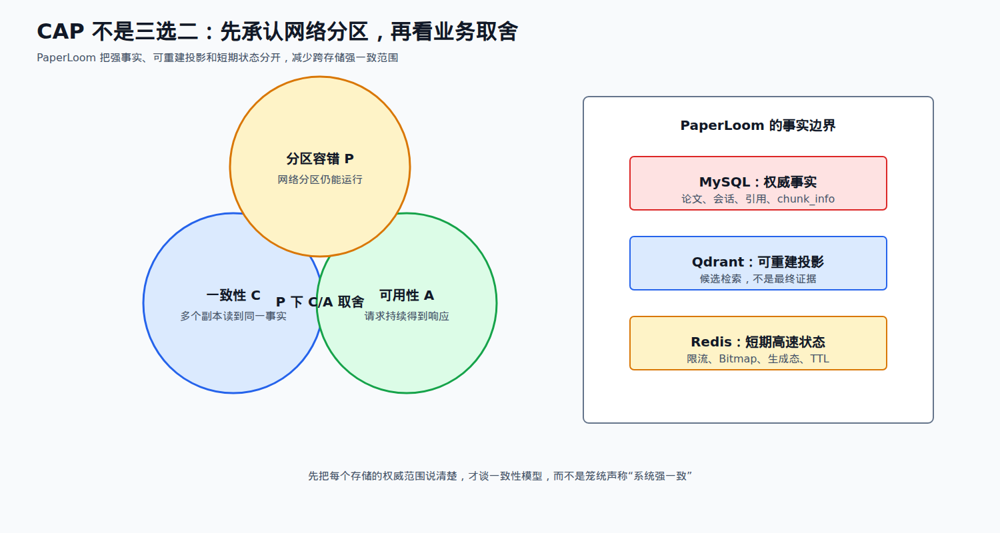
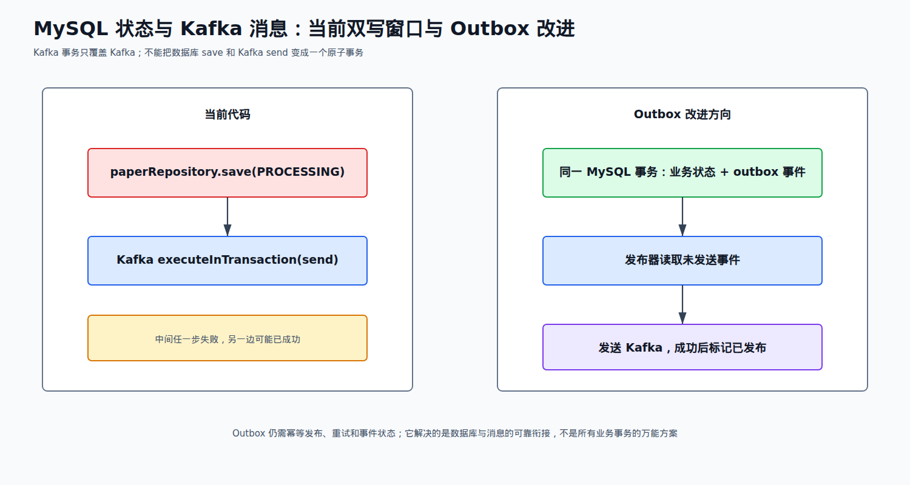

# 05 分布式篇

来源：`面渣逆袭-分布式篇.pdf`。原书主线是 CAP、BASE、分布式锁、分布式事务、共识算法、幂等和限流；下面把主问题及书中的小节一起列出，项目话术只使用 PaperLoom 代码证据。

## 先记住项目事实边界

PaperLoom 不是已经完成大规模微服务治理的平台，但真实跨越 Java、Python、MySQL、Redis、Kafka、Qdrant、MinIO 和模型服务。最适合面试的分布式难点是：跨存储事实边界、上传与消息双写、Kafka 重试/DLT、任务状态归属和重复请求幂等。



## 原书题目总表

| 题号 | PDF 页 | 原题/小节 | 取舍 | PaperLoom 关联 |
| --- | ---: | --- | --- | --- |
| Q1 | 1 | 说说 CAP 原则 | 必背 | MySQL、Qdrant、Redis 的职责边界 |
| Q2 | 2 | 为什么 CAP 不可兼得 | 必背 | 网络分区下 C/A 取舍 |
| Q3 | 3 | CAP 对应的模型和应用 | 选背 | 只讲模型对比，不认领注册中心 |
| Q4 | 4 | BASE 理论了解吗 | 必背 | 可重建索引、短期状态和最终一致 |
| Q5 | 6 | 有哪些分布式锁的实现方案 | 必背 | 项目实际用 MySQL 锁/条件更新 |
| Q5.1 | 7 | MySQL 分布式锁如何实现 | 必背项目 | 悲观锁、唯一约束、条件更新 |
| Q5.2 | 7 | ZooKeeper 如何实现分布式锁 | 了解 | 未使用，只准备原理 |
| Q5.3 | 8 | Redis 怎么实现分布式锁 | 必背边界 | 项目没有 Redis/Redisson 锁 |
| Q6 | 9 | 什么是分布式事务 | 必背 | MySQL 与 Kafka 双写窗口 |
| Q7 | 11 | 分布式事务有哪些常见实现方案 | 必背 | 2PC、3PC、TCC、Outbox、消息事务 |
| Q7.1 | 11 | 说说 2PC 两阶段提交 | 选背 | 只讲协调流程和阻塞问题 |
| Q7.2 | 13 | 3PC 了解吗 | 了解 | 只作 2PC 对比 |
| Q7.3 | 14 | TCC 了解吗 | 了解 | 项目未引入 Seata/TCC |
| Q7.4 | 14 | 本地消息表了解吗 | 必背改进 | 解决 MySQL 状态与 Kafka 事件可靠衔接 |
| Q7.5 | 15 | MQ 消息事务了解吗 | 必背对照 | Kafka 事务只覆盖 Kafka |
| Q7.6 | 16 | 最大努力通知了解吗 | 了解 | 回调重试和主动查询 |
| Q8 | 17 | 你们用什么？能说一下 Seata 吗 | 必背边界 | 项目没有 Seata |
| Q9 | 20 | 分布式算法 Paxos 了解么 | 了解 | 不声称实现共识算法 |
| Q10 | 23 | 说说 Raft 算法 | 了解 | 不声称做过选主集群 |
| Q11 | 26 | 说说什么是幂等性 | 必背项目题 | 分片唯一约束、状态机、job_id、重复消息 |
| Q12 | 29 | 你了解哪些限流算法 | 必背 | 当前实现固定窗口，不是令牌桶 |

## 第一轮必须拿下

Q1-Q2、Q4-Q6、Q7/Q7.4/Q7.5、Q11-Q12。二面追问重点是“为什么 Kafka 事务不能覆盖 MySQL”“重复消息如何不重复落库”“旧任务为什么不能覆盖新任务”。

## 重点背诵稿

### Q1-Q4：CAP 与 BASE

**Q1 CAP 四句回答：** CAP 的 C 是多个副本对同一时刻数据的一致观察，A 是每个请求都能得到响应，P 是发生网络分区时系统仍能继续提供服务。分布式环境中网络分区不是可选项，所以真正的取舍是在 P 存在时如何在 C 和 A 之间选择；不是平时简单地从三个字母里任意挑两个。

**Q2 为什么不可兼得：** 分区后 N1、N2 之间无法及时通信。若 N1 已写新值，N2 仍返回旧值，立刻响应可保 A 但破坏 C；等待同步再响应可保 C，但分区期间不能保证 A。选择必须落到业务：权限和最终证据更偏向正确性，短期进度和候选索引可以接受降级或延迟。

**Q3 模型只做对比：** CA 依赖没有分区的环境，现实分布式系统很难真正承诺；CP 在分区时牺牲部分可用性换一致性，常见于强协调系统；AP 在分区时优先可用性，接受短时不一致。原书把 ZooKeeper 归为 CP、Eureka 归为 AP，并指出 Nacos 可按配置支持两类。PaperLoom 没有使用这些注册中心，不能说项目实现了某种注册中心模型。

**Q4 BASE：** Basically Available（基本可用）、Soft State（允许中间状态）、Eventually Consistent（最终一致）。它不是“不要一致性”，而是把强一致范围缩小，允许可控的延迟和重试，最终回到正确状态。

PaperLoom 的真实落点是：MySQL 保存论文、会话、引用和 `chunk_info` 权威事实；Qdrant 是可删除、可重建的候选检索投影；Redis 保存 TTL 短期状态和快路径。上传 Bitmap 丢失时从 MySQL 回源，索引失败后可重试或重建，这属于明确划分事实等级后的最终一致，而不是所有系统都强一致。

### Q5：分布式锁三种方案

| 方案 | 原书核心 | 优点 | 风险 |
| --- | --- | --- | --- |
| MySQL | 唯一约束、插入锁记录、悲观锁、条件更新 | 状态本来就在库里，语义直观 | 数据库 IO 和锁竞争 |
| ZooKeeper | 临时顺序节点，最小序号获得锁 | 会话失效可自动删除，协调能力强 | 部署和运维成本更高 |
| Redis | `SET key value NX PX ttl`，token 校验释放 | 延迟低、实现简单 | 过期、续租、主从切换和 fencing |

**Q5.1 项目回答：** 会话范围的 Scope 冻结使用 Repository 的 `PESSIMISTIC_WRITE`，索引任务不长时间持有数据库锁，而是使用状态 + `job_id` 条件更新抢占和完成。唯一约束还用于 `(file_md5, chunk_index)`，重复上传在数据库层收敛。这里的关键是锁住本来就属于 MySQL 的事实，不需要额外引入 Redis 锁。

**Q5.2 ZooKeeper：** 常见做法是每个竞争者在锁目录下创建临时顺序节点，只监听自己前一个节点；前驱释放或会话失效后再竞争。只监听前驱可减少惊群。项目没有 ZooKeeper 依赖和部署证据，只准备原理。

**Q5.3 Redis：** 加锁用 `SET lock value NX PX ttl`，value 是唯一 owner token；释放必须 Lua 原子地比较 token 后删除，避免旧持有者误删新锁。业务执行时间超过 TTL 时要续租；还要考虑客户端暂停和 Redis 主从切换，关键写入可用 fencing token。PaperLoom 没有 Redis 分布式锁、Redisson 或 Redlock 实践，不能把书中项目话术贴过来。

### Q6-Q8：分布式事务和方案取舍

分布式事务是一次业务操作跨越多个独立资源或服务，仍希望满足原子提交、回滚或可补偿的协调语义。它比单库事务更难，因为网络可能丢包、参与者可能超时或重启，协调者和参与者的状态也可能不一致。

**Q7 方案表：**

| 方案 | 记忆句 | 代价 |
| --- | --- | --- |
| 2PC | prepare 收集投票，commit/rollback 统一决定 | 阻塞、单点协调和长时间锁资源 |
| 3PC | 在 2PC 前增加 canCommit/预提交阶段和超时 | 降低部分阻塞但协议更复杂，不能消除所有故障 |
| TCC | Try 预留、Confirm 提交、Cancel 取消 | 业务侵入大，每个参与者要写补偿逻辑 |
| 本地消息表/Outbox | 业务状态和事件在同一数据库事务，异步发布 | 需要轮询/发布器、重试和幂等 |
| MQ 事务消息 | prepare → 本地事务 → commit/rollback | 依赖 MQ 回查和消息语义，不能覆盖任意外部数据库 |
| 最大努力通知 | 通知重试 + 主动查询兜底 | 最终结果依赖对方查询和业务补偿 |
| Saga | 多步骤本地事务，失败执行反向补偿 | 补偿不是回滚，业务设计复杂 |



**PaperLoom 的真实双写：** 上传合并后，代码先把 `Paper` 的向量化状态保存为 PROCESSING，再调用 `kafkaTemplate.executeInTransaction` 发送 `PaperProcessingTask`。Kafka 事务能保证 Kafka 生产会话内的发送语义，但不能把已经完成的 MySQL save 和 Kafka send 包进同一个原子事务；所以仍有“数据库成功、消息失败”或“消息已发、数据库提交异常”的窗口。正确说法是“Kafka 侧启用了幂等生产者和事务发送，但跨 MySQL/Kafka 仍不是 exactly-once”。

**Q7.4 Outbox 改进：** 在同一个 MySQL 事务里写业务状态和 outbox 事件，独立发布器读取未发送事件投递 Kafka，成功后标记已发布；发布失败重试，消费者按事件 ID 幂等。Outbox 不是项目已实现功能，而是对当前双写窗口的可验证改进方向。

**Q7.5 MQ 事务消息：** 发送 prepare，执行本地事务，再 commit 或 rollback；MQ 还可能回查本地事务状态。它只解决 MQ 参与者能看到的协议，不能自动把 MySQL、MinIO、远程模型服务都纳入同一个原子事务。

**Q7.6 最大努力通知：** 结果方先记录处理中，通知方按退避重试；达到次数后停止自动通知，同时提供查询接口让业务方主动确认。它适合支付回调等通知语义，不应代替需要强约束的本地事务。

**Q8 Seata：** Seata 常见角色是 TC（事务协调器）、TM（事务管理器）和 RM（资源管理器），可提供 AT、TCC、SAGA 等模式。PaperLoom 没有 Seata 依赖、TC 部署或全局 XID 证据；项目的 Kafka 事务也不等于 Seata 分布式事务。

### Q9-Q10：Paxos 与 Raft

Paxos 通过 Proposer、Acceptor、Learner 和多数派投票达成共识；核心是编号更大的提案可以阻止旧提案，最终只有一个值被多数派接受。Raft 把共识拆成 Leader 选举、日志复制和安全性，节点以 term 任期和多数票选主，Leader 把日志复制到多数节点后再提交。

面试只需说清“多数派、任期/编号、日志提交、故障节点恢复”，不要把 Redis Sentinel 的故障转移、Kafka 的 ISR 或 PaperLoom 的任务抢占说成自己实现了 Paxos/Raft。当前项目没有共识算法代码，也没有多副本故障演练证据。

### Q11：幂等性与项目四层防线

幂等表示同一个业务请求执行一次或重复执行多次，最终业务效果相同。它不是“接口只调用一次”，而是要能面对客户端重试、网络超时后重发、MQ 重复投递和 Worker 崩溃恢复。

PaperLoom 可以按四层回答：

1. **数据约束：** `ChunkInfo` 的 `(file_md5, chunk_index)` 唯一约束，重复分片保存会被数据库约束收敛。
2. **状态机：** 合并前用状态条件更新抢占；已经 COMPLETED 的合并按幂等成功返回，MERGING 则拒绝并发合并。
3. **消息消费：** `PaperProcessingConsumer` 先检查论文是否已经 searchable，已完成则跳过重复处理；失败抛出异常，让 Kafka ErrorHandler 重试而不是静默确认。
4. **任务归属：** 索引完成更新要匹配当前状态和自己的 `job_id`，旧 Worker 恢复后不能覆盖新 Worker 的结果；进程内 research harness 用 `generationId` + `putIfAbsent` 拒绝同一进程重复活动请求。

不要把 Kafka 的幂等生产者等同业务幂等：生产者不重复发送只解决一个环节，消费者写数据库、写 Qdrant 和调用 MinIO 仍要用业务键和状态判断。

### Q12：限流算法

| 算法 | 核心 | 优缺点 |
| --- | --- | --- |
| 固定窗口计数 | 窗口内计数，超限拒绝 | 简单，但边界可能突刺 |
| 滑动日志 | 保存每次请求时间戳 | 准确，内存和清理成本高 |
| 滑动窗口计数 | 多个小窗口近似统计 | 平滑和成本折中 |
| 令牌桶 | 按速率产生令牌，允许桶容量范围的突发 | 控制平均速率，参数需调优 |
| 漏桶 | 请求进入队列，按固定速率流出 | 平滑，但队列满会丢弃/排队 |

PaperLoom `RateLimitService` 当前是 Redis 固定窗口：对 key `INCR`，第一次计数再 `EXPIRE`，超限读取 TTL 作为 `retry-after`；全局 Token 预算也是计数器预占和失败回退，不是令牌桶。优点是实现简单，缺点是边界突刺和 `INCR/EXPIRE` 两命令窗口。若要升级，先基于真实流量选择 Lua 滑动窗口或令牌桶，并明确项目尚未落地。

## 两条项目链路

### 上传合并与消息发布

```text
分片已在 MinIO + chunk_info
          ↓
合并状态条件更新为 MERGING
          ↓
合并成功，Paper 状态保存为 PROCESSING
          ↓
Kafka executeInTransaction 发送 PaperProcessingTask
          ↓
Consumer：已 searchable 则跳过，否则解析 → Qdrant 索引 → READY
          ↓失败
固定 3 秒退避，最多 4 次重试 → paper-processing-dlt
```

这条链路能回答 Q6、Q7、Q7.4、Q7.5、Q11：数据库状态、Kafka 消息、消费者处理和 Qdrant 投影各自有失败点，幂等键和状态机比一句“exactly-once”更可靠。

### 任务重试的时间边界

```text
瞬时故障？──否──> 标记 FAILED / 进入 DLT
    │是
    ↓
是否幂等？──否──> 先补幂等键或人工处理
    │是
    ↓
退避 + 抖动 + 最大次数 + Deadline
    ↓
成功完成 / 耗尽后可观测地失败
```

不能无限重试；每次重试要记录原因、耗时和 attempt，避免故障扩大为重试风暴。

## 项目证据与绝对不能说错的边界

| 追问 | 可以说 | 不可以说 |
| --- | --- | --- |
| CAP/BASE | MySQL 是权威事实，Qdrant 可重建，Redis 是短期状态；不同数据选择不同一致性 | 项目整体“强一致”或“整体 AP” |
| 分布式锁 | 会话范围 MySQL 悲观锁；任务状态条件更新 + job_id | PaperLoom 使用 Redisson、ZooKeeper 或 Redlock |
| Kafka 事务 | `acks=all`、幂等生产者、事务前缀、`executeInTransaction` | MySQL 与 Kafka 已经一个原子事务/exactly-once |
| 消费重试 | DefaultErrorHandler 固定 3 秒、最多 4 次，耗尽发 DLT | 消息永不重复或无限重试 |
| 幂等 | chunk 唯一约束、合并状态、searchable 跳过、job_id 归属 | 只靠 Kafka key 就保证业务幂等 |
| 限流 | Redis 固定窗口 + Token counter | 已经用令牌桶/漏桶或 Lua 滑动窗口 |
| 共识算法 | 能解释 Paxos/Raft 多数派和日志 | 项目实现了 Paxos/Raft 或多副本选主 |
| Outbox | 是当前双写窗口的改进方向 | 已经上线 Outbox/CDC |

## 对应代码

- `../src/main/java/io/github/chzarles/paperloom/controller/PaperUploadController.java`：合并后保存 PROCESSING，再用 Kafka 事务发送处理任务。
- `../src/main/java/io/github/chzarles/paperloom/config/KafkaConfig.java`：`acks=all`、幂等生产者、事务前缀、固定退避 ErrorHandler 和 DLT。
- `../src/main/java/io/github/chzarles/paperloom/consumer/PaperProcessingConsumer.java`：searchable 幂等跳过、失败抛出触发重试、解析和索引流程。
- `../src/main/java/io/github/chzarles/paperloom/model/ChunkInfo.java`：`(file_md5, chunk_index)` 唯一约束。
- `../src/main/java/io/github/chzarles/paperloom/service/UploadService.java`：分片数据库事实、状态条件更新和重复上传处理。
- `../src/main/java/io/github/chzarles/paperloom/service/RateLimitService.java`：固定窗口限流；不要与令牌桶混淆。
- `../src/main/java/io/github/chzarles/paperloom/service/UsageQuotaService.java`：全局 Token counter 预占、结算和失败回退。

## 最后背一遍：项目版分布式自我介绍

> PaperLoom 的分布式问题我会先划事实边界：MySQL 保存论文、会话、引用和分片权威数据，Qdrant 是可重建候选索引，Redis 是限流、Token 预算、上传 Bitmap 和生成态的短期状态。上传合并后代码先把 MySQL 论文状态保存为 PROCESSING，再通过 Kafka 事务发送处理任务；Kafka 事务只覆盖 Kafka，不能让 MySQL save 和 Kafka send 成为一个原子事务，所以仍有双写窗口，Outbox 是可选改进。消费者用 searchable 状态跳过重复处理，chunk_info 唯一约束收敛重复分片，任务完成还要匹配自己的 job_id，失败按固定 3 秒退避、最多 4 次后进入 DLT。当前限流是 Redis 固定窗口和 Token counter，不是令牌桶；项目没有 Redis/Redisson 锁、Seata、Paxos/Raft 或已上线的 Outbox 实践。
