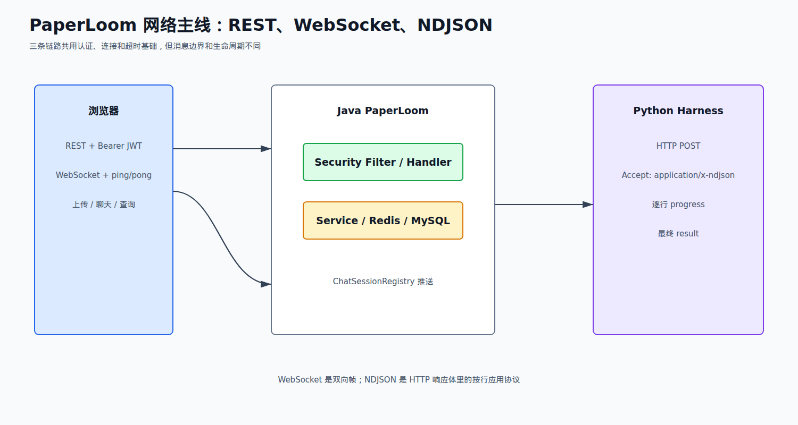
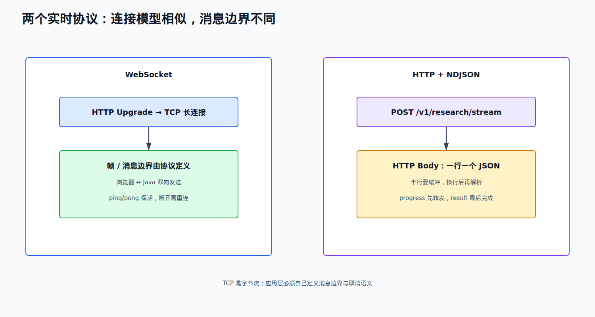
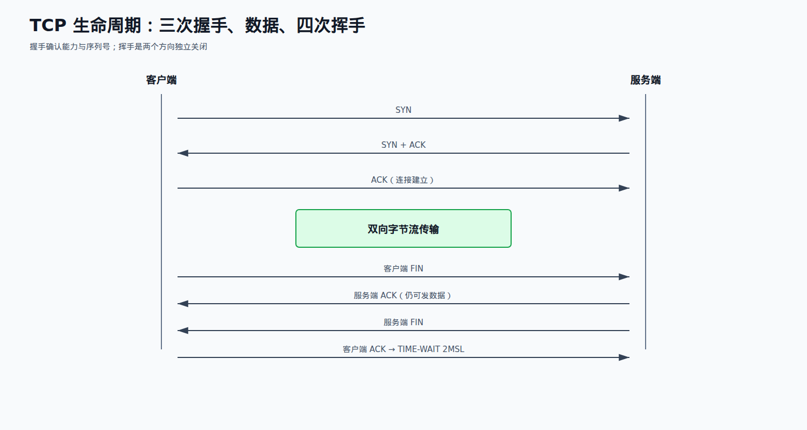

# 06 计算机网络篇

来源：`面渣逆袭计算机网络.pdf`。原书题号从 Q1 到 Q62，其中 Q6 是 WebSocket 与 Socket，Q7 是端口服务；题号没有连续遗漏。页码按 PDF 页面核对，题名保留原书语义。

## PaperLoom 的网络面试主线

PaperLoom 有三条可被追问的网络链路：浏览器用 HTTP/JSON 和 Bearer JWT 调 REST 接口；浏览器与 Java 通过 WebSocket 双向推送聊天和进度；Java 用 HTTP POST + `application/x-ndjson` 逐行读取 Python research harness 的流。网络层的超时、重连、半行数据和取消，都会影响上层状态机。



## 62 题总表

| 题号 | PDF 页 | 原题 | 取舍 | PaperLoom 关联 |
| --- | ---: | --- | --- | --- |
| Q1 | 1 | 说下计算机网络体系结构 | 选背 | 分层定位故障 |
| Q2 | 3 | 每一层对应的网络协议有哪些 | 选背 | HTTP/TCP/IP/链路层边界 |
| Q3 | 4 | 数据在各层之间怎么传输 | 选背 | 封装、解封装 |
| Q4 | 5 | 浏览器输入 URL 到显示主页 | 必背 | REST、WebSocket、服务端链路 |
| Q5 | 7 | DNS 的解析过程 | 必背 | Python/MinIO/Qdrant 地址解析 |
| Q6 | 9 | WebSocket 与 Socket 的区别 | 必背项目 | 聊天和进度推送 |
| Q7 | 9 | 端口及对应服务 | 选背 | Java、Python、Kafka、MinIO 端口 |
| Q8 | 11 | HTTP 常用状态码及含义 | 必背项目 | 401/403/409/429/5xx |
| Q9 | 13 | HTTP 有哪些请求方式 | 必背基础 | GET 查询、POST 写入/流式任务 |
| Q10 | 15 | GET 和 POST 的区别 | 必背 | 幂等、安全、缓存和参数位置 |
| Q11 | 15 | GET 的长度限制是多少 | 了解 | URL 受浏览器/代理限制，不用于大正文 |
| Q12 | 16 | HTTP 请求的过程与原理 | 必背 | Filter → Controller → Service |
| Q13 | 17 | HTTP 报文结构 | 选背 | Header、Body、Content-Type |
| Q14 | 18 | URI 和 URL 的区别 | 了解 | 资源标识与定位 |
| Q15 | 19 | HTTP/1.0、1.1、2.0 的区别 | 必背 | 长连接与多路复用 |
| Q16 | 20 | HTTP/3 了解吗 | 了解 | QUIC/UDP 对照 |
| Q17 | 20 | HTTP 如何实现长连接、何时超时 | 必背 | WebSocket、HTTP client timeout |
| Q18 | 22 | HTTP 与 HTTPS 区别 | 必背 | 传输安全边界 |
| Q19 | 22 | 为什么用 HTTPS，解决什么问题 | 必背 | 机密性、完整性、身份认证 |
| Q20 | 22 | HTTPS 工作流程 | 必背 | 证书、密钥协商、对称加密 |
| Q21 | 24 | 客户端如何校验证书 | 选背 | CA 链、域名、有效期 |
| Q22 | 25 | HTTP 为什么无状态 | 必背 | JWT/Session 不同方案 |
| Q23 | 26 | Session 与 Cookie 的联系区别 | 必背 | 项目使用无状态 JWT |
| Q24 | 29 | TCP 三次握手 | 必背 | 长连接建立 |
| Q25 | 31 | 为什么三次，不能两次/四次 | 必背 | 双方收发能力与序列号 |
| Q26 | 34 | 握手每次没收到报文会怎样 | 选背 | 超时重传与连接失败 |
| Q27 | 34 | 第二次有 ACK，为什么还要 SYN | 选背 | 确认双方初始序列号 |
| Q28 | 34 | 第三次握手可以携带数据吗 | 了解 | 建连后数据语义 |
| Q29 | 34 | 半连接队列与 SYN Flood | 了解 | backlog、资源耗尽 |
| Q30 | 36 | TCP 四次挥手过程 | 必背 | 长连接关闭 |
| Q31 | 39 | 挥手为什么需要四次 | 必背 | 双向半关闭 |
| Q32 | 40 | 为什么等待 2MSL | 必背 | 最后 ACK 与旧报文失效 |
| Q33 | 41 | 保活计时器作用 | 选背 | 心跳与死连接 |
| Q34 | 41 | CLOSE-WAIT 与 TIME-WAIT | 必背 | 连接泄漏排查 |
| Q35 | 43 | TIME-WAIT 过多怎么办 | 选背 | 长连接、端口和复用 |
| Q36 | 43 | TCP 报文首部格式 | 了解 | 端口、序号、确认号、窗口 |
| Q37 | 44 | TCP 如何保证可靠性 | 必背 | 重传、窗口、拥塞控制 |
| Q38 | 50 | TCP 流量控制 | 必背 | 接收窗口与背压 |
| Q39 | 51 | TCP 滑动窗口 | 选背 | 累积确认和发送窗口 |
| Q40 | 53 | Nagle 算法和延迟确认 | 选背 | 小包延迟取舍 |
| Q41 | 54 | TCP 拥塞控制 | 选背 | 慢启动、拥塞避免、快重传 |
| Q42 | 63 | TCP 重传机制 | 必背 | RTO、快重传、SACK |
| Q43 | 69 | TCP 粘包和拆包 | 必背项目 | NDJSON 按行解析边界 |
| Q44 | 71 | TCP 与 UDP 区别 | 必背 | HTTP/TCP 与 QUIC/UDP 对比 |
| Q45 | 73 | 为什么 QQ 采用 UDP | 了解 | 实时性与自定义可靠性 |
| Q46 | 73 | UDP 为什么不可靠 | 选背 | 无连接、无重传、无顺序 |
| Q47 | 74 | DNS 为什么用 UDP | 选背 | 小请求低开销，超长/特殊情况可 TCP |
| Q48 | 74 | IP 定义和作用 | 必背基础 | 寻址与路由 |
| Q49 | 75 | IP 地址有哪些分类 | 了解 | A/B/C/D/E 与 CIDR 对照 |
| Q50 | 76 | 域名和 IP 的关系 | 必背 | 一 IP 多域名、DNS 映射 |
| Q51 | 77 | IPv4 地址不够如何解决 | 选背 | NAT、IPv6、CIDR |
| Q52 | 77 | ARP 工作过程 | 了解 | IP 到 MAC 的局域网解析 |
| Q53 | 78 | 为什么既有 IP 又有 MAC | 选背 | 路由寻址与链路寻址 |
| Q54 | 79 | ICMP 的功能 | 了解 | 错误报告和诊断 |
| Q55 | 80 | ping 的原理 | 了解 | ICMP Echo、ARP、往返时间 |
| Q56 | 81 | 有哪些安全攻击 | 选背 | 认证、注入、拒绝服务分类 |
| Q57 | 82 | DNS 劫持 | 了解 | DNS 响应被篡改 |
| Q58 | 84 | CSRF 及防御 | 必背项目 | Bearer JWT 与 Cookie 风险差异 |
| Q59 | 85 | DoS、DDoS、DRDoS | 了解 | 流量耗尽和反射放大 |
| Q60 | 86 | XSS 及防御 | 必背 | Token 存储和输出编码 |
| Q61 | 87 | 对称与非对称加密区别 | 必背 | TLS 混合加密 |
| Q62 | 88 | RSA 与 AES 区别 | 选背 | 密钥交换与数据加密 |

## 第一轮必须拿下

Q4-Q10、Q12、Q15、Q17-Q25、Q30-Q32、Q34、Q37-Q38、Q42-Q44、Q50、Q58、Q60-Q61。低优先级题先背一句定义，项目题再展开链路和边界。

## 重点背诵稿

### Q1-Q5：分层、封装、URL 与 DNS

OSI/TCP-IP 分层的价值是把问题定位到层：应用层 HTTP/DNS/WebSocket，传输层 TCP/UDP，网络层 IP/ICMP，链路层 Ethernet/ARP。发送时数据逐层加上本层首部完成封装，接收端按相反顺序解封装；上一层只依赖下一层提供的服务。

**Q4 浏览器输入 URL：** 解析 URL → 查浏览器/系统/本地 DNS 缓存 → DNS 递归查询得到 IP → 建立 TCP（三次握手，HTTPS 再做 TLS）→ 发送 HTTP 请求 → 服务端经过代理、Filter、Controller 和 Service → 返回响应 → 浏览器解析 HTML/CSS/JS 并请求子资源。PaperLoom 的 WebSocket 不走普通页面响应链；Python harness 是服务器主动发起的 HTTP 流请求。

**Q5 DNS：** 客户端先查浏览器、操作系统和本地缓存，未命中后向递归 DNS 请求；递归 DNS 代表客户端向根、顶级域和权威 DNS 逐级查询，拿到 A/AAAA/CNAME 等记录并按 TTL 缓存。DNS 变化不会立刻在所有客户端生效，排查服务地址要看缓存和 TTL。

### Q6-Q17：Socket、HTTP、WebSocket 与长连接

Socket 是操作系统提供的网络编程端点抽象，通常由协议、IP、端口等识别；WebSocket 是应用层协议，先通过 HTTP Upgrade 握手，再在 TCP 连接上双向传输帧。它不是裸 TCP，也不是“HTTP 长轮询”。

PaperLoom 的 `ChatWebSocketHandler` 在连接建立时校验 JWT，把用户和 clientId 放入 Session Registry，并用 ping/pong 保活；聊天和研究进度由 Java 向浏览器推送。Java 调 Python 是 HTTP POST + NDJSON，不要把两条链路混成 WebSocket。

**Q7 端口只作速查：** HTTP 80、HTTPS 443、Redis 6379、Kafka 9092、MinIO 常见 9000/9001；实际部署以环境变量和容器配置为准，不能把本地端口说成生产拓扑。

**Q8 状态码项目版：** 200 成功；201 创建；204 成功无响应体；301/302 重定向；304 缓存未修改；400 参数错误；401 没有有效认证；403 已认证但没有论文/组织权限；404 资源不存在；409 状态冲突（例如正在合并或会话范围冲突）；429 触发 Redis 限流；500 服务内部错误；502 网关从上游拿到坏响应；503 服务暂不可用；504 网关等待上游超时。401 不是“没有权限”，403 才是授权拒绝。

**Q9-Q11：** GET 常用于读取，语义上应安全且幂等；POST 常用于创建或触发动作，不保证幂等。GET 参数通常在 URL，POST 数据通常在 Body；URL 长度受浏览器、代理和服务器限制，没有统一的“HTTP 最大长度”，大正文和复杂任务放请求体。PaperLoom 的上传、合并、聊天请求使用 POST，论文查询使用 GET；重复 POST 是否安全仍要靠业务幂等键和状态机。

**Q12-Q14：** HTTP 请求由客户端连接、发送请求行/头/体，服务端解析、鉴权、执行业务并返回状态行/头/体组成。URI 是资源标识的通用概念，URL 是带访问位置和协议的 URI。PaperLoom 的 Spring Security Filter 先处理 Bearer JWT，再进入 Controller/Handler；网络成功不代表业务授权成功。

**Q15-Q17：** HTTP/1.0 默认短连接；HTTP/1.1 默认持久连接并支持 chunked；HTTP/2 使用二进制分帧、头部压缩和同一 TCP 连接上的流多路复用；HTTP/3 基于 QUIC/UDP，减少 TCP 层队头阻塞。长连接仍受连接池、代理空闲超时、服务端读写超时和文件描述符限制；WebSocket 需要心跳、重连和关闭清理，不等于永久在线。



### Q18-Q23：HTTPS、无状态、Cookie、Session、JWT

HTTPS = HTTP over TLS。证书把域名、公钥和 CA 信任链绑定，客户端验证证书后协商会话密钥，后续用对称加密传输，保证机密性、完整性和服务端身份认证。现代 TLS 会使用临时密钥交换，面试不必死背“客户端直接用服务器 RSA 公钥加密全部会话密钥”的旧版简化流程。

**Q20/Q21：** 客户端验证证书链是否由受信 CA 签发、域名是否匹配、是否过期/吊销，再完成密钥协商。HTTPS 只保护传输，不能替代应用层权限；PaperLoom 仍需 JWT 校验和 `OrgTagAuthorizationFilter` 判断论文资源权限。

HTTP 无状态是协议不会自动记住前一次请求。Cookie 由浏览器保存并自动随匹配请求发送；Session 状态在服务端，Cookie 常携带 Session ID；JWT 把签名后的 claims 放在客户端请求中，服务端验证签名和过期时间，不需要服务端保存会话表。

PaperLoom 的 Spring Security 配置是 `STATELESS`，REST 请求通过 `Authorization: Bearer <JWT>` 认证，WebSocket 建立后也校验 JWT。Bearer Token 不会像 Cookie 那样被浏览器对任意站点自动附带，因此经典 CSRF 风险较低，但 Token 存储、XSS、CORS 和泄露后的撤销仍需处理。

### Q24-Q36：TCP 握手、挥手与连接状态



**Q24-Q25 三次握手：** 客户端 SYN（带初始序列号）→ 服务端 SYN+ACK（确认客户端并发送自己的序列号）→ 客户端 ACK。三次用于确认双方发送/接收能力和双方初始序列号；两次无法让服务端确认客户端已经收到自己的序列号，四次通常可以合并第二、三步，没必要额外增加一次。

**Q26-Q29：** 每次握手报文丢失都会按 TCP 超时策略重传，超过次数则连接失败。第二次必须同时 SYN 和 ACK，因为服务端既要确认客户端的序列号，也要声明自己的初始序列号。第三次 ACK 在协议上可以携带数据，但要满足状态和实现条件。半连接队列保存收到 SYN、等待最终 ACK 的连接；SYN Flood 伪造大量 SYN 消耗队列和资源，防御可用 SYN Cookie、代理、限速和扩大 backlog。

**Q30-Q35 四次挥手：** 一方发送 FIN 表示自己不再发送，另一方先 ACK，但仍可能继续发送剩余数据；剩余数据发完后再发送 FIN，对方回最后 ACK 并进入 TIME-WAIT。因为 TCP 两个方向独立关闭，ACK 和 FIN 通常不能合成一次。

TIME-WAIT 等待 2MSL，一是保证最后 ACK 丢失时能收到对端重传的 FIN 并再次确认，二是让旧连接报文在网络中过期，避免污染新连接。CLOSE-WAIT 表示本端收到对端 FIN 但应用还没有关闭；服务器出现大量 CLOSE-WAIT 通常是应用没有 close。TIME-WAIT 多表示本端主动关闭，过多会占内存和端口；优先复用长连接、修复连接生命周期、合理设置 `SO_REUSEADDR`，不要粗暴缩短协议等待。

保活计时器用于发现长时间无数据且对端已故障的连接；应用层 WebSocket ping/pong 往往比依赖系统 TCP keepalive 更快发现断链。连接池也应检查借出连接和空闲连接。

### Q37-Q43：TCP 可靠性、窗口、拥塞和粘包

TCP 可靠性来自校验和、序列号、确认应答、超时重传、滑动窗口、有序交付、流量控制和拥塞控制。接收窗口防止发送方超过接收缓冲；滑动窗口允许多个未确认报文在途，收到确认后窗口向前滑动。拥塞窗口根据网络拥塞动态调整，慢启动、拥塞避免、快重传和快恢复共同控制发送速率；RTO 根据 RTT 估计，SACK 可描述非连续收到的块。

Nagle 会合并小包以减少网络开销，延迟确认会稍等再回 ACK；低延迟交互可能关闭 Nagle 或调整策略，但要用真实数据验证，不能凭感觉关闭。

TCP 是字节流，没有消息边界；一次 send 可能被拆成多次 recv，多次 send 也可能被一次 recv 合并。解决办法是应用层定义长度字段、分隔符或固定长度协议。PaperLoom 的 NDJSON 用换行分隔事件，读取器应维护“半行缓冲”：读到半个 JSON 不能立即解析，跨 read 拼接到换行后再处理；WebSocket 则由帧协议保留消息边界。

TCP 可靠不等于业务 exactly-once：客户端超时后重试时，服务端第一次请求可能已经写入数据库，因此仍要依靠 chunk 唯一约束、状态机和请求幂等键。

### Q44-Q55：UDP、IP、DNS、ARP、ICMP

TCP 面向连接、可靠、有序、带流量/拥塞控制；UDP 无连接、无重传、无顺序保证，报文开销小、延迟低，应用可以自己实现序列号、重传和拥塞控制。QQ 等实时业务可能优先 UDP，因为允许丢少量旧消息并自行优化；DNS 常用 UDP 进行小请求，响应过大、区域传送或特殊失败时可以回退 TCP。

IP 负责跨网络寻址和路由，不保证可靠传输；MAC 是局域网链路上的下一跳地址。一个 IP 可以对应多个域名，一个域名也可以通过 DNS 对应多个 IP 做负载均衡。IPv4 不足可用 NAT、CIDR、私网地址和 IPv6；ARP 在局域网广播“谁拥有这个 IP”，目标主机单播返回 MAC，发送方缓存映射。ICMP 用于错误报告和诊断，`ping` 发送 ICMP Echo Request，收到 Echo Reply 后根据时间戳计算往返时间；跨网段前还可能需要 ARP 得到网关 MAC。

### Q56-Q62：安全攻击与加密

安全攻击可按目标分为窃取/篡改数据、身份伪造、注入、拒绝服务和脚本执行。DNS 劫持是域名解析结果被篡改，用户被导向错误 IP；防御依靠可信 DNS、DNSSEC、HTTPS 证书校验和监控，不能只在应用层相信域名。

CSRF 利用浏览器自动携带 Cookie/凭证，让用户在不知情时发起跨站操作；防御包括 SameSite Cookie、CSRF Token、Origin/Referer 校验和避免危险操作使用无保护 Cookie。PaperLoom 使用 Bearer JWT，经典自动携带风险降低，但前端把 Token 放在 `localStorage` 仍要防 XSS，并配合严格 CORS 和输出编码。

DoS 是拒绝服务，DDoS 是多源分布式拒绝服务，DRDoS 利用第三方服务反射放大。防御要在 CDN/网关限流、连接数和资源配额、黑名单/挑战、缓存和监控多层处理。

XSS 是恶意脚本进入页面并在受害者浏览器执行；反射型来自请求参数，存储型来自持久化内容，DOM 型由前端代码拼接产生。防御核心是上下文相关输出编码、HTML 清洗、CSP、安全 DOM API 和 HttpOnly/Secure/SameSite Cookie。不要把“用了 JWT”说成已经解决 XSS。

对称加密使用同一密钥，速度快，适合大量业务数据；非对称加密有公钥/私钥，适合身份认证和密钥交换，速度较慢。TLS 通常用证书和非对称/临时密钥交换建立会话，再用 AES/ChaCha20 等对称算法传输正文。RSA 是非对称算法，AES 是对称算法，二者不是同一层面的替代关系。

## 两条项目网络链路

### Java 调 Python 的 NDJSON 流

```text
Java HttpClient POST /v1/research/stream
  Accept: application/x-ndjson
          ↓
Python 逐行输出 progress / result
          ↓
Java InputStream BufferedReader.readLine()
  ├─ progress：立即写 Redis/推送 WebSocket
  └─ result：结算 Token、完成 Future、持久化会话
```

必须处理代理缓冲、空闲超时、半行 JSON、HTTP 非 200、远程断开和取消；一条 TCP 连接的可靠传输不会替代应用层 deadline 和幂等。

### WebSocket 连接与认证

```text
浏览器带 JWT 建立 WebSocket
        ↓
ChatWebSocketHandler 校验 token
        ├─ 失败：关闭 POLICY_VIOLATION
        └─ 成功：注册 userId + clientId
        ↓
ping/pong 保活，消息交给 ChatHandler
        ↓
ChatSessionRegistry 按用户和目标 clientId 推送
```

当前 Session Registry 是单个 Java 进程内 Map；多副本部署时不能直接广播到所有节点，需要共享 Pub/Sub、网关粘性或专门的消息路由，这不是当前代码已完成的能力。

## 项目证据与绝对不能说错的边界

| 追问 | 可以说 | 不可以说 |
| --- | --- | --- |
| 实时通道 | 浏览器与 Java 用 WebSocket；Java 与 Python 用 HTTP/NDJSON | Python harness 也用 WebSocket |
| 认证 | REST Bearer JWT；WebSocket 建连后校验 JWT；资源权限另由过滤器/数据库判断 | JWT 自动解决所有授权和 XSS |
| 状态码 | 401 未认证、403 无权限、409 状态冲突、429 限流、5xx 上游/服务故障 | 401 和 403 混用 |
| TCP 可靠性 | 传输层有序重传，但应用仍要幂等和 deadline | TCP 保证业务请求 exactly-once |
| 长连接 | WebSocket 心跳/重连；HTTP client 有连接和读取超时 | 连接永久不超时 |
| 多副本 | 当前 Session Registry 是单 JVM 内存结构 | WebSocket 已经跨节点一致广播 |
| 安全 | Bearer JWT 降低经典 CSRF，但仍需防 XSS、CORS、Token 泄露 | 关闭 CSRF 就等于安全 |

## 对应代码

- `../src/main/java/io/github/chzarles/paperloom/handler/ChatWebSocketHandler.java`：JWT 校验、WebSocket Session、心跳 ping/pong、关闭清理。
- `../src/main/java/io/github/chzarles/paperloom/service/ChatSessionRegistry.java`：按 userId/clientId 管理进程内连接和推送。
- `../src/main/java/io/github/chzarles/paperloom/service/PythonResearchHarnessClient.java`：Java HttpClient、POST NDJSON、connect timeout、逐行读取、Future 取消。
- `../src/main/java/io/github/chzarles/paperloom/config/SecurityConfig.java`：无状态认证和 Spring Security 过滤链。
- `../src/main/java/io/github/chzarles/paperloom/config/OrgTagAuthorizationFilter.java`：论文资源授权，不与网络层认证混为一谈。
- `../src/main/resources/application.yml`：Python/Redis/Kafka/MinIO 地址及 WebSocket 允许来源通过环境变量配置。

## 最后背一遍：项目版网络自我介绍

> PaperLoom 有两条实时链路：浏览器与 Java 通过 WebSocket 双向传输聊天和进度，建连时校验 Bearer JWT，并在 Session Registry 中按 userId 和 clientId 管理连接；Java 调 Python research harness 使用普通 HTTP POST 和 `application/x-ndjson`，逐行处理 progress，最后保存 result。TCP 能保证字节流可靠有序，但没有消息边界，也不保证业务 exactly-once，所以 NDJSON 需要按换行缓冲，任务仍要有超时、取消和幂等。REST 层的 401、403、409、429 分别对应认证、授权、状态冲突和限流。当前 Session Registry 是单 JVM 内存结构，不能声称多副本 WebSocket 已经跨节点广播；Bearer JWT 降低了经典 CSRF 风险，但 XSS、CORS 和 Token 存储仍要治理。
